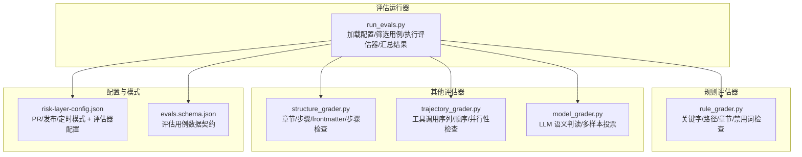
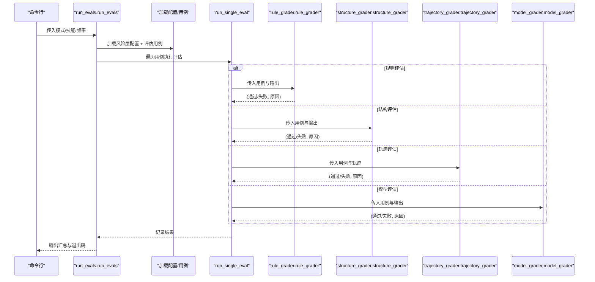
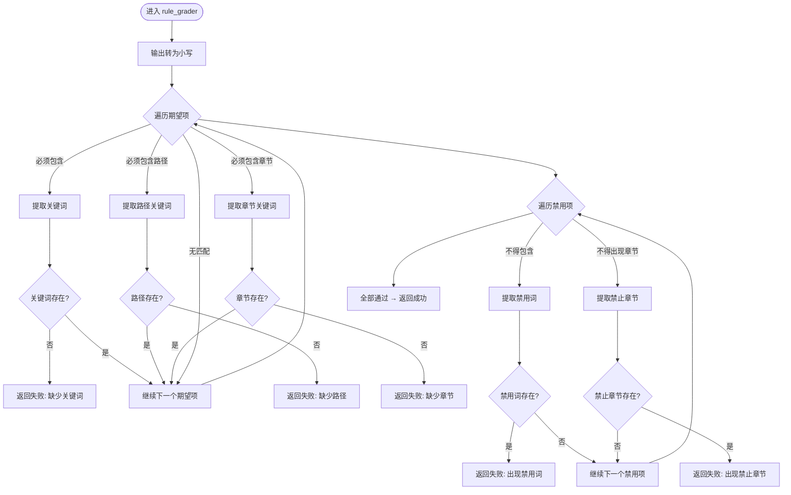
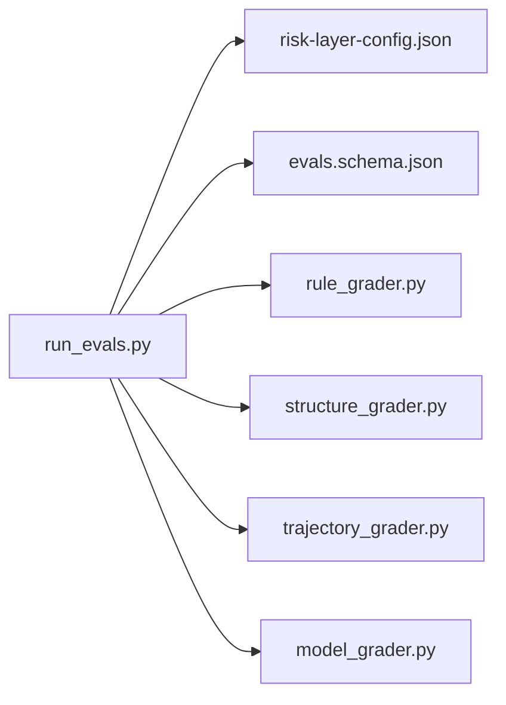

# 规则评估

<cite>
**本文引用的文件**
- [run_evals.py](file://plugins/frontend-team-toolkit/skill-engineering/scripts/run_evals.py)
- [rule_grader.py](file://plugins/frontend-team-toolkit/skill-engineering/scripts/graders/rule_grader.py)
- [structure_grader.py](file://plugins/frontend-team-toolkit/skill-engineering/scripts/graders/structure_grader.py)
- [trajectory_grader.py](file://plugins/frontend-team-toolkit/skill-engineering/scripts/graders/trajectory_grader.py)
- [model_grader.py](file://plugins/frontend-team-toolkit/skill-engineering/scripts/graders/model_grader.py)
- [evals.schema.json](file://plugins/frontend-team-toolkit/skill-engineering/schemas/evals.schema.json)
- [risk-layer-config.json](file://plugins/frontend-team-toolkit/skill-engineering/config/risk-layer-config.json)
</cite>

## 目录
1. [简介](#简介)
2. [项目结构](#项目结构)
3. [核心组件](#核心组件)
4. [架构总览](#架构总览)
5. [详细组件分析](#详细组件分析)
6. [依赖关系分析](#依赖关系分析)
7. [性能考量](#性能考量)
8. [故障排查指南](#故障排查指南)
9. [结论](#结论)
10. [附录](#附录)

## 简介
本技术文档聚焦“规则评估”模块，系统阐述规则评估在技能工程评估体系中的工作原理与实现机制。规则评估负责对输出进行“关键字/路径/章节/禁用词”等显式规则的合规性校验，是评估流水线中的基础“硬性约束”环节。文档将从规则定义语法、匹配算法、评分逻辑、配置示例与常见业务场景出发，并说明规则评估与模型评估的协同与优先级处理机制。

## 项目结构
规则评估模块位于前端团队工具包的技能工程脚本目录下，围绕“评估运行器 + 多种评估器 + 配置与模式 + 数据契约”组织：

- 评估运行器：根据 CI 模式加载风险层配置、筛选评估用例、执行评估器并汇总结果
- 规则评估器：解析期望与禁用条件，执行关键字/路径/章节/禁用词检查
- 其他评估器：结构评估、轨迹评估、模型评估（用于语义质量）
- 配置与模式：风险层配置控制评估范围、阻断策略与自动/半自动策略
- 数据契约：评估用例 JSON Schema 定义字段与取值范围

图表来源
- [run_evals.py:135-174](file://plugins/frontend-team-toolkit/skill-engineering/scripts/run_evals.py#L135-L174)
- [rule_grader.py:41-92](file://plugins/frontend-team-toolkit/skill-engineering/scripts/graders/rule_grader.py#L41-L92)
- [structure_grader.py:63-122](file://plugins/frontend-team-toolkit/skill-engineering/scripts/graders/structure_grader.py#L63-L122)
- [trajectory_grader.py:59-139](file://plugins/frontend-team-toolkit/skill-engineering/scripts/graders/trajectory_grader.py#L59-L139)
- [model_grader.py:184-226](file://plugins/frontend-team-toolkit/skill-engineering/scripts/graders/model_grader.py#L184-L226)
- [risk-layer-config.json:1-70](file://plugins/frontend-team-toolkit/skill-engineering/config/risk-layer-config.json#L1-L70)
- [evals.schema.json:15-38](file://plugins/frontend-team-toolkit/skill-engineering/schemas/evals.schema.json#L15-L38)

章节来源
- [run_evals.py:135-174](file://plugins/frontend-team-toolkit/skill-engineering/scripts/run_evals.py#L135-L174)
- [evals.schema.json:15-38](file://plugins/frontend-team-toolkit/skill-engineering/schemas/evals.schema.json#L15-L38)
- [risk-layer-config.json:1-70](file://plugins/frontend-team-toolkit/skill-engineering/config/risk-layer-config.json#L1-L70)

## 核心组件
- 规则评估器（rule_grader）：对“必须包含/必须包含路径/必须包含章节/不得包含/不得出现章节”等规则进行匹配与断言，返回布尔结果与原因字符串
- 结构评估器（structure_grader）：对章节存在性、frontmatter 格式与字段、步骤编号等进行检查
- 轨迹评估器（trajectory_grader）：对代理/技能调用序列、顺序、并行/串行编排进行检查
- 模型评估器（model_grader）：通过 LLM 判读输出是否满足“期望/禁用”条件，支持本地模拟与 API 模式，可启用多样本投票
- 评估运行器（run_evals）：按 PR/发布/定时模式加载风险层配置，筛选评估用例，调用对应评估器，聚合结果并输出 TSV

章节来源
- [rule_grader.py:41-92](file://plugins/frontend-team-toolkit/skill-engineering/scripts/graders/rule_grader.py#L41-L92)
- [structure_grader.py:63-122](file://plugins/frontend-team-toolkit/skill-engineering/scripts/graders/structure_grader.py#L63-L122)
- [trajectory_grader.py:59-139](file://plugins/frontend-team-toolkit/skill-engineering/scripts/graders/trajectory_grader.py#L59-L139)
- [model_grader.py:184-226](file://plugins/frontend-team-toolkit/skill-engineering/scripts/graders/model_grader.py#L184-L226)
- [run_evals.py:84-132](file://plugins/frontend-team-toolkit/skill-engineering/scripts/run_evals.py#L84-L132)

## 架构总览
规则评估在评估流水线中的位置如下：运行器根据模式加载风险层配置，过滤评估用例后，针对每个用例执行相应评估器；规则评估器负责“硬性约束”的快速判定，模型评估器负责“语义质量”的深度判断；复合评估器（如 rule+human）要求非人工评估全部通过才可判定通过。

图表来源
- [run_evals.py:135-174](file://plugins/frontend-team-toolkit/skill-engineering/scripts/run_evals.py#L135-L174)
- [run_evals.py:84-132](file://plugins/frontend-team-toolkit/skill-engineering/scripts/run_evals.py#L84-L132)
- [rule_grader.py:41-92](file://plugins/frontend-team-toolkit/skill-engineering/scripts/graders/rule_grader.py#L41-L92)
- [structure_grader.py:63-122](file://plugins/frontend-team-toolkit/skill-engineering/scripts/graders/structure_grader.py#L63-L122)
- [trajectory_grader.py:59-139](file://plugins/frontend-team-toolkit/skill-engineering/scripts/graders/trajectory_grader.py#L59-L139)
- [model_grader.py:184-226](file://plugins/frontend-team-toolkit/skill-engineering/scripts/graders/model_grader.py#L184-L226)

## 详细组件分析

### 规则评估器（rule_grader）
- 功能定位：对“必须包含/必须包含路径/必须包含章节/不得包含/不得出现章节”等规则进行显式匹配
- 关键流程：
  - 将输出转为小写以进行不区分大小写的关键词匹配
  - 解析期望项：支持“必须包含”“必须包含路径”“必须包含章节”等模式，提取关键词并断言存在
  - 解析禁用项：支持“不得包含”“不得出现章节”等模式，提取禁用词并断言不存在
  - 返回布尔结果与失败原因（如“缺少关键词/缺少路径/缺少章节/出现禁用词/出现禁止章节”）

图表来源
- [rule_grader.py:41-92](file://plugins/frontend-team-toolkit/skill-engineering/scripts/graders/rule_grader.py#L41-L92)

章节来源
- [rule_grader.py:16-38](file://plugins/frontend-team-toolkit/skill-engineering/scripts/graders/rule_grader.py#L16-L38)
- [rule_grader.py:41-92](file://plugins/frontend-team-toolkit/skill-engineering/scripts/graders/rule_grader.py#L41-L92)

### 结构评估器（structure_grader）
- 功能定位：对章节存在性、frontmatter 格式与字段、步骤编号等进行结构性检查
- 关键流程：
  - 提取期望章节与禁用章节，断言章节标题存在
  - 检查 frontmatter 是否存在、格式是否正确、必要字段是否存在
  - 解析步骤列表，断言步骤编号与顺序存在

章节来源
- [structure_grader.py:16-47](file://plugins/frontend-team-toolkit/skill-engineering/scripts/graders/structure_grader.py#L16-L47)
- [structure_grader.py:50-61](file://plugins/frontend-team-toolkit/skill-engineering/scripts/graders/structure_grader.py#L50-L61)
- [structure_grader.py:63-122](file://plugins/frontend-team-toolkit/skill-engineering/scripts/graders/structure_grader.py#L63-L122)

### 轨迹评估器（trajectory_grader）
- 功能定位：对代理/技能调用序列、顺序、并行/串行编排进行检查
- 关键流程：
  - 从代理轨迹中提取“Read 子技能”与“Spawn Agent”序列
  - 断言必须调用的子技能与代理名称存在
  - 解析顺序描述（如“先A再B最后C”），验证序列一致性
  - 检查串行/并行约束（如串行中不应出现并行调用标记）

章节来源
- [trajectory_grader.py:15-39](file://plugins/frontend-team-toolkit/skill-engineering/scripts/graders/trajectory_grader.py#L15-L39)
- [trajectory_grader.py:41-57](file://plugins/frontend-team-toolkit/skill-engineering/scripts/graders/trajectory_grader.py#L41-L57)
- [trajectory_grader.py:59-139](file://plugins/frontend-team-toolkit/skill-engineering/scripts/graders/trajectory_grader.py#L59-L139)

### 模型评估器（model_grader）
- 功能定位：通过 LLM 判读输出是否满足“期望/禁用”条件，支持本地模拟与 API 模式，可启用多样本投票
- 关键流程：
  - 构建判读提示，包含期望与禁用列表以及待评估输出
  - 在 API 模式下调用 LLM，或多样本投票统计多数结果
  - 在本地模式下基于关键词抽取与简单规则进行模拟判读
  - 解析 LLM 响应，提取逐条判定与最终结论

章节来源
- [model_grader.py:28-68](file://plugins/frontend-team-toolkit/skill-engineering/scripts/graders/model_grader.py#L28-L68)
- [model_grader.py:71-95](file://plugins/frontend-team-toolkit/skill-engineering/scripts/graders/model_grader.py#L71-L95)
- [model_grader.py:97-140](file://plugins/frontend-team-toolkit/skill-engineering/scripts/graders/model_grader.py#L97-L140)
- [model_grader.py:143-182](file://plugins/frontend-team-toolkit/skill-engineering/scripts/graders/model_grader.py#L143-L182)
- [model_grader.py:184-226](file://plugins/frontend-team-toolkit/skill-engineering/scripts/graders/model_grader.py#L184-L226)

### 评估运行器（run_evals）
- 功能定位：按模式加载风险层配置，筛选评估用例，调用评估器，汇总结果并输出 TSV
- 关键流程：
  - 加载风险层配置（PR/发布/定时模式 + 评估器配置）
  - 加载技能评估用例（evals.json）
  - 按模式过滤用例（支持随机抽查）
  - 逐条执行评估器（规则/结构/轨迹/模型/人工）
  - 复合评估器：非人工评估全部通过才可通过
  - 输出 TSV 与统计摘要

章节来源
- [run_evals.py:38-59](file://plugins/frontend-team-toolkit/skill-engineering/scripts/run_evals.py#L38-L59)
- [run_evals.py:62-68](file://plugins/frontend-team-toolkit/skill-engineering/scripts/run_evals.py#L62-L68)
- [run_evals.py:71-74](file://plugins/frontend-team-toolkit/skill-engineering/scripts/run_evals.py#L71-L74)
- [run_evals.py:76-81](file://plugins/frontend-team-toolkit/skill-engineering/scripts/run_evals.py#L76-L81)
- [run_evals.py:84-132](file://plugins/frontend-team-toolkit/skill-engineering/scripts/run_evals.py#L84-L132)
- [run_evals.py:135-174](file://plugins/frontend-team-toolkit/skill-engineering/scripts/run_evals.py#L135-L174)
- [run_evals.py:177-186](file://plugins/frontend-team-toolkit/skill-engineering/scripts/run_evals.py#L177-L186)

## 依赖关系分析
- 运行器依赖各评估器模块与风险层配置
- 评估器之间无直接耦合，均以统一的输入/输出约定（元组形式）参与运行器调度
- 风险层配置决定评估范围、阻断策略与评估器自动化程度

图表来源
- [run_evals.py:25-35](file://plugins/frontend-team-toolkit/skill-engineering/scripts/run_evals.py#L25-L35)
- [risk-layer-config.json:1-70](file://plugins/frontend-team-toolkit/skill-engineering/config/risk-layer-config.json#L1-L70)
- [evals.schema.json:15-38](file://plugins/frontend-team-toolkit/skill-engineering/schemas/evals.schema.json#L15-L38)

章节来源
- [run_evals.py:25-35](file://plugins/frontend-team-toolkit/skill-engineering/scripts/run_evals.py#L25-L35)

## 性能考量
- 规则评估器采用简单的字符串匹配与正则抽取，时间复杂度近似 O(N)（N 为期望/禁用项数量与输出长度），开销极低
- 结构评估器涉及正则与多次子串查找，整体仍为线性或线性对数级别
- 轨迹评估器对代理轨迹进行一次扫描并提取序列，复杂度与轨迹长度线性相关
- 模型评估器在 API 模式下受网络与模型响应影响，本地模拟模式可显著降低延迟
- 多样本投票会线性增加模型评估耗时，需权衡成本与稳定性

## 故障排查指南
- 规则评估失败
  - 关键词缺失：确认“必须包含”关键词是否出现在输出中（注意大小写与引号）
  - 路径缺失：确认“必须包含路径”中指定的路径是否存在于输出文本
  - 禁用词出现：确认“不得包含”中的禁用词未出现在输出中
  - 章节缺失/禁止章节：确认章节标题格式与大小写是否符合预期
- 结构评估失败
  - 缺少 frontmatter：确认输出以 YAML frontmatter 开头并包含必要字段
  - 步骤缺失：确认步骤编号与顺序与期望一致
- 轨迹评估失败
  - 未调用子技能/代理：确认代理轨迹中包含必要的工具调用
  - 调用顺序错误：确认顺序描述与实际轨迹一致
  - 并行/串行约束：确认串行编排中未混入并行标记
- 模型评估失败
  - API 模式：检查密钥与网络连通性；本地模式：确认输出长度与内容足够支撑判读
  - 多样本投票：若多数结果冲突，考虑提高样本数或切换到人工复核

章节来源
- [rule_grader.py:54-92](file://plugins/frontend-team-toolkit/skill-engineering/scripts/graders/rule_grader.py#L54-L92)
- [structure_grader.py:74-122](file://plugins/frontend-team-toolkit/skill-engineering/scripts/graders/structure_grader.py#L74-L122)
- [trajectory_grader.py:76-139](file://plugins/frontend-team-toolkit/skill-engineering/scripts/graders/trajectory_grader.py#L76-L139)
- [model_grader.py:195-226](file://plugins/frontend-team-toolkit/skill-engineering/scripts/graders/model_grader.py#L195-L226)

## 结论
规则评估作为评估流水线的“硬性约束”环节，提供了高效、可解释的显式规则校验能力。它与结构评估、轨迹评估、模型评估共同构成多维度的质量保障体系。通过风险层配置与模式化运行，规则评估既能在 PR/发布等关键节点快速拦截高风险问题，又能在定时回归中保持持续监控。建议在规则定义中尽量使用明确的关键词与路径，减少歧义，提升评估稳定性与可维护性。

## 附录

### 规则定义语法与匹配算法
- 期望项（expected）
  - “必须包含[关键词]”：抽取关键词并在输出中进行不区分大小写的匹配
  - “必须包含路径[路径]”：直接匹配完整路径字符串
  - “必须包含章节[章节名]”：匹配 Markdown 章节标题格式
- 禁用项（must_not）
  - “不得包含[禁用词]”：匹配禁用词
  - “不得出现章节[章节名]”：匹配章节标题
- 匹配算法
  - 关键词抽取：支持多种引号与冒号格式，回退到引号内文本
  - 字符串匹配：规则评估器对输出进行小写化后匹配，结构/轨迹评估器对章节标题进行精确匹配

章节来源
- [rule_grader.py:16-38](file://plugins/frontend-team-toolkit/skill-engineering/scripts/graders/rule_grader.py#L16-L38)
- [rule_grader.py:54-92](file://plugins/frontend-team-toolkit/skill-engineering/scripts/graders/rule_grader.py#L54-L92)
- [structure_grader.py:16-47](file://plugins/frontend-team-toolkit/skill-engineering/scripts/graders/structure_grader.py#L16-L47)
- [trajectory_grader.py:15-39](file://plugins/frontend-team-toolkit/skill-engineering/scripts/graders/trajectory_grader.py#L15-L39)

### 评分逻辑与优先级
- 单评估器评分：规则/结构/轨迹/模型评估器均返回布尔结果与原因
- 复合评估器：非人工评估器全部通过才可通过；若包含人工评估，则标记为“待人工复核”
- 风险层优先级：PR/发布/定时模式分别设置风险过滤与阻断策略，规则评估作为基础门槛参与整体判定

章节来源
- [run_evals.py:84-132](file://plugins/frontend-team-toolkit/skill-engineering/scripts/run_evals.py#L84-L132)
- [run_evals.py:135-174](file://plugins/frontend-team-toolkit/skill-engineering/scripts/run_evals.py#L135-L174)
- [risk-layer-config.json:1-70](file://plugins/frontend-team-toolkit/skill-engineering/config/risk-layer-config.json#L1-L70)

### 规则配置示例与常见业务场景
- 示例：规则评估配置
  - 期望：必须包含「BLOCKED」「references/output-contract.md」
  - 禁用：不得包含「TODO」「参考资料」章节
- 场景：技能文档评审
  - 必须包含：结论状态、评分维度表格、参考链接
  - 禁用：不得出现 ≥9.0 的通过结论、不得只有总分而无维度依据
- 场景：工作流编排检查
  - 必须按顺序：先 lint 再 review
  - 必须串行：不得在串行编排中使用并行标记
- 场景：模板与结构合规
  - 必须有 frontmatter 与必要字段
  - 必须包含「When to Activate」「Workflow」章节

章节来源
- [rule_grader.py:95-110](file://plugins/frontend-team-toolkit/skill-engineering/scripts/graders/rule_grader.py#L95-L110)
- [structure_grader.py:125-155](file://plugins/frontend-team-toolkit/skill-engineering/scripts/graders/structure_grader.py#L125-L155)
- [trajectory_grader.py:142-163](file://plugins/frontend-team-toolkit/skill-engineering/scripts/graders/trajectory_grader.py#L142-L163)
- [model_grader.py:229-273](file://plugins/frontend-team-toolkit/skill-engineering/scripts/graders/model_grader.py#L229-L273)

### 评估用例数据契约（JSON Schema）
- 必填字段：skill_name、evals
- 评估用例字段：id、name、type、prompt、expected、must_not、grader、risk、source
- 支持的评估器类型：rule、structure、trajectory、model、human、rule+human
- 风险等级：low、medium、high

章节来源
- [evals.schema.json:6-38](file://plugins/frontend-team-toolkit/skill-engineering/schemas/evals.schema.json#L6-L38)