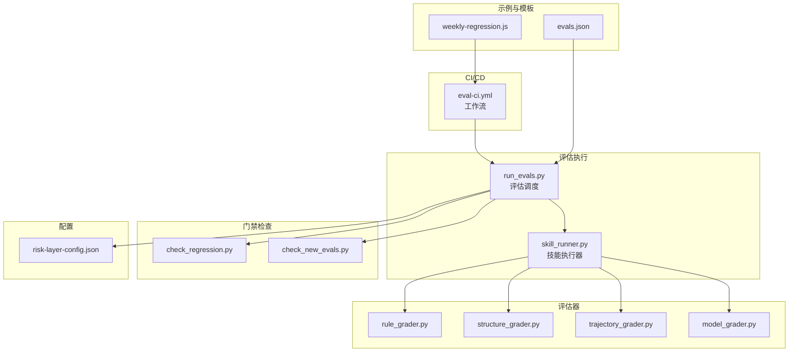
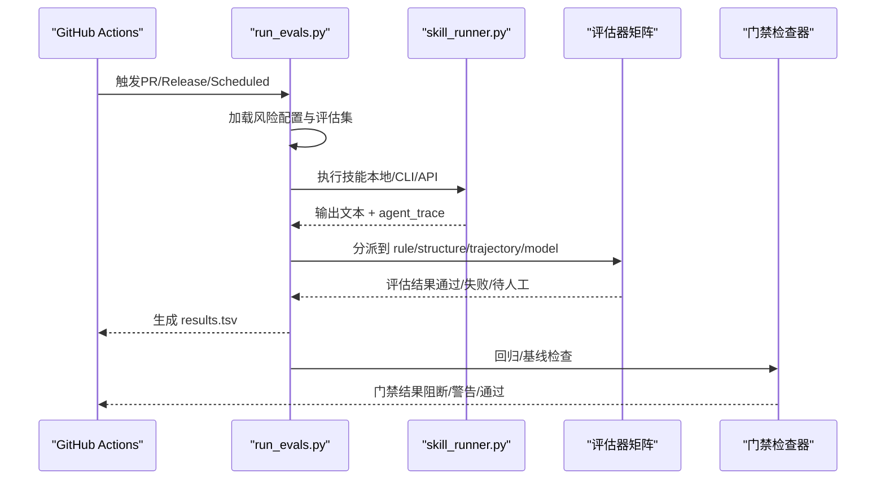
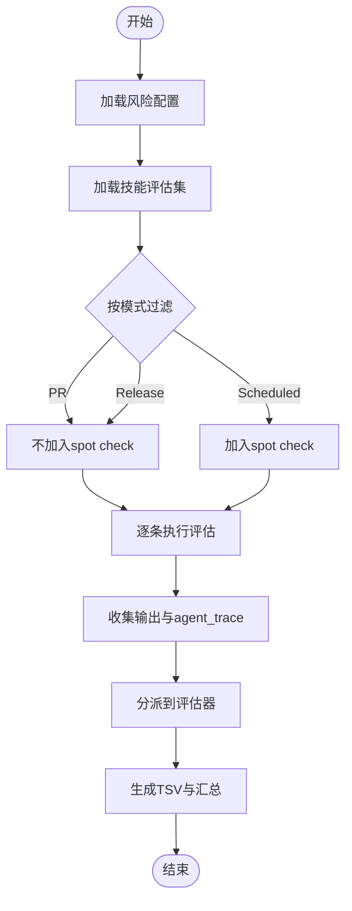
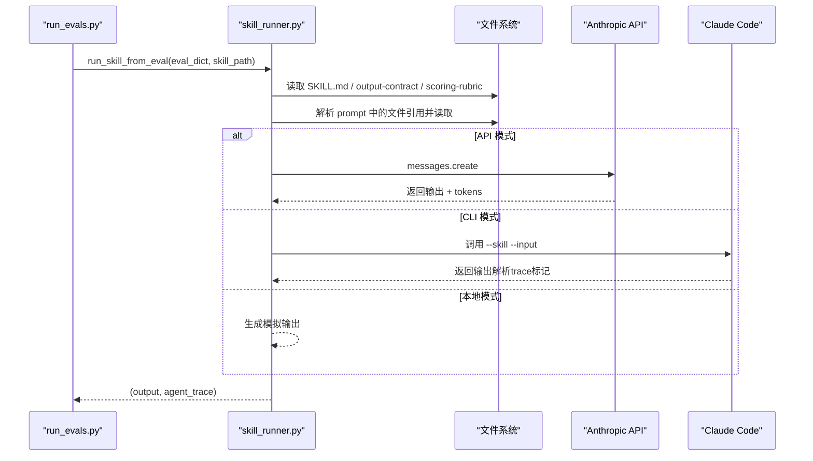
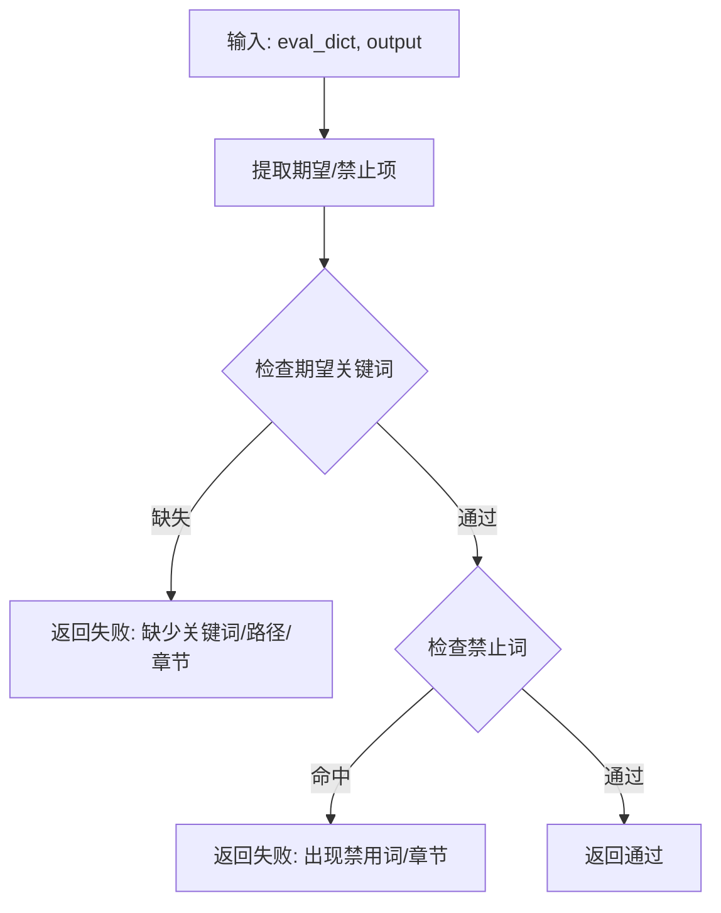
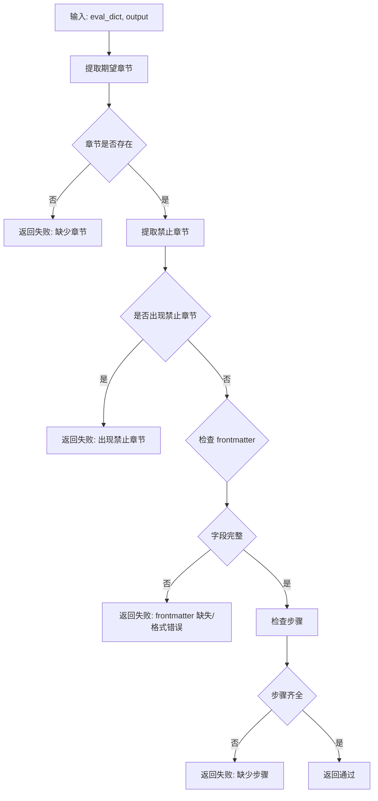
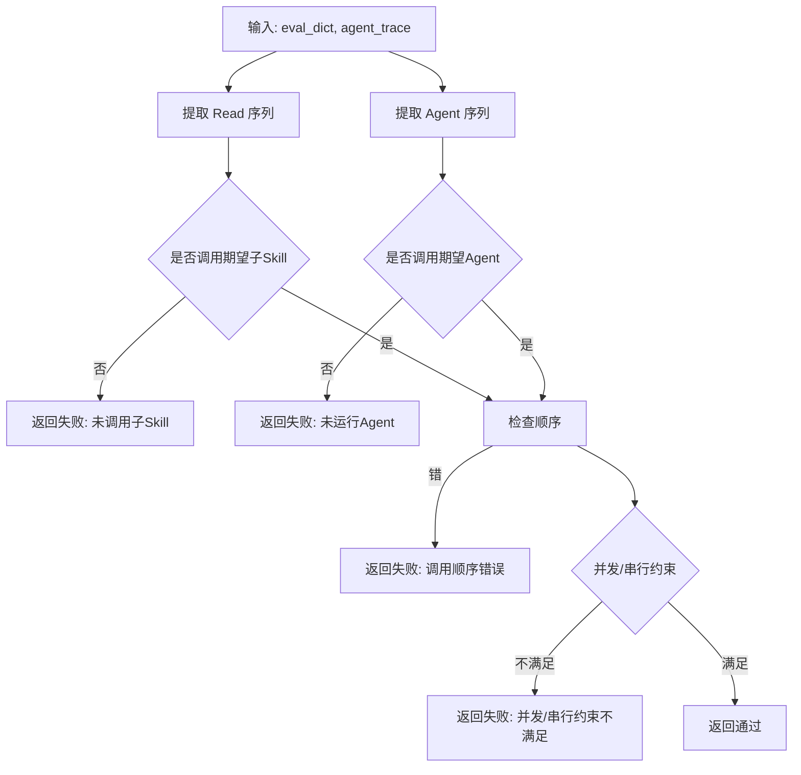
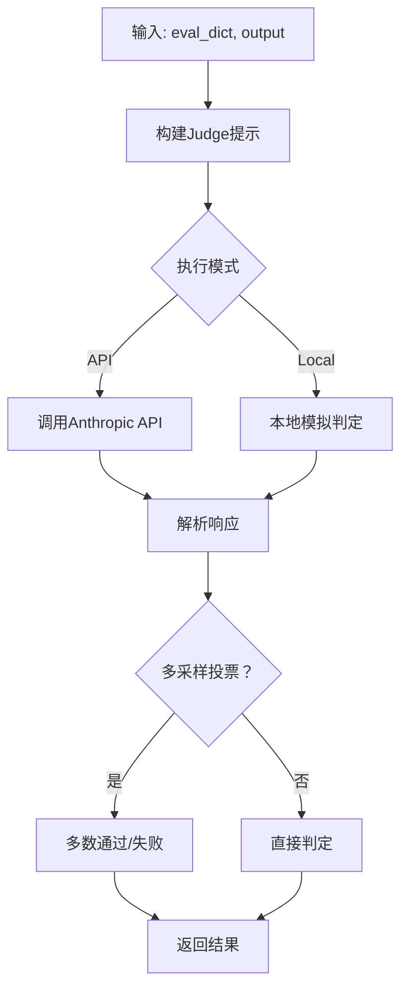
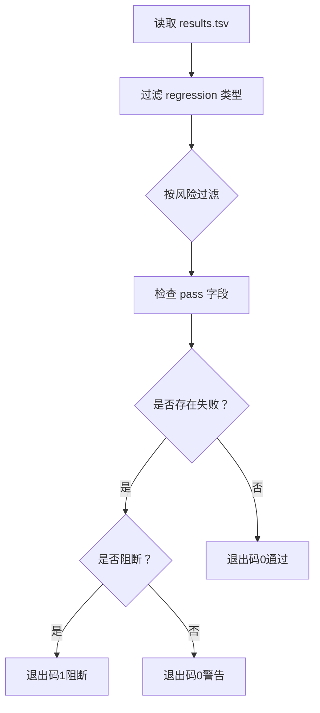
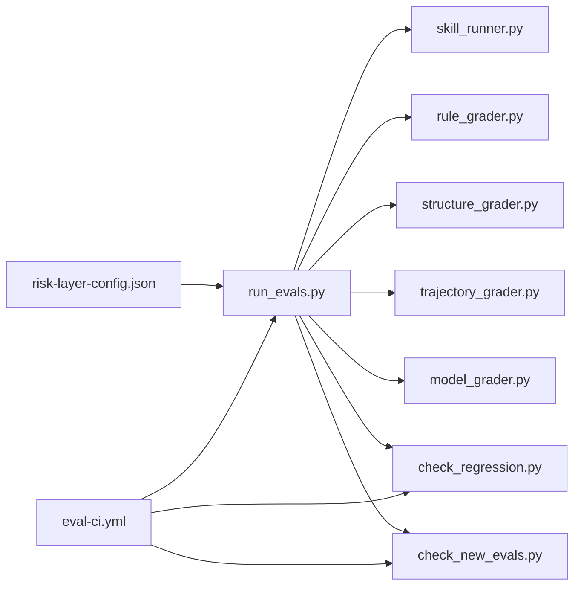

# 评估与监控系统

<cite>
**本文档引用的文件**
- [run_evals.py](file://plugins/frontend-team-toolkit/skill-engineering/scripts/run_evals.py)
- [check_regression.py](file://plugins/frontend-team-toolkit/skill-engineering/scripts/check_regression.py)
- [check_new_evals.py](file://plugins/frontend-team-toolkit/skill-engineering/scripts/check_new_evals.py)
- [skill_runner.py](file://plugins/frontend-team-toolkit/skill-engineering/scripts/skill_runner.py)
- [model_grader.py](file://plugins/frontend-team-toolkit/skill-engineering/scripts/graders/model_grader.py)
- [rule_grader.py](file://plugins/frontend-team-toolkit/skill-engineering/scripts/graders/rule_grader.py)
- [structure_grader.py](file://plugins/frontend-team-toolkit/skill-engineering/scripts/graders/structure_grader.py)
- [trajectory_grader.py](file://plugins/frontend-team-toolkit/skill-engineering/scripts/graders/trajectory_grader.py)
- [risk-layer-config.json](file://plugins/frontend-team-toolkit/skill-engineering/config/risk-layer-config.json)
- [evals.json](file://plugins/frontend-team-toolkit/skills/wechat-article-review/evals/evals.json)
- [weekly-regression.js](file://plugins/frontend-team-toolkit/skill-engineering/templates/new-skill/workflows/weekly-regression.js)
- [eval-ci.yml](file://.github/workflows/eval-ci.yml)
- [README.md](file://plugins/frontend-team-toolkit/skill-engineering/README.md)
</cite>

## 目录
1. [简介](#简介)
2. [项目结构](#项目结构)
3. [核心组件](#核心组件)
4. [架构总览](#架构总览)
5. [详细组件分析](#详细组件分析)
6. [依赖关系分析](#依赖关系分析)
7. [性能考虑](#性能考虑)
8. [故障排查指南](#故障排查指南)
9. [结论](#结论)
10. [附录](#附录)

## 简介
本系统是一套面向 Agent Skill 的多维度评估与监控体系，覆盖输出质量（模型评估）、结构合规（结构评估）、规则约束（规则评估）、执行轨迹（轨迹评估）四大维度。系统通过 CI/CD 流水线驱动自动化回归，结合风险分层策略与门禁红线，确保变更不会导致质量退化。同时提供回归检测、新评估基线检查、结果上传与通知等能力，形成闭环的质量保障。

## 项目结构
系统主要由以下模块构成：
- 评估执行器：根据 CI 模式筛选评估集并执行，产出结果
- 评估器集合：规则、结构、轨迹、模型四类评估器
- 技能执行器：封装本地/CLI/API 三种执行模式，采集输出与 agent_trace
- 门禁检查器：回归检测、新评估基线检查
- 配置中心：风险分层、门禁红线、通知策略
- CI/CD：GitHub Actions 工作流，驱动 PR/Release/Scheduled 场景
- 示例与模板：示例技能、动态编排脚本模板、Schema

图表来源
- [eval-ci.yml:36-208](file://.github/workflows/eval-ci.yml#L36-L208)
- [run_evals.py:135-174](file://plugins/frontend-team-toolkit/skill-engineering/scripts/run_evals.py#L135-L174)
- [skill_runner.py:308-356](file://plugins/frontend-team-toolkit/skill-engineering/scripts/skill_runner.py#L308-L356)
- [risk-layer-config.json:1-70](file://plugins/frontend-team-toolkit/skill-engineering/config/risk-layer-config.json#L1-L70)

章节来源
- [README.md:34-69](file://plugins/frontend-team-toolkit/skill-engineering/README.md#L34-L69)

## 核心组件
- 评估执行器（run_evals.py）
  - 解析风险分层配置，按模式过滤评估集
  - 调用技能执行器执行评估，分派至对应评估器
  - 生成 TSV 结果并打印汇总统计
- 技能执行器（skill_runner.py）
  - 支持本地模拟、Claude Code CLI、Anthropic API 三种执行模式
  - 构建上下文与提示词，采集 agent_trace
- 评估器
  - 规则评估器：关键词/路径/禁用词检查
  - 结构评估器：章节/步骤/YAML frontmatter 检查
  - 轨迹评估器：agent/skill 调用序列与并发/串行约束
  - 模型评估器：LLM Judge 语义判定，支持多采样投票
- 门禁检查器
  - 回归检查：识别 regression 类型失败并按风险级别处理
  - 新评估基线检查：确保新增评估具备基线记录
- 配置中心（risk-layer-config.json）
  - 定义 PR/Release/Scheduled 三种模式的风险过滤与阻断策略
  - 定义各类评估器的自动化程度与漂移风险等级
  - 定义门禁红线、通知策略

章节来源
- [run_evals.py:135-174](file://plugins/frontend-team-toolkit/skill-engineering/scripts/run_evals.py#L135-L174)
- [skill_runner.py:308-356](file://plugins/frontend-team-toolkit/skill-engineering/scripts/skill_runner.py#L308-L356)
- [rule_grader.py:41-92](file://plugins/frontend-team-toolkit/skill-engineering/scripts/graders/rule_grader.py#L41-L92)
- [structure_grader.py:63-122](file://plugins/frontend-team-toolkit/skill-engineering/scripts/graders/structure_grader.py#L63-L122)
- [trajectory_grader.py:59-139](file://plugins/frontend-team-toolkit/skill-engineering/scripts/graders/trajectory_grader.py#L59-L139)
- [model_grader.py:184-226](file://plugins/frontend-team-toolkit/skill-engineering/scripts/graders/model_grader.py#L184-L226)
- [check_regression.py:37-54](file://plugins/frontend-team-toolkit/skill-engineering/scripts/check_regression.py#L37-L54)
- [check_new_evals.py:45-83](file://plugins/frontend-team-toolkit/skill-engineering/scripts/check_new_evals.py#L45-L83)
- [risk-layer-config.json:1-70](file://plugins/frontend-team-toolkit/skill-engineering/config/risk-layer-config.json#L1-L70)

## 架构总览
系统采用“配置驱动 + 评估器矩阵”的架构：
- 配置驱动：通过 risk-layer-config.json 控制评估范围与门禁策略
- 评估器矩阵：rule/structure/trajectory/model 四类评估器并行或组合执行
- 执行链路：CI 触发 → 评估执行器 → 技能执行器 → 评估器 → 结果汇总 → 门禁检查 → 通知

图表来源
- [eval-ci.yml:66-141](file://.github/workflows/eval-ci.yml#L66-L141)
- [run_evals.py:135-174](file://plugins/frontend-team-toolkit/skill-engineering/scripts/run_evals.py#L135-L174)
- [skill_runner.py:308-356](file://plugins/frontend-team-toolkit/skill-engineering/scripts/skill_runner.py#L308-L356)
- [check_regression.py:57-96](file://plugins/frontend-team-toolkit/skill-engineering/scripts/check_regression.py#L57-L96)
- [check_new_evals.py:45-83](file://plugins/frontend-team-toolkit/skill-engineering/scripts/check_new_evals.py#L45-L83)

## 详细组件分析

### 评估执行器（run_evals.py）
- 功能要点
  - 加载风险分层配置，按模式过滤评估集
  - 随机加入 spot check（仅 Scheduled）
  - 调用技能执行器执行每个评估，收集输出与 agent_trace
  - 将评估结果写入 TSV，包含评估 ID、类型、风险、评估器、通过状态、原因、时间戳
  - 打印汇总统计（通过/失败/待人工）
- 关键流程
  - 配置加载与模式解析
  - 评估集过滤与随机 spot check
  - 逐条执行与结果聚合
  - TSV 写入与退出码

图表来源
- [run_evals.py:38-174](file://plugins/frontend-team-toolkit/skill-engineering/scripts/run_evals.py#L38-L174)

章节来源
- [run_evals.py:38-174](file://plugins/frontend-team-toolkit/skill-engineering/scripts/run_evals.py#L38-L174)

### 技能执行器（skill_runner.py）
- 功能要点
  - 支持三种执行模式：本地模拟、Claude Code CLI、Anthropic API
  - 构建技能上下文（SKILL.md、output-contract、scoring-rubric）
  - 解析 prompt 中的文件引用，读取并注入正文
  - 采集 agent_trace（API 模式包含 tokens 使用情况）
- 关键流程
  - 解析 frontmatter 与构建上下文
  - 选择执行模式并执行
  - 解析 trace 标记（CLI 模式）

图表来源
- [skill_runner.py:328-356](file://plugins/frontend-team-toolkit/skill-engineering/scripts/skill_runner.py#L328-L356)
- [skill_runner.py:199-257](file://plugins/frontend-team-toolkit/skill-engineering/scripts/skill_runner.py#L199-L257)
- [skill_runner.py:260-305](file://plugins/frontend-team-toolkit/skill-engineering/scripts/skill_runner.py#L260-L305)
- [skill_runner.py:84-104](file://plugins/frontend-team-toolkit/skill-engineering/scripts/skill_runner.py#L84-L104)

章节来源
- [skill_runner.py:31-81](file://plugins/frontend-team-toolkit/skill-engineering/scripts/skill_runner.py#L31-L81)
- [skill_runner.py:199-257](file://plugins/frontend-team-toolkit/skill-engineering/scripts/skill_runner.py#L199-L257)
- [skill_runner.py:260-305](file://plugins/frontend-team-toolkit/skill-engineering/scripts/skill_runner.py#L260-L305)
- [skill_runner.py:328-356](file://plugins/frontend-team-toolkit/skill-engineering/scripts/skill_runner.py#L328-L356)

### 评估器矩阵

#### 规则评估器（rule_grader.py）
- 评分算法
  - 从期望/禁止项中提取关键词，进行大小写不敏感匹配
  - 支持“必须包含/不得包含”“路径/章节”等模式
- 质量控制
  - 完全自动，无漂移风险
  - 严格基于文本匹配，结果稳定

图表来源
- [rule_grader.py:41-92](file://plugins/frontend-team-toolkit/skill-engineering/scripts/graders/rule_grader.py#L41-L92)

章节来源
- [rule_grader.py:41-92](file://plugins/frontend-team-toolkit/skill-engineering/scripts/graders/rule_grader.py#L41-L92)

#### 结构评估器（structure_grader.py）
- 评分算法
  - 提取期望/禁止章节，检查 Markdown 标题层级
  - 检查 YAML frontmatter 是否存在与字段完整性
  - 解析步骤列表并校验缺失步骤
- 质量控制
  - 完全自动，无漂移风险
  - 严格基于结构与格式规范

图表来源
- [structure_grader.py:63-122](file://plugins/frontend-team-toolkit/skill-engineering/scripts/graders/structure_grader.py#L63-L122)

章节来源
- [structure_grader.py:63-122](file://plugins/frontend-team-toolkit/skill-engineering/scripts/graders/structure_grader.py#L63-L122)

#### 轨迹评估器（trajectory_grader.py）
- 评分算法
  - 从 agent_trace 中提取 Read/Agent 调用序列
  - 校验是否调用指定子 Skill/Agent
  - 校验调用顺序（先/再/最后）
  - 校验并发/串行约束（Promise.all）
- 质量控制
  - 完全自动，无漂移风险
  - 依赖 trace 解析准确性

图表来源
- [trajectory_grader.py:59-139](file://plugins/frontend-team-toolkit/skill-engineering/scripts/graders/trajectory_grader.py#L59-L139)

章节来源
- [trajectory_grader.py:59-139](file://plugins/frontend-team-toolkit/skill-engineering/scripts/graders/trajectory_grader.py#L59-L139)

#### 模型评估器（model_grader.py）
- 评分算法
  - 构建 LLM Judge 提示，逐条对比 expected/must_not
  - 支持 API 模式与本地模拟
  - 支持多采样投票（提升稳定性）
- 质量控制
  - 半自动，存在漂移风险
  - 通过 sample_count 降低漂移影响
  - 通过 risk-layer-config.json 的 drift_risk 与 spot_check_rate 控制

图表来源
- [model_grader.py:184-226](file://plugins/frontend-team-toolkit/skill-engineering/scripts/graders/model_grader.py#L184-L226)
- [model_grader.py:71-94](file://plugins/frontend-team-toolkit/skill-engineering/scripts/graders/model_grader.py#L71-L94)

章节来源
- [model_grader.py:184-226](file://plugins/frontend-team-toolkit/skill-engineering/scripts/graders/model_grader.py#L184-L226)

### 门禁检查器

#### 回归检查（check_regression.py）
- 功能要点
  - 识别类型为 regression 的评估
  - 按风险级别（high/medium/all）过滤
  - 支持阻断或仅警告
- 关键流程
  - 读取 TSV 结果
  - 过滤 regression 且失败的记录
  - 根据配置决定退出码

图表来源
- [check_regression.py:37-96](file://plugins/frontend-team-toolkit/skill-engineering/scripts/check_regression.py#L37-L96)

章节来源
- [check_regression.py:37-96](file://plugins/frontend-team-toolkit/skill-engineering/scripts/check_regression.py#L37-L96)

#### 新评估基线检查（check_new_evals.py）
- 功能要点
  - 对比 evals.json 中的评估 ID 与 results.tsv 已有记录
  - 识别新增但未 baseline 的评估
  - 支持阻断或仅警告
- 关键流程
  - 读取评估集与现有 ID 集合
  - 计算差集得到新评估
  - 根据配置决定退出码

章节来源
- [check_new_evals.py:45-83](file://plugins/frontend-team-toolkit/skill-engineering/scripts/check_new_evals.py#L45-L83)

### 配置中心（risk-layer-config.json）
- 风险分层与模式
  - PR 模式：高/中风险，高风险回归必阻
  - Release 模式：全量风险，任何回归必阻
  - Scheduled 模式：按频率（weekly/monthly/quarterly）过滤，支持 spot check
- 评估器配置
  - rule/structure/trajectory：完全自动，漂移风险 none
  - model：半自动，支持 sample_count 与 spot_check_rate
  - human：人工，触发策略 release
- 门禁红线
  - block_on：regression_high_fail、new_eval_no_baseline、skill_change_no_baseline
  - warn_on：regression_medium_fail、capability_below_baseline、model_grader_fail
- 通知策略
  - Slack 频道、邮件接收人、PR 失败评论

章节来源
- [risk-layer-config.json:1-70](file://plugins/frontend-team-toolkit/skill-engineering/config/risk-layer-config.json#L1-L70)

### 示例与模板
- 示例技能（wechat-article-review）
  - evals.json 展示了多种评估类型（regression/capability）、grader 组合、风险等级与 artifact 引用
- 动态编排模板（weekly-regression.js）
  - 使用 Claude Code `/loop` 的自动化回归脚本，按风险过滤并报告问题

章节来源
- [evals.json:1-213](file://plugins/frontend-team-toolkit/skills/wechat-article-review/evals/evals.json#L1-L213)
- [weekly-regression.js:14-69](file://plugins/frontend-team-toolkit/skill-engineering/templates/new-skill/workflows/weekly-regression.js#L14-L69)

## 依赖关系分析
- 组件耦合
  - run_evals.py 依赖 skill_runner.py 与各评估器
  - skill_runner.py 依赖环境变量与外部服务（API/CLI）
  - 门禁检查器依赖 TSV 结果文件
  - CI 工作流串联上述组件
- 外部依赖
  - Anthropic API（model_grader、skill_runner API 模式）
  - Claude Code CLI（skill_runner CLI 模式）
  - GitHub Actions（CI 工作流）

图表来源
- [run_evals.py:25-35](file://plugins/frontend-team-toolkit/skill-engineering/scripts/run_evals.py#L25-L35)
- [eval-ci.yml:36-208](file://.github/workflows/eval-ci.yml#L36-L208)

章节来源
- [run_evals.py:25-35](file://plugins/frontend-team-toolkit/skill-engineering/scripts/run_evals.py#L25-L35)
- [eval-ci.yml:36-208](file://.github/workflows/eval-ci.yml#L36-L208)

## 性能考虑
- 评估器性能
  - rule/structure/trajectory 为纯文本/正则匹配，性能优异
  - model_grader 的 API 调用成本较高，可通过 sample_count 控制
- 执行模式选择
  - 本地模式用于快速验证与测试，避免外部依赖
  - API/CLI 模式用于生产回归，确保一致性
- CI 并行化
  - Release 模式可并行执行多个技能的评估
  - Scheduled 模式按频率裁剪评估集，减少负载

## 故障排查指南
- 常见问题
  - 评估结果为空或过短：model_grader 会返回失败并提示输出长度不足
  - API 调用失败：检查 API 密钥与网络连通性
  - Claude Code 未安装或超时：检查 CLI 路径与超时设置
  - 回归失败阻断合并：根据 risk-layer-config.json 的 block_on 设置定位失败项
  - 新评估未 baseline：检查 results.tsv 是否存在对应 ID
- 排查步骤
  - 本地复现：使用 run_evals.py 的本地模式与示例技能
  - 检查 trace：在 API/CLI 模式下查看 tokens 使用与 trace 标记
  - 校验配置：确认 risk-layer-config.json 的模式与门禁设置

章节来源
- [model_grader.py:195-196](file://plugins/frontend-team-toolkit/skill-engineering/scripts/graders/model_grader.py#L195-L196)
- [skill_runner.py:205-207](file://plugins/frontend-team-toolkit/skill-engineering/scripts/skill_runner.py#L205-L207)
- [skill_runner.py:298-302](file://plugins/frontend-team-toolkit/skill-engineering/scripts/skill_runner.py#L298-L302)
- [check_regression.py:82-92](file://plugins/frontend-team-toolkit/skill-engineering/scripts/check_regression.py#L82-L92)
- [check_new_evals.py:69-80](file://plugins/frontend-team-toolkit/skill-engineering/scripts/check_new_evals.py#L69-L80)

## 结论
该评估与监控系统以配置驱动为核心，通过规则、结构、轨迹、模型四类评估器实现多维度质量保障，并结合 CI/CD 的门禁机制确保变更质量可控。风险分层与门禁红线进一步提升了系统的可运维性与可靠性。建议在生产环境中启用 API/CLI 执行模式，合理配置 model_grader 的采样次数与 spot check 率，持续优化评估集覆盖度与回归频率。

## 附录

### CI/CD 集成与自动化执行
- 触发方式
  - PR：按 PR 变更检测受影响技能，执行 PR 模式评估
  - Push：在 main 分支上对所有技能执行 Release 模式评估
  - Schedule：按周/月/季度执行 Scheduled 模式评估
  - Manual：通过 workflow_dispatch 手动选择模式与技能
- 门禁策略
  - PR：高风险回归必阻，中风险回归仅警告
  - Release：任何回归必阻
  - Scheduled：按频率与 spot check 策略执行
- 通知与报告
  - 失败时在 PR 下评论、发送 Slack 通知
  - 上传评估结果为工作流制品

章节来源
- [eval-ci.yml:3-208](file://.github/workflows/eval-ci.yml#L3-L208)

### 配置示例与调优建议
- 风险分层配置
  - PR 模式：保留高/中风险，高风险回归必阻
  - Release 模式：全量风险，任何回归必阻
  - Scheduled 模式：按频率裁剪并加入 spot check
- 评估器调优
  - model_grader：在资源允许时提高 sample_count，降低漂移风险
  - rule/structure/trajectory：保持完全自动，确保稳定性
  - human：在 Release 时触发，作为最终仲裁
- 通知策略
  - 配置 Slack 频道与邮件接收人，确保问题及时可见

章节来源
- [risk-layer-config.json:1-70](file://plugins/frontend-team-toolkit/skill-engineering/config/risk-layer-config.json#L1-L70)