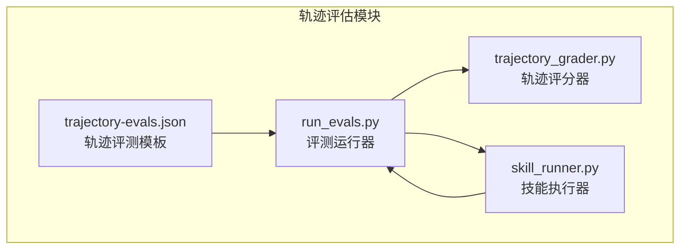
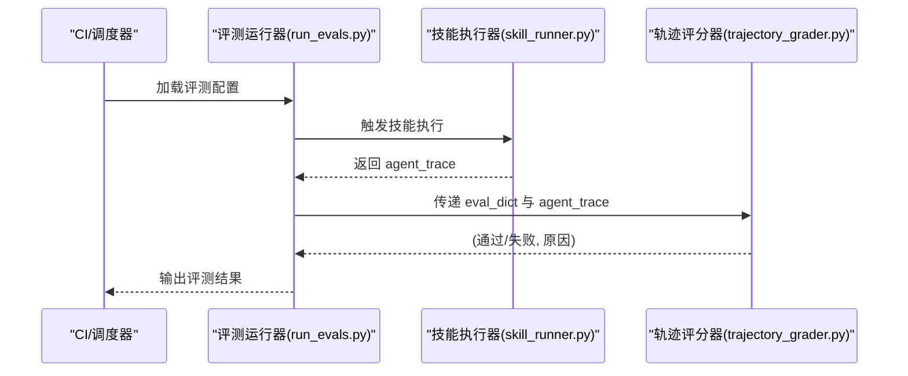
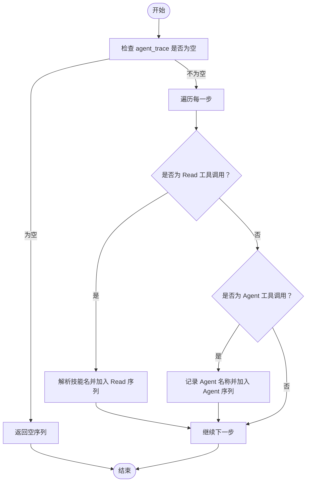
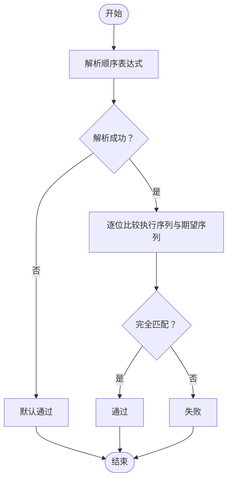
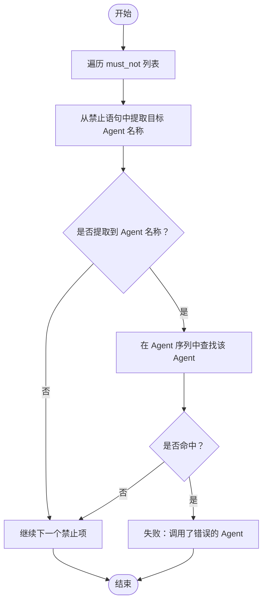
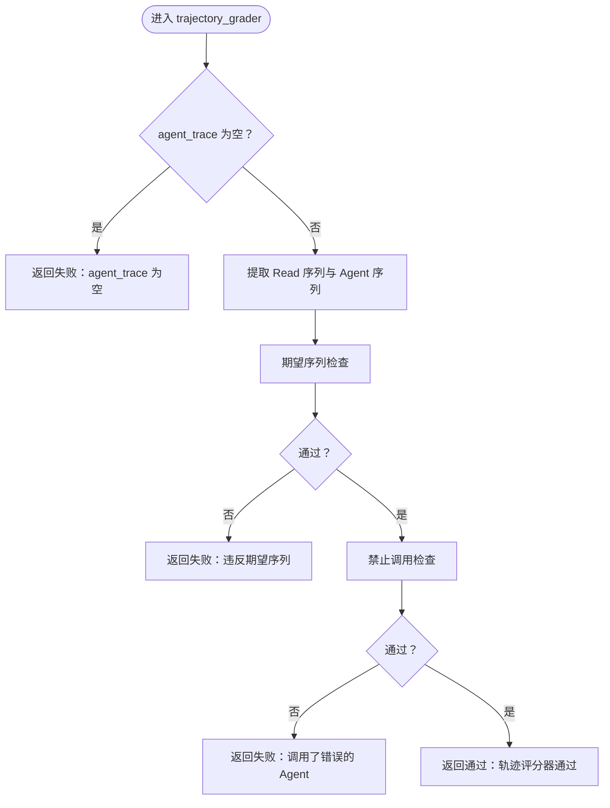
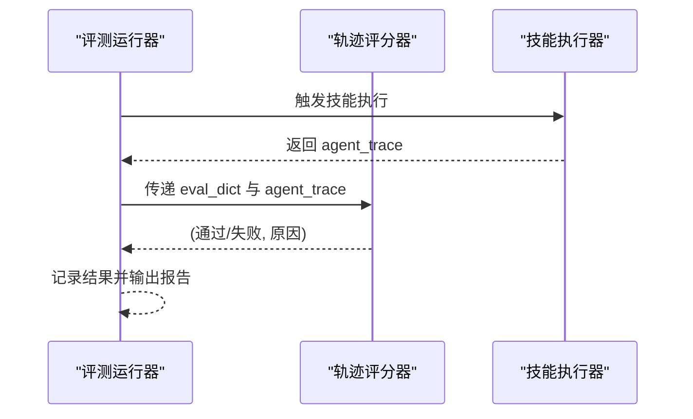
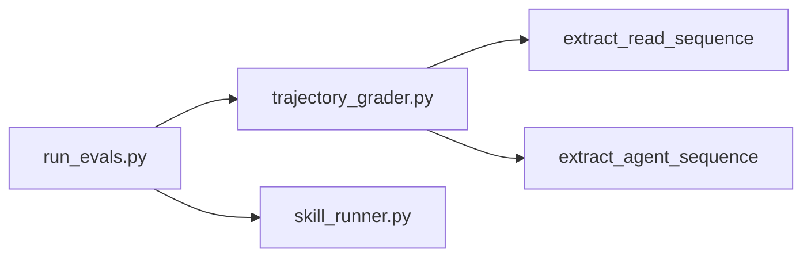

# 轨迹评估

<cite>
**本文引用的文件**
- [trajectory_grader.py](file://plugins/frontend-team-toolkit/skill-engineering/scripts/graders/trajectory_grader.py)
- [run_evals.py](file://plugins/frontend-team-toolkit/skill-engineering/scripts/run_evals.py)
- [skill_runner.py](file://plugins/frontend-team-toolkit/skill-engineering/scripts/skill_runner.py)
- [trajectory-evals.json](file://plugins/frontend-team-toolkit/skill-engineering/templates/new-skill/evals/trajectory-evals.json)
</cite>

## 目录
1. [引言](#引言)
2. [项目结构](#项目结构)
3. [核心组件](#核心组件)
4. [架构总览](#架构总览)
5. [详细组件分析](#详细组件分析)
6. [依赖关系分析](#依赖关系分析)
7. [性能考虑](#性能考虑)
8. [故障排除指南](#故障排除指南)
9. [结论](#结论)
10. [附录](#附录)

## 引言
本技术文档围绕“轨迹评估”模块展开，系统阐述其理论基础、实现方法与工程实践。轨迹评估的核心目标是通过对智能体执行过程的轨迹进行序列校验与行为模式分析，确保技能执行遵循预期流程（如先读取子技能、再按序调用 Agent、避免跳过关键步骤等），并在此基础上进行质量路径评估与异常检测。该模块在技能执行监控与质量保证中扮演关键角色，既可用于 PR 风险评估，也可用于发布前全量验证与定期回归。

## 项目结构
轨迹评估模块位于前端团队工具包插件内，采用脚本化与模板化的组合方式组织：
- 轨迹评分器：位于 graders 目录，负责解析执行轨迹并进行序列与规则校验。
- 评测运行器：位于 scripts 目录，统一调度各类评分器，支持不同运行模式（PR、发布、定时）。
- 技能执行器：负责从评测配置中触发具体技能执行，并回传执行轨迹。
- 评测模板：位于 templates/new-skill/evals，提供轨迹评测样例配置。

**图表来源**
- [trajectory_grader.py:1-163](file://plugins/frontend-team-toolkit/skill-engineering/scripts/graders/trajectory_grader.py#L1-L163)
- [run_evals.py:1-111](file://plugins/frontend-team-toolkit/skill-engineering/scripts/run_evals.py#L1-L111)
- [skill_runner.py](file://plugins/frontend-team-toolkit/skill-engineering/scripts/skill_runner.py)
- [trajectory-evals.json](file://plugins/frontend-team-toolkit/skill-engineering/templates/new-skill/evals/trajectory-evals.json)

**章节来源**
- [trajectory_grader.py:1-163](file://plugins/frontend-team-toolkit/skill-engineering/scripts/graders/trajectory_grader.py#L1-L163)
- [run_evals.py:1-111](file://plugins/frontend-team-toolkit/skill-engineering/scripts/run_evals.py#L1-L111)

## 核心组件
- 轨迹提取器
  - 提取 Read 工具调用序列：从执行轨迹中识别对子技能的读取顺序。
  - 提取 Agent 调用序列：从执行轨迹中识别按序 spawn 的 Agent 名称。
- 轨迹评分器
  - 期望序列检查：支持“先A再B最后C”等顺序表达式解析与匹配。
  - 禁止调用检查：支持“不得调用某 Agent”等禁止项检测。
  - 返回布尔结果与原因字符串，便于上层记录与告警。
- 评测运行器
  - 按模式选择评测集：PR 模式仅运行高/中风险；发布模式运行全部；定时模式按频率运行。
  - 统一调度各评分器：根据评测配置选择 rule/structure/trajectory/model/human 或复合评分器。
  - 支持随机抽查：对非高/中风险评测进行抽样补充，提升覆盖率。
- 技能执行器
  - 从评测配置中读取目标技能，驱动执行并返回 agent_trace。
  - 与轨迹评分器配合，形成端到端的轨迹评估闭环。

**章节来源**
- [trajectory_grader.py:15-56](file://plugins/frontend-team-toolkit/skill-engineering/scripts/graders/trajectory_grader.py#L15-L56)
- [trajectory_grader.py:59-139](file://plugins/frontend-team-toolkit/skill-engineering/scripts/graders/trajectory_grader.py#L59-L139)
- [run_evals.py:84-111](file://plugins/frontend-team-toolkit/skill-engineering/scripts/run_evals.py#L84-L111)

## 架构总览
下图展示了从评测配置到执行轨迹采集再到轨迹评分的整体流程：

**图表来源**
- [run_evals.py:84-111](file://plugins/frontend-team-toolkit/skill-engineering/scripts/run_evals.py#L84-L111)
- [skill_runner.py](file://plugins/frontend-team-toolkit/skill-engineering/scripts/skill_runner.py)
- [trajectory_grader.py:59-139](file://plugins/frontend-team-toolkit/skill-engineering/scripts/graders/trajectory_grader.py#L59-L139)

## 详细组件分析

### 轨迹提取器
- 功能职责
  - 从 agent_trace 中抽取 Read 序列：识别对子技能的读取顺序，便于后续“必须读取/按序读取”的校验。
  - 从 agent_trace 中抽取 Agent 序列：识别按序 spawn 的 Agent 名称，便于后续“先A再B最后C”等顺序校验。
- 复杂度分析
  - 时间复杂度：O(N)，N 为 agent_trace 步数。
  - 空间复杂度：O(K)，K 为提取出的序列长度。
- 边界处理
  - 对空轨迹直接返回空序列，避免后续校验误判。
  - 对路径解析失败时，保留默认行为以保证鲁棒性。

**图表来源**
- [trajectory_grader.py:15-38](file://plugins/frontend-team-toolkit/skill-engineering/scripts/graders/trajectory_grader.py#L15-L38)

**章节来源**
- [trajectory_grader.py:15-38](file://plugins/frontend-team-toolkit/skill-engineering/scripts/graders/trajectory_grader.py#L15-L38)

### 期望顺序校验
- 功能职责
  - 解析“先A再B最后C”等中文顺序表达式，将其映射为步骤顺序列表。
  - 将实际执行序列与期望顺序进行逐位比对，若不一致则判定失败。
- 实现要点
  - 使用正则解析顺序关键词，提取步骤名称。
  - 忽略大小写进行匹配，增强容错性。
  - 若无法解析表达式，采用“可解析即通过”的策略，避免误伤。
- 复杂度分析
  - 时间复杂度：O(M)，M 为表达式中步骤数量。
  - 空间复杂度：O(M)。

**图表来源**
- [trajectory_grader.py:41-56](file://plugins/frontend-team-toolkit/skill-engineering/scripts/graders/trajectory_grader.py#L41-L56)

**章节来源**
- [trajectory_grader.py:41-56](file://plugins/frontend-team-toolkit/skill-engineering/scripts/graders/trajectory_grader.py#L41-L56)

### 禁止调用校验
- 功能职责
  - 支持“不得跳过 X 直接 Y”等禁止项，防止关键步骤被跳过。
  - 支持“不得调用某 Agent”等禁止项，避免错误 Agent 被调用。
- 实现要点
  - 使用正则从禁止语句中提取目标 Agent 名称。
  - 在 Agent 序列中进行包含性检查，一旦命中即判定失败。
- 复杂度分析
  - 时间复杂度：O(P)，P 为禁止项数量；对每个禁止项内部检查序列 O(Q)，Q 为 Agent 序列长度。
  - 空间复杂度：O(1)。

**图表来源**
- [trajectory_grader.py:120-139](file://plugins/frontend-team-toolkit/skill-engineering/scripts/graders/trajectory_grader.py#L120-L139)

**章节来源**
- [trajectory_grader.py:120-139](file://plugins/frontend-team-toolkit/skill-engineering/scripts/graders/trajectory_grader.py#L120-L139)

### 轨迹评分器主流程
- 功能职责
  - 统一入口：接收 eval_dict 与 agent_trace，返回 (通过/失败, 原因)。
  - 调用轨迹提取器生成 Read 序列与 Agent 序列。
  - 依次执行“期望序列检查”“禁止调用检查”，任一失败即终止并返回失败原因。
  - 全部通过则返回成功与默认通过信息。
- 错误处理
  - 对空轨迹直接返回失败与提示信息。
  - 对不可解析的顺序表达式采用默认通过策略，避免误伤。
- 复杂度分析
  - 总体时间复杂度：O(N + M + P·Q)。
  - 空间复杂度：O(K)。

**图表来源**
- [trajectory_grader.py:59-139](file://plugins/frontend-team-toolkit/skill-engineering/scripts/graders/trajectory_grader.py#L59-L139)

**章节来源**
- [trajectory_grader.py:59-139](file://plugins/frontend-team-toolkit/skill-engineering/scripts/graders/trajectory_grader.py#L59-L139)

### 评测运行器与技能执行器
- 评测运行器
  - 模式选择：PR 模式仅运行高/中风险评测；发布模式运行全部；定时模式按频率运行。
  - 评分器分派：根据评测配置选择对应评分器或复合评分器。
  - 随机抽查：对非高/中风险评测进行抽样补充，提升覆盖率。
- 技能执行器
  - 从评测配置中读取目标技能，驱动执行并返回 agent_trace。
  - 与轨迹评分器配合，形成端到端的轨迹评估闭环。

**图表来源**
- [run_evals.py:84-111](file://plugins/frontend-team-toolkit/skill-engineering/scripts/run_evals.py#L84-L111)
- [skill_runner.py](file://plugins/frontend-team-toolkit/skill-engineering/scripts/skill_runner.py)
- [trajectory_grader.py:59-139](file://plugins/frontend-team-toolkit/skill-engineering/scripts/graders/trajectory_grader.py#L59-L139)

**章节来源**
- [run_evals.py:84-111](file://plugins/frontend-team-toolkit/skill-engineering/scripts/run_evals.py#L84-L111)

## 依赖关系分析
- 模块耦合
  - 评测运行器与轨迹评分器通过函数接口耦合，参数为字典与轨迹列表。
  - 评测运行器与技能执行器通过执行结果耦合，后者提供 agent_trace。
- 依赖链
  - 评测运行器依赖轨迹评分器与技能执行器。
  - 轨迹评分器依赖轨迹提取器（内部函数）。
- 可能的循环依赖
  - 当前模块无循环依赖，结构清晰。
- 外部依赖
  - Python 标准库（正则、随机等）。
  - 评测模板提供配置样例，指导如何编写期望与禁止项。

**图表来源**
- [run_evals.py:25-31](file://plugins/frontend-team-toolkit/skill-engineering/scripts/run_evals.py#L25-L31)
- [trajectory_grader.py:15-38](file://plugins/frontend-team-toolkit/skill-engineering/scripts/graders/trajectory_grader.py#L15-L38)

**章节来源**
- [run_evals.py:25-31](file://plugins/frontend-team-toolkit/skill-engineering/scripts/run_evals.py#L25-L31)
- [trajectory_grader.py:15-38](file://plugins/frontend-team-toolkit/skill-engineering/scripts/graders/trajectory_grader.py#L15-L38)

## 性能考虑
- 时间复杂度优化
  - 轨迹提取与序列校验均为线性扫描，整体复杂度可控。
  - 顺序解析与禁止项检查可按需扩展，建议在评测配置中尽量明确与简洁。
- 空间复杂度优化
  - 仅存储必要序列与中间变量，避免额外缓存。
- 并发与批处理
  - 评测运行器支持批量评测，可在 CI 中并行执行多个评测任务。
- 可观测性
  - 建议在 CI 日志中输出详细的轨迹与评分原因，便于定位问题。

## 故障排除指南
- 常见问题与排查
  - agent_trace 为空：检查技能执行器是否正确返回轨迹，确认评测配置指向正确的技能。
  - 期望顺序解析失败：检查中文顺序表达式格式，确保使用“先/再/最后”等关键词。
  - 禁止调用误报：检查禁止语句中的 Agent 名称是否与实际调用一致，注意大小写与标点。
  - 评测未覆盖：确认是否处于 PR/定时模式，必要时启用随机抽查或切换到发布模式。
- 建议的日志与调试
  - 在 CI 中打印 eval_dict 与 agent_trace 的关键字段，辅助定位问题。
  - 对失败用例生成最小复现，便于回归测试。

**章节来源**
- [trajectory_grader.py:70-71](file://plugins/frontend-team-toolkit/skill-engineering/scripts/graders/trajectory_grader.py#L70-L71)
- [trajectory_grader.py:44-47](file://plugins/frontend-team-toolkit/skill-engineering/scripts/graders/trajectory_grader.py#L44-L47)
- [run_evals.py:76-81](file://plugins/frontend-team-toolkit/skill-engineering/scripts/run_evals.py#L76-L81)

## 结论
轨迹评估模块通过“轨迹提取—规则校验—结果输出”的流水线，实现了对技能执行过程的序列合规性与行为模式的自动化评估。它在 PR 风险控制、发布质量把关与定期回归中发挥关键作用。建议在实际使用中：
- 明确编写期望顺序与禁止项，保持评测配置简洁清晰；
- 结合 CI 模式与随机抽查，平衡覆盖率与成本；
- 强化可观测性与日志输出，提升问题定位效率。

## 附录
- 示例与模板
  - 轨迹评测模板提供了典型配置样例，可作为新评测编写的参考。
  - 测试用例展示了通过与失败场景，便于理解评分器的行为边界。

**章节来源**
- [trajectory-evals.json](file://plugins/frontend-team-toolkit/skill-engineering/templates/new-skill/evals/trajectory-evals.json)
- [trajectory_grader.py:142-163](file://plugins/frontend-team-toolkit/skill-engineering/scripts/graders/trajectory_grader.py#L142-L163)