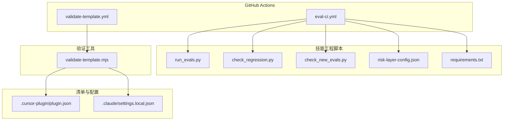
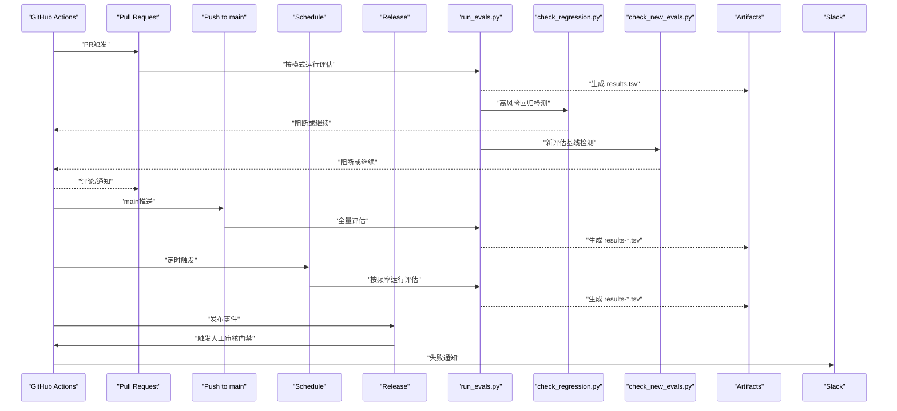
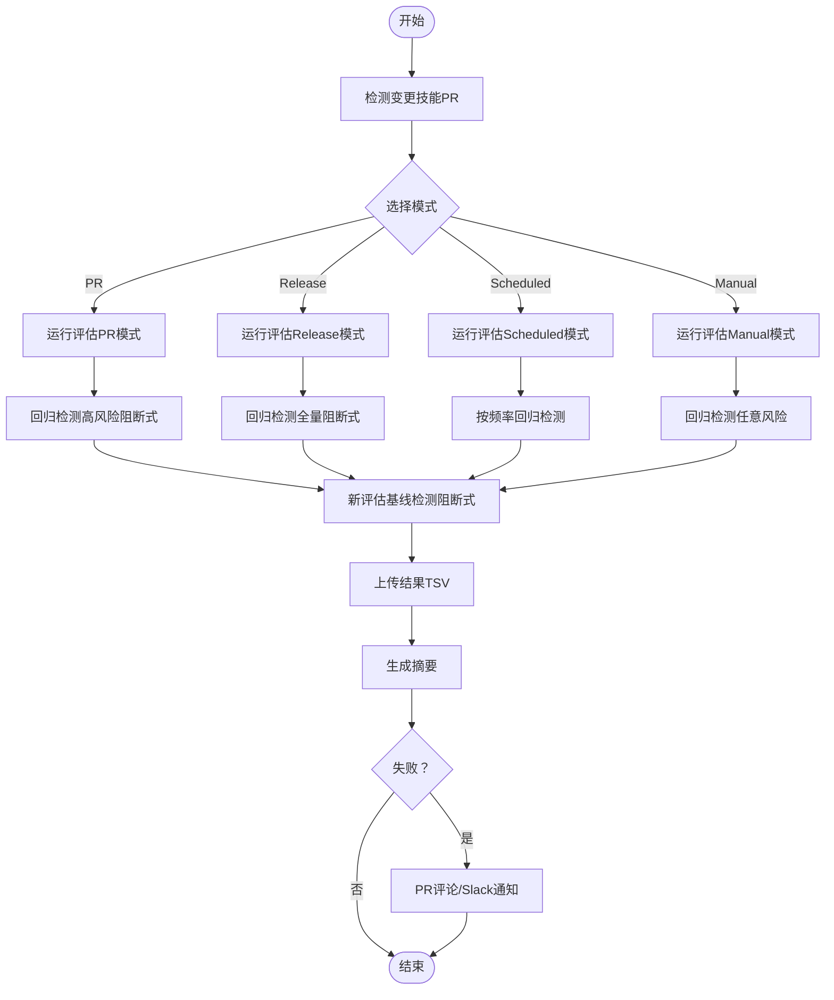
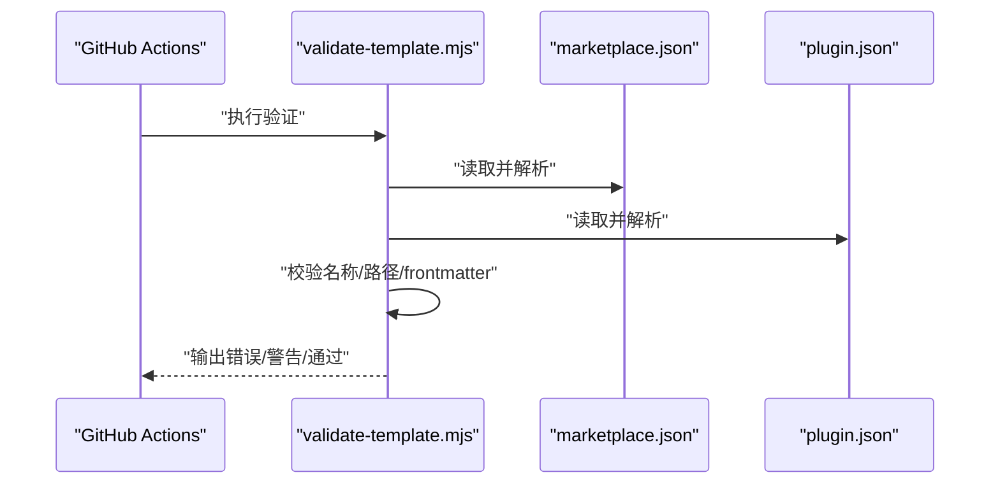
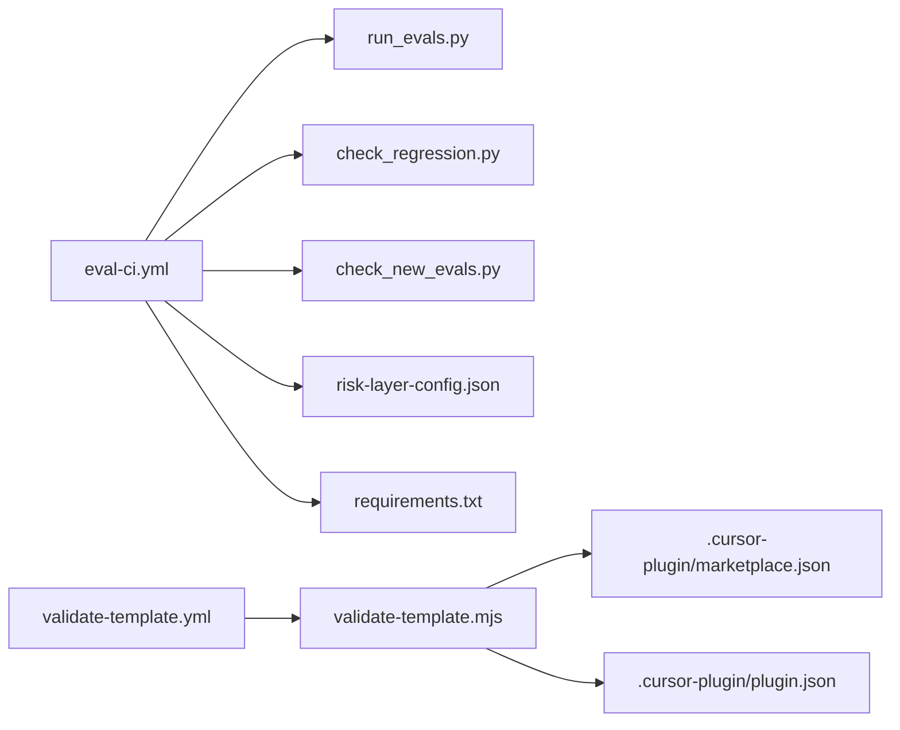

# CI/CD配置

<cite>
**本文引用的文件**
- [eval-ci.yml](file://.github/workflows/eval-ci.yml)
- [validate-template.yml](file://.github/workflows/validate-template.yml)
- [validate-template.mjs](file://scripts/validate-template.mjs)
- [run_evals.py](file://plugins/frontend-team-toolkit/skill-engineering/scripts/run_evals.py)
- [check_regression.py](file://plugins/frontend-team-toolkit/skill-engineering/scripts/check_regression.py)
- [check_new_evals.py](file://plugins/frontend-team-toolkit/skill-engineering/scripts/check_new_evals.py)
- [risk-layer-config.json](file://plugins/frontend-team-toolkit/skill-engineering/config/risk-layer-config.json)
- [requirements.txt](file://plugins/frontend-team-toolkit/skill-engineering/requirements.txt)
- [plugin.json](file://plugins/frontend-team-toolkit/.cursor-plugin/plugin.json)
- [.claude/settings.local.json](file://.claude/settings.local.json)
</cite>

## 目录
1. [简介](#简介)
2. [项目结构](#项目结构)
3. [核心组件](#核心组件)
4. [架构总览](#架构总览)
5. [详细组件分析](#详细组件分析)
6. [依赖关系分析](#依赖关系分析)
7. [性能考虑](#性能考虑)
8. [故障排除指南](#故障排除指南)
9. [结论](#结论)
10. [附录](#附录)

## 简介
本指南面向前端团队市场插件生态的CI/CD配置，重点覆盖以下方面：
- GitHub Actions 工作流配置与执行策略
- 评估CI工作流（eval-ci.yml）的触发条件、执行步骤、环境配置与缓存策略
- 模板验证工作流（validate-template.yml）的触发与验证逻辑
- 脚本验证工具 validate-template.mjs 的使用方法与配置选项
- 构建触发条件、分支保护规则与部署策略建议
- 自定义工作流与新增验证步骤的方法

## 项目结构
该仓库围绕“技能工程”与“市场清单”两条主线组织CI/CD：
- GitHub Actions 工作流位于 .github/workflows/ 目录
- 评估运行与回归检测脚本位于 plugins/frontend-team-toolkit/skill-engineering/scripts/
- 市场清单验证脚本位于 scripts/validate-template.mjs
- 风险层配置位于 plugins/frontend-team-toolkit/skill-engineering/config/risk-layer-config.json
- 插件清单与权限配置位于 .cursor-plugin/plugin.json 与 .claude/settings.local.json

图表来源
- [eval-ci.yml:1-208](file://.github/workflows/eval-ci.yml#L1-L208)
- [validate-template.yml:1-33](file://.github/workflows/validate-template.yml#L1-L33)
- [run_evals.py:1-227](file://plugins/frontend-team-toolkit/skill-engineering/scripts/run_evals.py#L1-L227)
- [check_regression.py:1-100](file://plugins/frontend-team-toolkit/skill-engineering/scripts/check_regression.py#L1-L100)
- [check_new_evals.py:1-87](file://plugins/frontend-team-toolkit/skill-engineering/scripts/check_new_evals.py#L1-L87)
- [risk-layer-config.json:1-70](file://plugins/frontend-team-toolkit/skill-engineering/config/risk-layer-config.json#L1-L70)
- [requirements.txt:1-13](file://plugins/frontend-team-toolkit/skill-engineering/requirements.txt#L1-L13)
- [validate-template.mjs:1-382](file://scripts/validate-template.mjs#L1-L382)
- [plugin.json:1-23](file://plugins/frontend-team-toolkit/.cursor-plugin/plugin.json#L1-L23)
- [.claude/settings.local.json:1-21](file://.claude/settings.local.json#L1-L21)

章节来源
- [eval-ci.yml:1-208](file://.github/workflows/eval-ci.yml#L1-L208)
- [validate-template.yml:1-33](file://.github/workflows/validate-template.yml#L1-L33)
- [validate-template.mjs:1-382](file://scripts/validate-template.mjs#L1-L382)

## 核心组件
- 评估CI工作流（eval-ci.yml）
  - 触发条件：拉取请求、推送至主分支、定时任务（周/月/季度）、发布事件、手动触发
  - 执行步骤：Python环境准备、依赖安装、变更技能检测、按模式运行评估、回归检测、新评估基线检测、结果上传与摘要生成、失败通知
  - 输出：评估结果TSV、作业输出（回归通过状态、总评估数）
- 模板验证工作流（validate-template.yml）
  - 触发条件：对 plugins、.cursor-plugin 与验证脚本的变更
  - 执行步骤：Node.js环境准备、运行 validate-template.mjs
- 验证工具（validate-template.mjs）
  - 功能：校验市场清单与插件清单一致性、路径安全与存在性、组件frontmatter完整性、可选hooks/mcp文件提示
- 评估运行器（run_evals.py）
  - 功能：根据模式（PR/Release/Scheduled）过滤评估集、调用评分器执行评估、生成TSV结果
- 回归检测（check_regression.py）
  - 功能：基于TSV结果筛选回归类评估并判定是否阻断合并
- 新评估基线检测（check_new_evals.py）
  - 功能：确保新增评估在基线中已有记录，必要时阻断合并
- 风险层配置（risk-layer-config.json）
  - 功能：定义不同模式下的风险过滤、阻断策略、随机抽查等

章节来源
- [eval-ci.yml:1-208](file://.github/workflows/eval-ci.yml#L1-L208)
- [validate-template.yml:1-33](file://.github/workflows/validate-template.yml#L1-L33)
- [validate-template.mjs:1-382](file://scripts/validate-template.mjs#L1-L382)
- [run_evals.py:1-227](file://plugins/frontend-team-toolkit/skill-engineering/scripts/run_evals.py#L1-L227)
- [check_regression.py:1-100](file://plugins/frontend-team-toolkit/skill-engineering/scripts/check_regression.py#L1-L100)
- [check_new_evals.py:1-87](file://plugins/frontend-team-toolkit/skill-engineering/scripts/check_new_evals.py#L1-L87)
- [risk-layer-config.json:1-70](file://plugins/frontend-team-toolkit/skill-engineering/config/risk-layer-config.json#L1-L70)

## 架构总览
下图展示评估CI工作流从触发到产出的关键交互：

图表来源
- [eval-ci.yml:36-208](file://.github/workflows/eval-ci.yml#L36-L208)
- [run_evals.py:135-174](file://plugins/frontend-team-toolkit/skill-engineering/scripts/run_evals.py#L135-L174)
- [check_regression.py:37-54](file://plugins/frontend-team-toolkit/skill-engineering/scripts/check_regression.py#L37-L54)
- [check_new_evals.py:45-83](file://plugins/frontend-team-toolkit/skill-engineering/scripts/check_new_evals.py#L45-L83)

## 详细组件分析

### 评估CI工作流（eval-ci.yml）
- 触发条件
  - 拉取请求：仅针对 plugins/frontend-team-toolkit/skills 与 skill-engineering 变更
  - 推送：仅针对主分支的上述路径变更
  - 定时：每周一9点、每月1日9点、每季度首月1日9点
  - 发布：当发布被创建时
  - 手动：workflow_dispatch 输入技能名与模式（pr/release/scheduled）
- 环境与依赖
  - Python 3.11 环境
  - 从 requirements.txt 安装依赖（含可选LLM评分支持）
- 执行步骤
  - PR模式：检测变更技能，运行指定或默认技能评估，统计总评估数
  - Release模式：遍历所有技能运行评估
  - Scheduled模式：根据cron确定频率（weekly/monthly/quarterly），运行对应风险集
  - Manual模式：按输入参数运行
  - 回归检测（高风险）：阻断式；中风险：非阻断式
  - 新评估基线检测：阻断式
  - 结果上传与摘要生成
  - 失败时在PR评论与Slack通知
- 作业输出
  - regression_pass：回归检测通过状态
  - total_evals：本次运行的评估总数

图表来源
- [eval-ci.yml:56-158](file://.github/workflows/eval-ci.yml#L56-L158)

章节来源
- [eval-ci.yml:1-208](file://.github/workflows/eval-ci.yml#L1-L208)

### 模板验证工作流（validate-template.yml）
- 触发条件：对 plugins、.cursor-plugin 与验证脚本的变更
- 执行步骤：
  - 检出代码
  - 设置Node.js 20环境
  - 运行 validate-template.mjs
- 验证范围：市场清单与插件清单一致性、路径安全与存在性、组件frontmatter完整性、hooks/mcp文件提示

图表来源
- [validate-template.yml:19-33](file://.github/workflows/validate-template.yml#L19-L33)
- [validate-template.mjs:250-359](file://scripts/validate-template.mjs#L250-L359)

章节来源
- [validate-template.yml:1-33](file://.github/workflows/validate-template.yml#L1-L33)
- [validate-template.mjs:1-382](file://scripts/validate-template.mjs#L1-L382)

### 脚本验证工具（validate-template.mjs）
- 主要功能
  - 解析市场清单与插件清单，校验名称格式与字段完整性
  - 校验插件目录与引用路径的安全性与存在性
  - 校验组件frontmatter（规则、技能、代理、命令）的必需字段
  - 对hooks.json与mcp.json的存在性给出警告提示
- 关键函数
  - pathExists/readJsonFile：文件存在性与JSON解析
  - parseFrontmatter：frontmatter解析
  - validateReferencedPath：相对路径安全与存在性校验
  - validateComponentFrontmatter：组件frontmatter校验
  - summarizeAndExit：汇总输出与退出码控制
- 使用方式
  - 在validate-template.yml中作为Node.js步骤执行
  - 无需额外参数，自动扫描 .cursor-plugin/marketplace.json 与各插件目录

章节来源
- [validate-template.mjs:1-382](file://scripts/validate-template.mjs#L1-L382)

### 评估运行器（run_evals.py）
- 模式与风险过滤
  - PR模式：高/中风险，高风险回归阻断
  - Release模式：全量风险，任意回归阻断
  - Scheduled模式：按频率（weekly/monthly/quarterly）过滤，并可在低风险中加入随机抽查
- 评分器类型
  - rule、structure、trajectory、model、human，以及复合评分器（如 rule+human）
- 输出
  - 生成TSV结果文件，包含评估ID、类型、风险、评分器、通过状态、原因、时间戳等

章节来源
- [run_evals.py:1-227](file://plugins/frontend-team-toolkit/skill-engineering/scripts/run_evals.py#L1-L227)
- [risk-layer-config.json:1-70](file://plugins/frontend-team-toolkit/skill-engineering/config/risk-layer-config.json#L1-L70)

### 回归检测（check_regression.py）
- 功能：从TSV中筛选类型包含“regression”的记录，按风险级别过滤并判定失败
- 行为：可配置阻断策略（block），失败时退出码1，成功时退出码0

章节来源
- [check_regression.py:1-100](file://plugins/frontend-team-toolkit/skill-engineering/scripts/check_regression.py#L1-L100)

### 新评估基线检测（check_new_evals.py）
- 功能：对比评估清单中的ID与现有TSV结果，发现未在基线中的新评估
- 行为：可配置阻断策略（block），未找到基线时退出码1，找到则退出码0

章节来源
- [check_new_evals.py:1-87](file://plugins/frontend-team-toolkit/skill-engineering/scripts/check_new_evals.py#L1-L87)

## 依赖关系分析
- 工作流与脚本耦合
  - eval-ci.yml 依赖 run_evals.py、check_regression.py、check_new_evals.py 与 risk-layer-config.json
  - validate-template.yml 依赖 validate-template.mjs
- 外部依赖
  - 评估运行可选依赖：anthropic（用于模型评分器）
- 清单与配置
  - marketplace.json 与各插件的 .cursor-plugin/plugin.json 由 validate-template.mjs 校验

图表来源
- [eval-ci.yml:36-208](file://.github/workflows/eval-ci.yml#L36-L208)
- [validate-template.yml:19-33](file://.github/workflows/validate-template.yml#L19-L33)
- [run_evals.py:1-227](file://plugins/frontend-team-toolkit/skill-engineering/scripts/run_evals.py#L1-L227)
- [check_regression.py:1-100](file://plugins/frontend-team-toolkit/skill-engineering/scripts/check_regression.py#L1-L100)
- [check_new_evals.py:1-87](file://plugins/frontend-team-toolkit/skill-engineering/scripts/check_new_evals.py#L1-L87)
- [risk-layer-config.json:1-70](file://plugins/frontend-team-toolkit/skill-engineering/config/risk-layer-config.json#L1-L70)
- [requirements.txt:1-13](file://plugins/frontend-team-toolkit/skill-engineering/requirements.txt#L1-L13)
- [validate-template.mjs:250-359](file://scripts/validate-template.mjs#L250-L359)
- [plugin.json:1-23](file://plugins/frontend-team-toolkit/.cursor-plugin/plugin.json#L1-L23)

章节来源
- [eval-ci.yml:36-208](file://.github/workflows/eval-ci.yml#L36-L208)
- [validate-template.yml:19-33](file://.github/workflows/validate-template.yml#L19-L33)

## 性能考虑
- 评估范围控制
  - PR模式仅运行高/中风险评估，减少运行时间
  - Scheduled模式按频率与抽查策略控制评估数量
- 依赖安装
  - 从 requirements.txt 安装依赖，避免重复安装
- 结果缓存
  - 当前工作流未显式配置缓存；可在后续优化中引入缓存以加速依赖安装与评估产物复用
- 并行化
  - 可考虑将多技能评估并行化（需注意资源限制）

## 故障排除指南
- 评估CI失败
  - 查看CI结果摘要与PR评论，定位失败原因（回归失败、新评估未基线）
  - 检查Slack通知链接，获取详细日志
- 模板验证失败
  - 根据validate-template.mjs输出的错误信息修正市场清单或插件清单字段
  - 确保引用路径为安全的相对路径且文件存在
- 权限问题
  - 若涉及Git操作或外部服务集成，检查 .claude/settings.local.json 中的权限配置

章节来源
- [eval-ci.yml:159-184](file://.github/workflows/eval-ci.yml#L159-L184)
- [validate-template.mjs:361-379](file://scripts/validate-template.mjs#L361-L379)
- [.claude/settings.local.json:1-21](file://.claude/settings.local.json#L1-L21)

## 结论
本CI/CD体系通过评估CI与模板验证双轨保障质量与一致性：
- 评估CI在PR、Release与Scheduled场景下分别采用不同的风险过滤与阻断策略，确保回归稳定与新评估有基线
- 模板验证确保市场清单与插件清单的规范性与可追溯性
- 建议结合缓存与并行化进一步提升效率，并完善分支保护与发布门禁策略

## 附录

### 构建触发条件与分支保护建议
- 触发条件
  - PR：仅在技能与工程脚本变更时触发评估CI
  - Push：主分支推送时全量评估
  - Schedule：按周/月/季度触发
  - Release：发布事件触发人工审核门禁
- 分支保护
  - 保护主分支：要求评估CI通过、模板验证通过
  - 强制PR评论与Slack通知：便于快速响应失败

章节来源
- [eval-ci.yml:3-35](file://.github/workflows/eval-ci.yml#L3-L35)
- [validate-template.yml:3-17](file://.github/workflows/validate-template.yml#L3-L17)

### 部署策略
- 发布前门禁
  - Release事件触发人工审核Issue，待审核通过后方可合并
- 结果与通知
  - 上传评估结果TSV供审计
  - 失败时在PR评论与Slack通知

章节来源
- [eval-ci.yml:186-208](file://.github/workflows/eval-ci.yml#L186-L208)

### 自定义工作流与新增验证步骤
- 自定义评估模式
  - 在 risk-layer-config.json 中扩展模式与风险过滤策略
  - 在 run_evals.py 中扩展评分器或运行逻辑
- 新增验证步骤
  - 在 validate-template.mjs 中增加新的校验逻辑（如新增字段、文件存在性）
  - 在 validate-template.yml 中调整触发路径或步骤顺序
- 缓存策略
  - 在 eval-ci.yml 中引入缓存步骤以加速依赖安装与评估产物复用

章节来源
- [risk-layer-config.json:1-70](file://plugins/frontend-team-toolkit/skill-engineering/config/risk-layer-config.json#L1-L70)
- [run_evals.py:1-227](file://plugins/frontend-team-toolkit/skill-engineering/scripts/run_evals.py#L1-L227)
- [validate-template.mjs:1-382](file://scripts/validate-template.mjs#L1-L382)
- [eval-ci.yml:43-158](file://.github/workflows/eval-ci.yml#L43-L158)