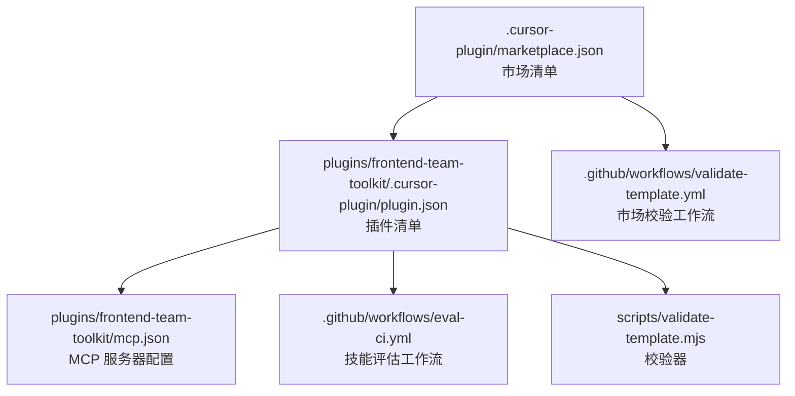
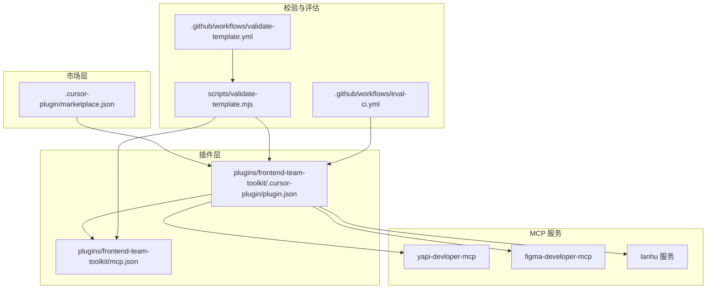
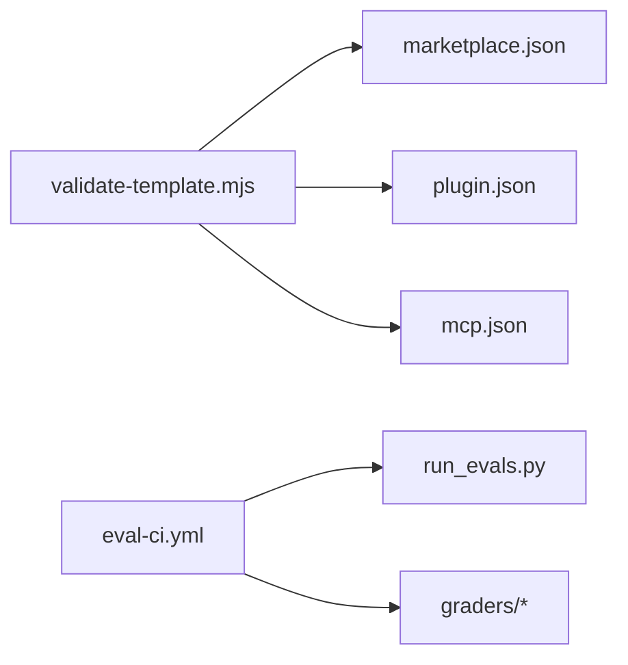
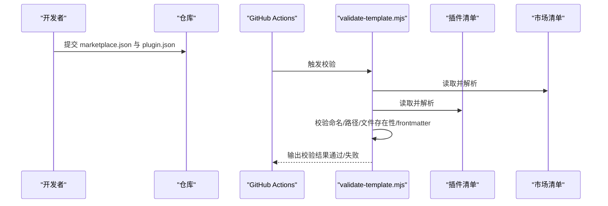
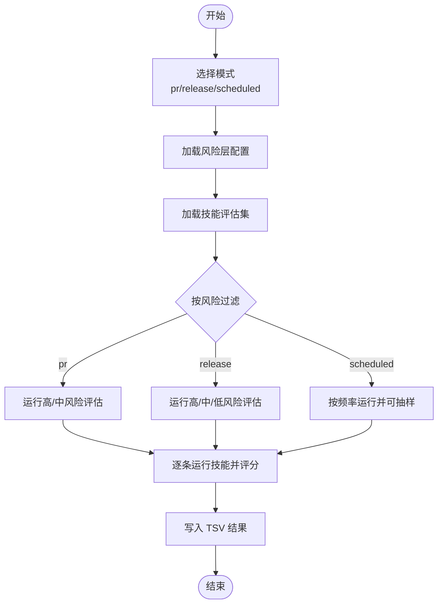

# 插件配置

<cite>
**本文引用的文件**
- [.cursor-plugin/marketplace.json](file://.cursor-plugin/marketplace.json)
- [plugins/frontend-team-toolkit/.cursor-plugin/plugin.json](file://plugins/frontend-team-toolkit/.cursor-plugin/plugin.json)
- [plugins/frontend-team-toolkit/mcp.json](file://plugins/frontend-team-toolkit/mcp.json)
- [.github/workflows/validate-template.yml](file://.github/workflows/validate-template.yml)
- [.github/workflows/eval-ci.yml](file://.github/workflows/eval-ci.yml)
- [scripts/validate-template.mjs](file://scripts/validate-template.mjs)
- [plugins/frontend-team-toolkit/skill-engineering/bin/new-skill.sh](file://plugins/frontend-team-toolkit/skill-engineering/bin/new-skill.sh)
- [plugins/frontend-team-toolkit/skill-engineering/scripts/run_evals.py](file://plugins/frontend-team-toolkit/skill-engineering/scripts/run_evals.py)
- [plugins/frontend-team-toolkit/skill-engineering/requirements.txt](file://plugins/frontend-team-toolkit/skill-engineering/requirements.txt)
</cite>

## 目录
1. [简介](#简介)
2. [项目结构](#项目结构)
3. [核心组件](#核心组件)
4. [架构总览](#架构总览)
5. [详细组件分析](#详细组件分析)
6. [依赖关系分析](#依赖关系分析)
7. [性能考虑](#性能考虑)
8. [故障排查指南](#故障排查指南)
9. [结论](#结论)
10. [附录](#附录)

## 简介
本指南面向 Cursor 插件开发者与维护者，系统讲解团队市场（marketplace）与插件（plugin）的配置规范，重点覆盖：
- MCP 协议服务器配置：命令行参数、环境变量与访问方式
- Cursor 插件清单文件 marketplace.json 与 plugin.json 的结构与字段语义
- 配置验证流程与调试技巧
- 插件开发与发布所需满足的配置要求
- YAPI、Figma、蓝湖三类 MCP 服务的完整配置步骤示例

## 项目结构
该仓库采用“市场 + 插件”两级目录组织，市场清单位于根级 .cursor-plugin/marketplace.json，插件清单与 MCP 配置位于插件目录 plugins/frontend-team-toolkit/.cursor-plugin/plugin.json 与 plugins/frontend-team-toolkit/mcp.json。

图表来源
- [.cursor-plugin/marketplace.json:1-21](file://.cursor-plugin/marketplace.json#L1-L21)
- [plugins/frontend-team-toolkit/.cursor-plugin/plugin.json:1-23](file://plugins/frontend-team-toolkit/.cursor-plugin/plugin.json#L1-L23)
- [plugins/frontend-team-toolkit/mcp.json:1-26](file://plugins/frontend-team-toolkit/mcp.json#L1-L26)
- [.github/workflows/validate-template.yml:1-33](file://.github/workflows/validate-template.yml#L1-L33)
- [.github/workflows/eval-ci.yml:1-208](file://.github/workflows/eval-ci.yml#L1-L208)
- [scripts/validate-template.mjs:1-382](file://scripts/validate-template.mjs#L1-L382)

章节来源
- [.cursor-plugin/marketplace.json:1-21](file://.cursor-plugin/marketplace.json#L1-L21)
- [plugins/frontend-team-toolkit/.cursor-plugin/plugin.json:1-23](file://plugins/frontend-team-toolkit/.cursor-plugin/plugin.json#L1-L23)
- [plugins/frontend-team-toolkit/mcp.json:1-26](file://plugins/frontend-team-toolkit/mcp.json#L1-L26)
- [.github/workflows/validate-template.yml:1-33](file://.github/workflows/validate-template.yml#L1-L33)
- [.github/workflows/eval-ci.yml:1-208](file://.github/workflows/eval-ci.yml#L1-L208)
- [scripts/validate-template.mjs:1-382](file://scripts/validate-template.mjs#L1-L382)

## 核心组件
- 市场清单（marketplace.json）
  - 定义市场名称、所有者、描述、版本、插件根目录位置，以及市场中收录的插件条目列表
  - 字段要点：name、owner、metadata.description、metadata.version、metadata.pluginRoot、plugins[]
- 插件清单（plugin.json）
  - 定义插件元数据：名称、显示名、版本、描述、作者、许可证、关键词等
  - 字段要点：name、displayName、version、description、author、license、keywords
- MCP 配置（mcp.json）
  - 定义多个 MCP 服务器，支持两类接入方式：
    - 命令行启动型：command + args（可带 --stdio），配合 env 环境变量
    - URL 直连型：url（用于本地或内网服务）
  - 字段要点：mcpServers.<server>.command/args/url，mcpServers.<server>.env

章节来源
- [.cursor-plugin/marketplace.json:1-21](file://.cursor-plugin/marketplace.json#L1-L21)
- [plugins/frontend-team-toolkit/.cursor-plugin/plugin.json:1-23](file://plugins/frontend-team-toolkit/.cursor-plugin/plugin.json#L1-L23)
- [plugins/frontend-team-toolkit/mcp.json:1-26](file://plugins/frontend-team-toolkit/mcp.json#L1-L26)

## 架构总览
下图展示从市场到插件再到 MCP 服务器的配置链路，以及校验与评估流水线：

图表来源
- [.cursor-plugin/marketplace.json:1-21](file://.cursor-plugin/marketplace.json#L1-L21)
- [plugins/frontend-team-toolkit/.cursor-plugin/plugin.json:1-23](file://plugins/frontend-team-toolkit/.cursor-plugin/plugin.json#L1-L23)
- [plugins/frontend-team-toolkit/mcp.json:1-26](file://plugins/frontend-team-toolkit/mcp.json#L1-L26)
- [scripts/validate-template.mjs:1-382](file://scripts/validate-template.mjs#L1-L382)
- [.github/workflows/validate-template.yml:1-33](file://.github/workflows/validate-template.yml#L1-L33)
- [.github/workflows/eval-ci.yml:1-208](file://.github/workflows/eval-ci.yml#L1-L208)

## 详细组件分析

### 市场清单（marketplace.json）字段说明
- name：市场标识符，需符合小写短横线命名规范
- displayName：市场显示名称
- owner：市场拥有者信息，含 name、email
- metadata：
  - description：市场描述
  - version：市场版本
  - pluginRoot：插件根目录相对路径（相对仓库根）
- plugins[]：插件条目数组
  - name：插件标识符
  - source：插件在仓库中的相对路径（若存在 metadata.pluginRoot，则为相对于该根的路径）
  - description：插件描述

章节来源
- [.cursor-plugin/marketplace.json:1-21](file://.cursor-plugin/marketplace.json#L1-L21)

### 插件清单（plugin.json）字段说明
- name/displayName/version：插件标识、显示名与版本
- description：插件功能描述
- author：作者信息（name/email）
- license：许可证
- keywords：关键词数组，便于检索与分类

章节来源
- [plugins/frontend-team-toolkit/.cursor-plugin/plugin.json:1-23](file://plugins/frontend-team-toolkit/.cursor-plugin/plugin.json#L1-L23)

### MCP 配置（mcp.json）字段说明
- mcpServers.<server>：
  - 命令行启动型（适用于 npm 包或可执行程序）：
    - command：命令（如 npx）
    - args：参数数组（建议以 --stdio 结尾）
    - env：环境变量映射（如 YAPI_BASE_URL、YAPI_USERNAME、YAPI_PASSWORD）
  - URL 直连型（适用于本地或内网服务）：
    - url：服务地址（含 role 与 name 参数）

章节来源
- [plugins/frontend-team-toolkit/mcp.json:1-26](file://plugins/frontend-team-toolkit/mcp.json#L1-L26)

### MCP 服务器配置示例

#### YAPI 集成
- 服务器名称：yapi-devloper-mcp
- 启动方式：命令行启动型
- 关键参数与环境变量：
  - 命令：npx
  - 参数：指向 yapi-devloper-mcp 包，并以 --stdio 结尾
  - 环境变量：
    - YAPI_BASE_URL：YAPI 服务地址
    - YAPI_USERNAME：登录用户名
    - YAPI_PASSWORD：登录密码
- 配置要点：
  - 使用 args 传递包名与 --stdio
  - 在 env 中设置 YAPI 访问凭据
  - 确保网络可达与凭据正确

章节来源
- [plugins/frontend-team-toolkit/mcp.json:3-10](file://plugins/frontend-team-toolkit/mcp.json#L3-L10)

#### Figma 集成
- 服务器名称：figma-developer-mcp
- 启动方式：命令行启动型
- 关键参数与环境变量：
  - 命令：npx
  - 参数：指向 figma-developer-mcp 包，并以 --stdio 结尾
  - 命令行参数：--figma-api-key=<个人访问令牌>
- 配置要点：
  - 将个人访问令牌作为命令行参数传入
  - 确保令牌有效且具备相应权限

章节来源
- [plugins/frontend-team-toolkit/mcp.json:12-19](file://plugins/frontend-team-toolkit/mcp.json#L12-L19)

#### 蓝湖集成
- 服务器名称：lanhu
- 启动方式：URL 直连型
- 关键参数：
  - url：形如 http://127.0.0.1:8000/mcp?role=Developer&name=developer@example.com
- 配置要点：
  - 确保本地或内网服务已运行
  - url 中的 role 与 name 可按需调整

章节来源
- [plugins/frontend-team-toolkit/mcp.json:21-23](file://plugins/frontend-team-toolkit/mcp.json#L21-L23)

### 插件开发与发布配置要求
- 插件清单与市场清单一致性
  - marketplace.json 中的 plugins[].name 必须与插件目录下的 .cursor-plugin/plugin.json 中的 name 一致
  - 若使用 metadata.pluginRoot，需确保其为安全的相对路径，且对应目录存在
- 组件清单校验
  - 插件目录中各组件（rules、skills、agents、commands、hooks）的清单文件需包含必要的 frontmatter 字段
  - 引用的外部路径必须是安全的相对路径，且文件存在
- MCP 服务器
  - 若使用 MCP，需在插件目录提供 mcp.json；若不使用则可省略
  - hooks/hooks.json 存在时才需要，否则仅给出警告

章节来源
- [scripts/validate-template.mjs:250-356](file://scripts/validate-template.mjs#L250-L356)
- [plugins/frontend-team-toolkit/.cursor-plugin/plugin.json:1-23](file://plugins/frontend-team-toolkit/.cursor-plugin/plugin.json#L1-L23)
- [.cursor-plugin/marketplace.json:1-21](file://.cursor-plugin/marketplace.json#L1-L21)

### 技能工程与评估配置
- 新技能生成
  - 使用新技能模板脚本生成标准化技能目录，包含 SKILL.md、evals/evals.json、references/output-contract.md、scripts/validate-output.sh 等
  - 生成后可直接运行验证脚本进行自检
- 评估运行
  - 支持三种模式：pr（拉取请求）、release（发布）、scheduled（定时）
  - 不同模式对风险等级过滤、是否阻断回归、是否抽样检查等策略不同
  - 评估结果输出为 TSV 文件，便于归档与通知

章节来源
- [plugins/frontend-team-toolkit/skill-engineering/bin/new-skill.sh:1-121](file://plugins/frontend-team-toolkit/skill-engineering/bin/new-skill.sh#L1-L121)
- [plugins/frontend-team-toolkit/skill-engineering/scripts/run_evals.py:1-200](file://plugins/frontend-team-toolkit/skill-engineering/scripts/run_evals.py#L1-L200)
- [.github/workflows/eval-ci.yml:1-208](file://.github/workflows/eval-ci.yml#L1-L208)

## 依赖关系分析
- 市场清单依赖插件清单：marketplace.json 的 plugins[].source 指向插件目录，插件目录需存在且包含 .cursor-plugin/plugin.json
- 插件清单依赖 MCP 配置：若插件启用 MCP，需提供 mcp.json；若未提供则仅给出警告
- 校验器依赖：validate-template.mjs 会读取市场与插件清单，校验命名、路径、文件存在性与 frontmatter 完整性
- 评估流水线依赖：eval-ci.yml 触发技能评估，依赖技能工程脚本与 Python 环境

图表来源
- [scripts/validate-template.mjs:1-382](file://scripts/validate-template.mjs#L1-L382)
- [.github/workflows/validate-template.yml:1-33](file://.github/workflows/validate-template.yml#L1-L33)
- [.github/workflows/eval-ci.yml:1-208](file://.github/workflows/eval-ci.yml#L1-L208)
- [plugins/frontend-team-toolkit/skill-engineering/scripts/run_evals.py:1-200](file://plugins/frontend-team-toolkit/skill-engineering/scripts/run_evals.py#L1-L200)

章节来源
- [scripts/validate-template.mjs:1-382](file://scripts/validate-template.mjs#L1-L382)
- [.github/workflows/validate-template.yml:1-33](file://.github/workflows/validate-template.yml#L1-L33)
- [.github/workflows/eval-ci.yml:1-208](file://.github/workflows/eval-ci.yml#L1-L208)
- [plugins/frontend-team-toolkit/skill-engineering/scripts/run_evals.py:1-200](file://plugins/frontend-team-toolkit/skill-engineering/scripts/run_evals.py#L1-L200)

## 性能考虑
- MCP 服务器启动成本
  - 命令行启动型（如 npx）首次可能有安装延迟，建议在 CI 或本地预热
- 评估运行效率
  - pr 模式仅运行高/中风险评估，减少耗时
  - scheduled 模式可按频率降低运行强度
- 资源隔离
  - 将 MCP 服务部署在独立进程或容器中，避免与主应用争抢资源

## 故障排查指南
- 市场与插件清单不一致
  - 症状：校验失败，提示 marketplace 条目 name 与 plugin.json name 不一致
  - 处理：统一两处的 name 字段
- 插件根目录错误
  - 症状：校验报错，提示 metadata.pluginRoot 非安全相对路径或不存在
  - 处理：修正为安全相对路径并确保目录存在
- 引用路径缺失
  - 症状：校验报错，提示某字段引用的路径不存在
  - 处理：检查并修正为实际存在的相对路径
- MCP 服务器无法连接
  - YAPI：检查 YAPI_BASE_URL、YAPI_USERNAME、YAPI_PASSWORD 是否正确
  - Figma：检查 --figma-api-key 是否有效
  - 蓝湖：检查本地服务是否启动，url 是否可达
- 评估失败
  - 查看 CI 输出的评估结果 TSV，定位失败项
  - 检查模型评分器（model_grader）与规则评分器（rule_grader）逻辑

章节来源
- [scripts/validate-template.mjs:250-356](file://scripts/validate-template.mjs#L250-L356)
- [plugins/frontend-team-toolkit/mcp.json:1-26](file://plugins/frontend-team-toolkit/mcp.json#L1-L26)
- [.github/workflows/eval-ci.yml:150-185](file://.github/workflows/eval-ci.yml#L150-L185)

## 结论
通过规范的市场与插件清单、严谨的 MCP 配置与路径校验、以及完善的评估流水线，可以确保 Cursor 插件在团队内部稳定发布与持续演进。建议在开发阶段即遵循本文的配置与校验流程，减少集成期问题。

## 附录

### 配置验证流程（序列图）

图表来源
- [.github/workflows/validate-template.yml:1-33](file://.github/workflows/validate-template.yml#L1-L33)
- [scripts/validate-template.mjs:250-356](file://scripts/validate-template.mjs#L250-L356)

### 评估运行流程（流程图）

图表来源
- [plugins/frontend-team-toolkit/skill-engineering/scripts/run_evals.py:135-174](file://plugins/frontend-team-toolkit/skill-engineering/scripts/run_evals.py#L135-L174)