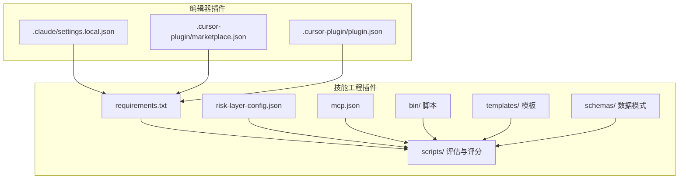
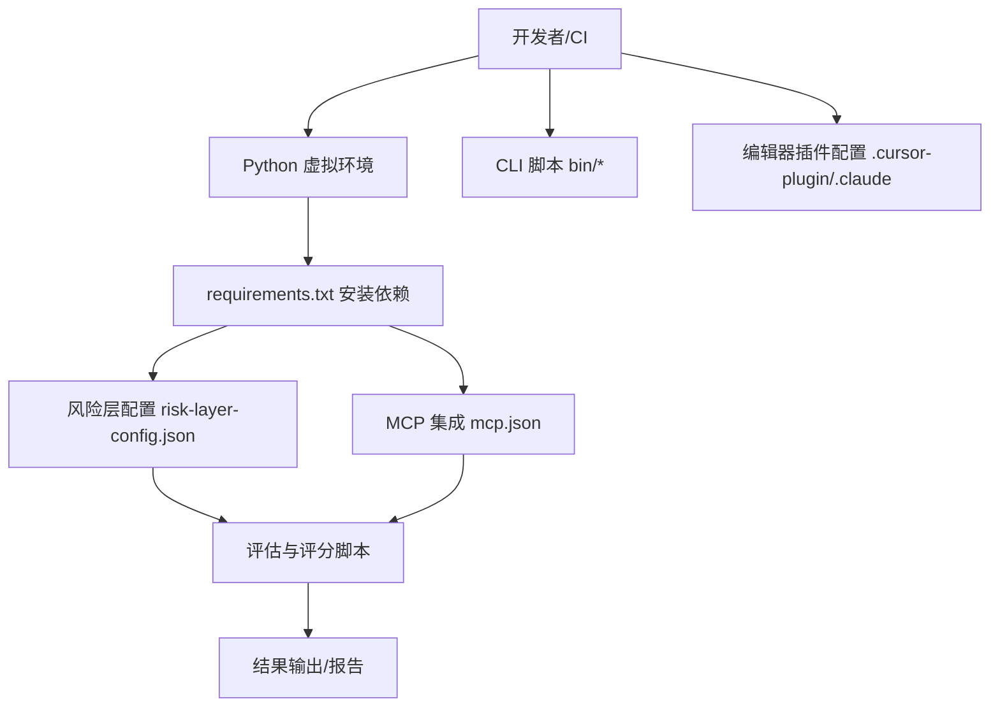
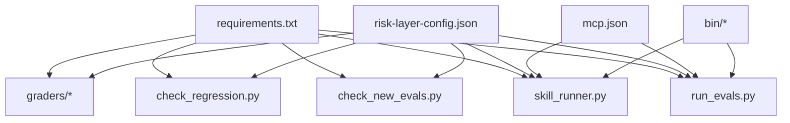

# 环境配置

<cite>
**本文引用的文件**
- [requirements.txt](file://plugins/frontend-team-toolkit/skill-engineering/requirements.txt)
- [risk-layer-config.json](file://plugins/frontend-team-toolkit/skill-engineering/config/risk-layer-config.json)
- [mcp.json](file://plugins/frontend-team-toolkit/mcp.json)
- [settings.local.json](file://.claude/settings.local.json)
- [plugin.json](file://plugins/frontend-team-toolkit/.cursor-plugin/plugin.json)
- [marketplace.json](file://.cursor-plugin/marketplace.json)
- [run_evals.py](file://plugins/frontend-team-toolkit/skill-engineering/scripts/run_evals.py)
- [check_new_evals.py](file://plugins/frontend-team-toolkit/skill-engineering/scripts/check_new_evals.py)
- [check_regression.py](file://plugins/frontend-team-toolkit/skill-engineering/scripts/check_regression.py)
- [skill_runner.py](file://plugins/frontend-team-toolkit/skill-engineering/scripts/skill_runner.py)
- [model_grader.py](file://plugins/frontend-team-toolkit/skill-engineering/scripts/graders/model_grader.py)
- [rule_grader.py](file://plugins/frontend-team-toolkit/skill-engineering/scripts/graders/rule_grader.py)
- [structure_grader.py](file://plugins/frontend-team-toolkit/skill-engineering/scripts/graders/structure_grader.py)
- [trajectory_grader.py](file://plugins/frontend-team-toolkit/skill-engineering/scripts/graders/trajectory_grader.py)
- [validate-skill.py](file://plugins/frontend-team-toolkit/skill-engineering/bin/validate-skill.py)
- [new-skill.sh](file://plugins/frontend-team-toolkit/skill-engineering/bin/new-skill.sh)
- [environment-check.md](file://plugins/frontend-team-toolkit/skills/ai-coding-tri-kit/references/environment-check.md)
- [.gitignore](file://.gitignore)
</cite>

## 目录
1. [简介](#简介)
2. [项目结构](#项目结构)
3. [核心组件](#核心组件)
4. [架构总览](#架构总览)
5. [详细组件分析](#详细组件分析)
6. [依赖关系分析](#依赖关系分析)
7. [性能考虑](#性能考虑)
8. [故障排除指南](#故障排除指南)
9. [结论](#结论)
10. [附录](#附录)

## 简介
本指南面向需要在本地或CI环境中搭建与运行技能工程（Skill Engineering）工具链的开发者，涵盖开发与生产环境的搭建步骤、Python与Node.js环境配置、系统依赖安装、依赖包用途说明、风险层配置参数详解、环境变量配置示例、跨平台差异与注意事项、环境验证方法以及常见配置问题的解决方案。本文所有技术细节均基于仓库中实际存在的配置文件与脚本进行梳理与总结。

## 项目结构
该仓库采用插件化组织方式，核心技能工程能力位于 `plugins/frontend-team-toolkit/` 目录下，其中包含：
- Python依赖定义：requirements.txt
- 风险层配置：config/risk-layer-config.json
- MCP集成配置：mcp.json
- 技能评估与评分脚本：scripts/ 下的多个Python脚本
- 评估模板与Schema：templates/ 与 schemas/ 目录
- CLI辅助脚本：bin/ 目录
- 第三方编辑器插件配置：.cursor-plugin/ 与 .claude/

**图表来源**
- [requirements.txt](file://plugins/frontend-team-toolkit/skill-engineering/requirements.txt)
- [risk-layer-config.json](file://plugins/frontend-team-toolkit/skill-engineering/config/risk-layer-config.json)
- [mcp.json](file://plugins/frontend-team-toolkit/mcp.json)
- [plugin.json](file://plugins/frontend-team-toolkit/.cursor-plugin/plugin.json)
- [marketplace.json](file://.cursor-plugin/marketplace.json)
- [settings.local.json](file://.claude/settings.local.json)

**章节来源**
- [requirements.txt](file://plugins/frontend-team-toolkit/skill-engineering/requirements.txt)
- [risk-layer-config.json](file://plugins/frontend-team-toolkit/skill-engineering/config/risk-layer-config.json)
- [mcp.json](file://plugins/frontend-team-toolkit/mcp.json)
- [plugin.json](file://plugins/frontend-team-toolkit/.cursor-plugin/plugin.json)
- [marketplace.json](file://.cursor-plugin/marketplace.json)
- [settings.local.json](file://.claude/settings.local.json)

## 核心组件
- Python依赖管理：通过 requirements.txt 统一声明运行时所需的第三方库，供虚拟环境安装使用。
- 风险层配置：risk-layer-config.json 定义了评估流程中的风险控制参数，影响评分与决策逻辑。
- MCP集成：mcp.json 提供与MCP（Model Context Protocol）相关的集成配置，用于模型上下文交互。
- 评估与评分脚本：scripts/ 目录下包含 run_evals.py、check_new_evals.py、check_regression.py、skill_runner.py 及各类 grader 脚本，负责执行评估、回归检查与评分。
- CLI辅助：bin/ 目录提供 new-skill.sh 与 validate-skill.py，支持新技能模板生成与输出校验。
- 编辑器插件：.cursor-plugin/ 与 .claude/ 提供编辑器侧的本地配置与市场信息。

**章节来源**
- [requirements.txt](file://plugins/frontend-team-toolkit/skill-engineering/requirements.txt)
- [risk-layer-config.json](file://plugins/frontend-team-toolkit/skill-engineering/config/risk-layer-config.json)
- [mcp.json](file://plugins/frontend-team-toolkit/mcp.json)
- [run_evals.py](file://plugins/frontend-team-toolkit/skill-engineering/scripts/run_evals.py)
- [check_new_evals.py](file://plugins/frontend-team-toolkit/skill-engineering/scripts/check_new_evals.py)
- [check_regression.py](file://plugins/frontend-team-toolkit/skill-engineering/scripts/check_regression.py)
- [skill_runner.py](file://plugins/frontend-team-toolkit/skill-engineering/scripts/skill_runner.py)
- [model_grader.py](file://plugins/frontend-team-toolkit/skill-engineering/scripts/graders/model_grader.py)
- [rule_grader.py](file://plugins/frontend-team-toolkit/skill-engineering/scripts/graders/rule_grader.py)
- [structure_grader.py](file://plugins/frontend-team-toolkit/skill-engineering/scripts/graders/structure_grader.py)
- [trajectory_grader.py](file://plugins/frontend-team-toolkit/skill-engineering/scripts/graders/trajectory_grader.py)
- [validate-skill.py](file://plugins/frontend-team-toolkit/skill-engineering/bin/validate-skill.py)
- [new-skill.sh](file://plugins/frontend-team-toolkit/skill-engineering/bin/new-skill.sh)

## 架构总览
技能工程工具链围绕“配置驱动 + 脚本执行 + 评估评分”的闭环展开。配置文件（requirements.txt、risk-layer-config.json、mcp.json）为脚本提供运行参数与策略；脚本负责执行具体任务；CLI与编辑器插件提供便捷入口。

**图表来源**
- [requirements.txt](file://plugins/frontend-team-toolkit/skill-engineering/requirements.txt)
- [risk-layer-config.json](file://plugins/frontend-team-toolkit/skill-engineering/config/risk-layer-config.json)
- [mcp.json](file://plugins/frontend-team-toolkit/mcp.json)
- [new-skill.sh](file://plugins/frontend-team-toolkit/skill-engineering/bin/new-skill.sh)
- [validate-skill.py](file://plugins/frontend-team-toolkit/skill-engineering/bin/validate-skill.py)

## 详细组件分析

### Python 环境配置
- 建议使用 Python 3.8+ 并创建独立虚拟环境，避免全局污染。
- 在技能工程目录下执行依赖安装，确保所有脚本可正常导入模块。
- 若需在CI中复用依赖缓存，建议结合 requirements.txt 的内容进行缓存键设计。

**章节来源**
- [requirements.txt](file://plugins/frontend-team-toolkit/skill-engineering/requirements.txt)

### Node.js 环境设置
- 仓库未直接提供 Node.js 依赖清单或构建脚本，若项目其他部分需要 Node.js，请根据实际需求安装并维护版本。
- 对于编辑器插件（如 Cursor），请参考对应插件配置文件以确定所需工具链版本。

**章节来源**
- [plugin.json](file://plugins/frontend-team-toolkit/.cursor-plugin/plugin.json)
- [marketplace.json](file://.cursor-plugin/marketplace.json)

### 系统依赖安装
- 仓库未包含系统级依赖清单（如 apt 包或 Homebrew Formula）。若脚本涉及系统命令或外部工具，请按需安装并在CI中显式声明。
- 建议在CI中使用容器镜像或基础环境，确保依赖一致性。

### 依赖包用途说明（基于 requirements.txt）
以下为依赖包在工具链中的典型用途分类（具体以实际脚本导入为准）：
- 评估与数据处理：可能用于解析JSON、CSV、执行统计分析等。
- 评分与规则引擎：支持规则评分、结构化评分与轨迹评分。
- 文件与路径操作：支持模板渲染、文件校验与输出检查。
- 日志与错误处理：统一记录与异常捕获。
- HTTP请求与API调用：与外部服务或MCP交互。
- 命令行与脚本执行：支持子进程调用与CLI集成。

**章节来源**
- [requirements.txt](file://plugins/frontend-team-toolkit/skill-engineering/requirements.txt)

### 风险层配置文件参数详解
风险层配置文件用于控制评估过程中的风险阈值、评分权重与决策开关。建议逐项理解以下类别的参数含义，并结合实际业务场景调整：
- 风险阈值：决定评估结果是否触发高风险标记。
- 评分权重：对不同维度（如模型评分、规则评分、结构评分、轨迹评分）赋予不同权重。
- 决策开关：启用/禁用特定评估环节或告警机制。
- 输出格式：控制结果输出的字段与格式。

为便于对照，建议将配置文件与各评分脚本关联起来，确认哪些参数直接影响评分逻辑。

**章节来源**
- [risk-layer-config.json](file://plugins/frontend-team-toolkit/skill-engineering/config/risk-layer-config.json)
- [model_grader.py](file://plugins/frontend-team-toolkit/skill-engineering/scripts/graders/model_grader.py)
- [rule_grader.py](file://plugins/frontend-team-toolkit/skill-engineering/scripts/graders/rule_grader.py)
- [structure_grader.py](file://plugins/frontend-team-toolkit/skill-engineering/scripts/graders/structure_grader.py)
- [trajectory_grader.py](file://plugins/frontend-team-toolkit/skill-engineering/scripts/graders/trajectory_grader.py)

### 环境变量配置示例
- 数据库连接：若脚本需要访问数据库，请在环境变量中设置连接字符串或凭据，并在脚本中安全读取。
- API密钥：用于外部服务或MCP集成的认证，建议使用只读权限的最小权限密钥。
- 路径设置：用于指定模板目录、输出目录、日志目录等，确保脚本可定位到所需资源。
- CI环境：在CI中通过项目设置或密钥管理服务注入敏感变量，避免硬编码。

注意：本仓库未提供具体的环境变量清单，请根据实际脚本需求补充。

### 不同操作系统下的配置差异与注意事项
- 路径分隔符：Windows 使用反斜杠，Unix 系列使用正斜杠；脚本应使用跨平台路径库处理。
- 权限与可执行性：在类Unix系统上，确保脚本具有可执行权限；Windows 上可通过批处理或PowerShell适配。
- 字符编码：确保文本文件与日志输出使用一致的编码（推荐UTF-8）。
- 终端与Shell：CI环境可能使用非交互式Shell，脚本需避免依赖交互输入。

**章节来源**
- [new-skill.sh](file://plugins/frontend-team-toolkit/skill-engineering/bin/new-skill.sh)
- [validate-skill.py](file://plugins/frontend-team-toolkit/skill-engineering/bin/validate-skill.py)

### 环境验证方法
- Python依赖验证：在虚拟环境中执行依赖安装，确保无冲突与缺失。
- 配置文件验证：使用JSON Schema（如 schemas/ 目录下的模式）验证配置文件格式正确。
- 脚本可用性验证：分别运行评估与评分脚本，观察输出与返回码。
- CLI与编辑器插件：通过CLI脚本生成新技能模板并执行校验，确认流程完整。
- 环境检查文档：参考技能工程提供的环境检查指南，核对本地环境与CI环境的一致性。

**章节来源**
- [environment-check.md](file://plugins/frontend-team-toolkit/skills/ai-coding-tri-kit/references/environment-check.md)
- [run_evals.py](file://plugins/frontend-team-toolkit/skill-engineering/scripts/run_evals.py)
- [check_new_evals.py](file://plugins/frontend-team-toolkit/skill-engineering/scripts/check_new_evals.py)
- [check_regression.py](file://plugins/frontend-team-toolkit/skill-engineering/scripts/check_regression.py)
- [skill_runner.py](file://plugins/frontend-team-toolkit/skill-engineering/scripts/skill_runner.py)
- [validate-skill.py](file://plugins/frontend-team-toolkit/skill-engineering/bin/validate-skill.py)

## 依赖关系分析
技能工程工具链的依赖关系主要体现在配置与脚本之间的耦合度。配置文件（requirements.txt、risk-layer-config.json、mcp.json）为脚本提供运行参数；脚本之间存在协作关系，共同完成评估与评分任务。

**图表来源**
- [requirements.txt](file://plugins/frontend-team-toolkit/skill-engineering/requirements.txt)
- [risk-layer-config.json](file://plugins/frontend-team-toolkit/skill-engineering/config/risk-layer-config.json)
- [mcp.json](file://plugins/frontend-team-toolkit/mcp.json)
- [run_evals.py](file://plugins/frontend-team-toolkit/skill-engineering/scripts/run_evals.py)
- [check_new_evals.py](file://plugins/frontend-team-toolkit/skill-engineering/scripts/check_new_evals.py)
- [check_regression.py](file://plugins/frontend-team-toolkit/skill-engineering/scripts/check_regression.py)
- [skill_runner.py](file://plugins/frontend-team-toolkit/skill-engineering/scripts/skill_runner.py)
- [new-skill.sh](file://plugins/frontend-team-toolkit/skill-engineering/bin/new-skill.sh)
- [validate-skill.py](file://plugins/frontend-team-toolkit/skill-engineering/bin/validate-skill.py)

**章节来源**
- [requirements.txt](file://plugins/frontend-team-toolkit/skill-engineering/requirements.txt)
- [risk-layer-config.json](file://plugins/frontend-team-toolkit/skill-engineering/config/risk-layer-config.json)
- [mcp.json](file://plugins/frontend-team-toolkit/mcp.json)
- [run_evals.py](file://plugins/frontend-team-toolkit/skill-engineering/scripts/run_evals.py)
- [check_new_evals.py](file://plugins/frontend-team-toolkit/skill-engineering/scripts/check_new_evals.py)
- [check_regression.py](file://plugins/frontend-team-toolkit/skill-engineering/scripts/check_regression.py)
- [skill_runner.py](file://plugins/frontend-team-toolkit/skill-engineering/scripts/skill_runner.py)
- [new-skill.sh](file://plugins/frontend-team-toolkit/skill-engineering/bin/new-skill.sh)
- [validate-skill.py](file://plugins/frontend-team-toolkit/skill-engineering/bin/validate-skill.py)

## 性能考虑
- 依赖安装：在CI中缓存依赖安装结果，减少重复下载时间。
- 评估并发：合理拆分评估任务，避免单次任务过长阻塞流水线。
- 日志与输出：控制日志级别与输出大小，避免I/O成为瓶颈。
- 资源限制：在容器或受限环境中为评估任务设置CPU与内存上限。

## 故障排除指南
- 依赖安装失败：检查网络连通性与镜像源配置；清理缓存后重试。
- 配置文件格式错误：使用JSON Schema验证配置文件；逐项比对参数类型与取值范围。
- 评估脚本报错：查看脚本输出与返回码；确认输入数据格式与路径正确。
- CLI脚本不可执行：在类Unix系统上赋予脚本可执行权限；检查Shebang与解释器路径。
- 编辑器插件无法加载：核对插件配置文件与工作区路径；重启编辑器后重试。
- 环境不一致：参考环境检查文档逐项核对；在CI中使用相同的基础镜像与工具链版本。

**章节来源**
- [environment-check.md](file://plugins/frontend-team-toolkit/skills/ai-coding-tri-kit/references/environment-check.md)
- [new-skill.sh](file://plugins/frontend-team-toolkit/skill-engineering/bin/new-skill.sh)
- [validate-skill.py](file://plugins/frontend-team-toolkit/skill-engineering/bin/validate-skill.py)

## 结论
通过规范化的Python与Node.js环境配置、严格的依赖管理、清晰的风险层配置与环境变量设置，以及完善的验证与故障排除流程，可以稳定地在本地与CI环境中运行技能工程工具链。建议在团队内形成标准化的环境搭建与维护流程，确保跨平台一致性与可重复性。

## 附录
- 版本与兼容性：请根据实际使用的Python版本与第三方库版本进行兼容性测试。
- 安全与合规：敏感信息通过环境变量注入；避免将密钥写入仓库。
- 自动化：将环境验证与评估流程纳入CI/CD流水线，实现自动化质量门禁。