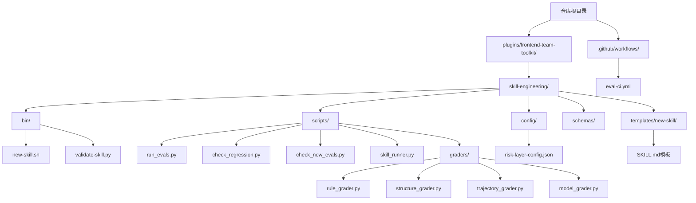
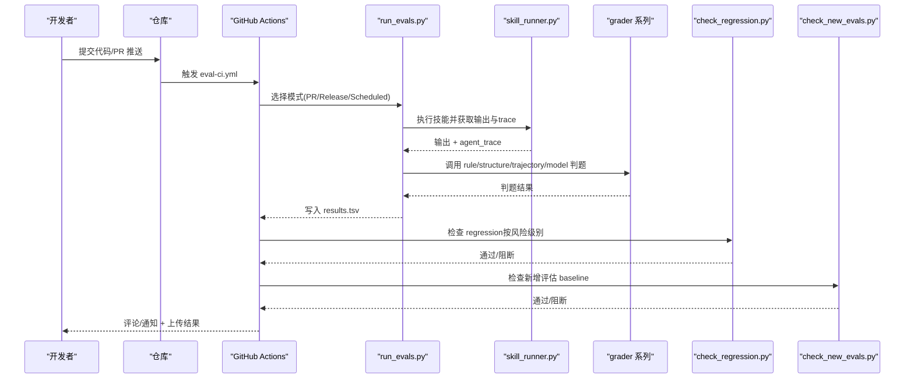
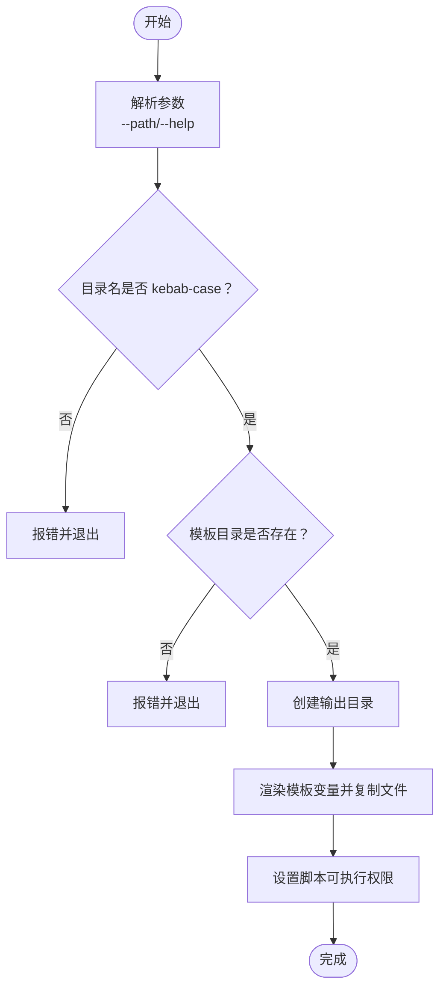
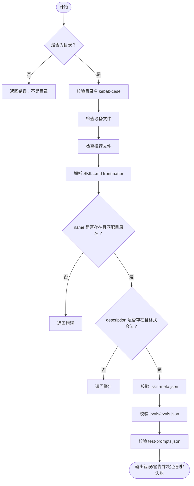
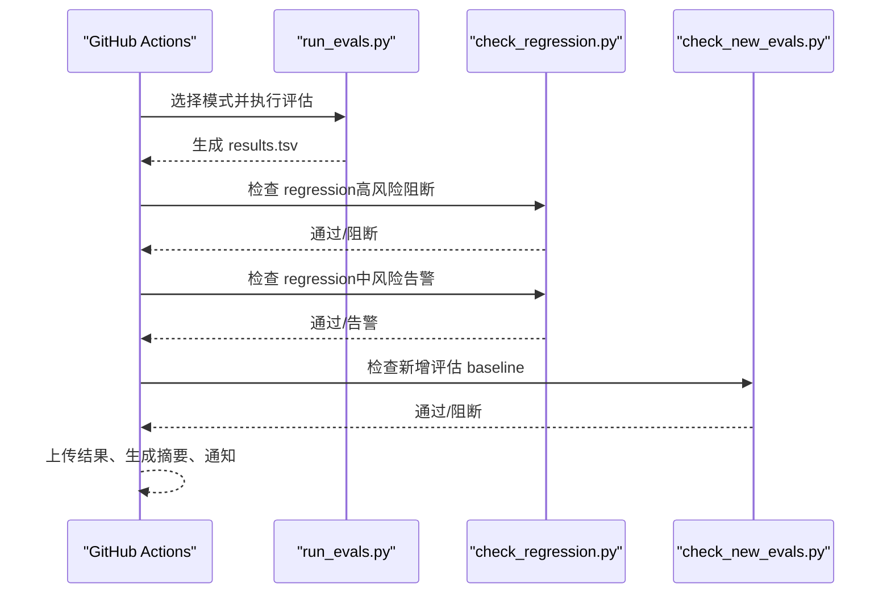
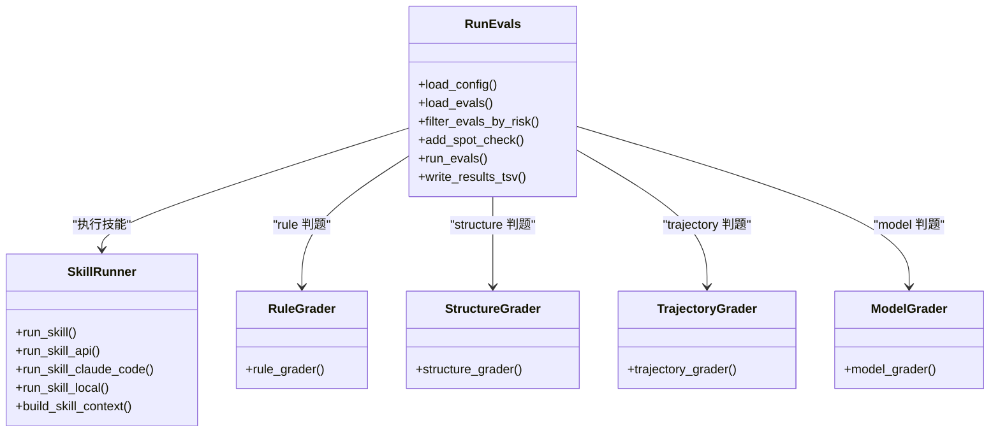
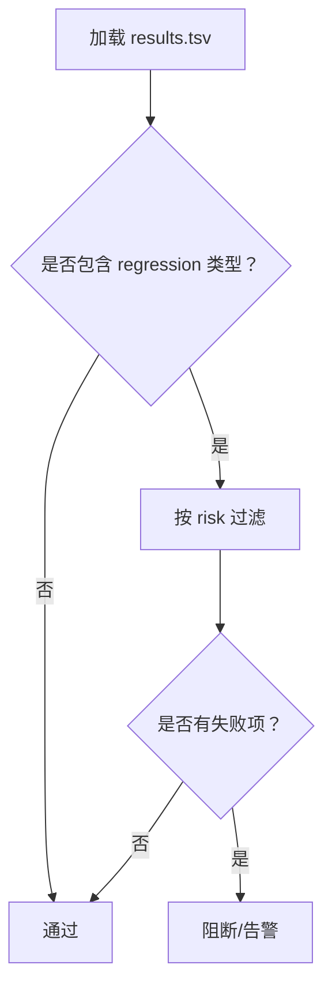
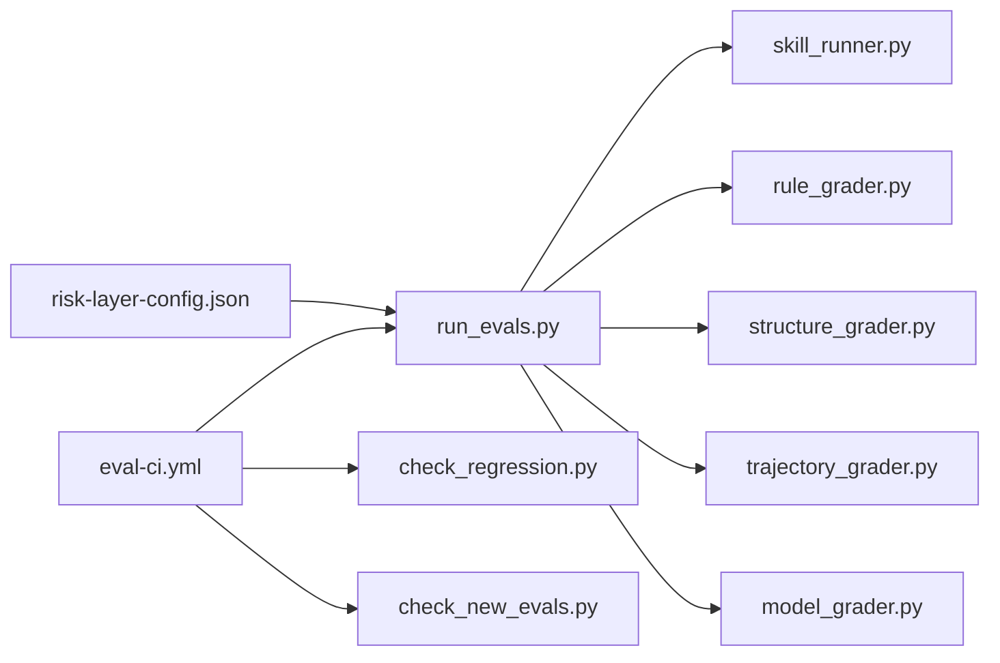

# 部署流程

<cite>
**本文引用的文件**
- [new-skill.sh](file://plugins/frontend-team-toolkit/skill-engineering/bin/new-skill.sh)
- [validate-skill.py](file://plugins/frontend-team-toolkit/skill-engineering/bin/validate-skill.py)
- [run_evals.py](file://plugins/frontend-team-toolkit/skill-engineering/scripts/run_evals.py)
- [check_regression.py](file://plugins/frontend-team-toolkit/skill-engineering/scripts/check_regression.py)
- [check_new_evals.py](file://plugins/frontend-team-toolkit/skill-engineering/scripts/check_new_evals.py)
- [skill_runner.py](file://plugins/frontend-team-toolkit/skill-engineering/scripts/skill_runner.py)
- [rule_grader.py](file://plugins/frontend-team-toolkit/skill-engineering/scripts/graders/rule_grader.py)
- [structure_grader.py](file://plugins/frontend-team-toolkit/skill-engineering/scripts/graders/structure_grader.py)
- [trajectory_grader.py](file://plugins/frontend-team-toolkit/skill-engineering/scripts/graders/trajectory_grader.py)
- [model_grader.py](file://plugins/frontend-team-toolkit/skill-engineering/scripts/graders/model_grader.py)
- [risk-layer-config.json](file://plugins/frontend-team-toolkit/skill-engineering/config/risk-layer-config.json)
- [eval-ci.yml](file://.github/workflows/eval-ci.yml)
- [README.md（技能工程）](file://plugins/frontend-team-toolkit/skill-engineering/README.md)
- [README.md（工具包）](file://plugins/frontend-team-toolkit/README.md)
- [SKILL.md（模板）](file://plugins/frontend-team-toolkit/skill-engineering/templates/new-skill/SKILL.md)
</cite>

## 目录
1. [简介](#简介)
2. [项目结构](#项目结构)
3. [核心组件](#核心组件)
4. [架构总览](#架构总览)
5. [详细组件分析](#详细组件分析)
6. [依赖关系分析](#依赖关系分析)
7. [性能考量](#性能考量)
8. [故障排查指南](#故障排查指南)
9. [结论](#结论)
10. [附录](#附录)

## 简介
本指南面向前端团队市场项目，提供从开发到生产的完整部署流程说明，涵盖代码提交、自动验证、测试执行与发布部署。重点介绍两类部署脚本的使用方法：new-skill.sh（技能创建脚本）与 validate-skill.py（结构与规范验证脚本）。同时，说明部署前的准备事项（环境检查、依赖验证、配置确认），并提供手动与自动化两种部署方式的操作步骤。文档还包含回滚策略、紧急处理流程以及监控与日志收集的配置要点。

## 项目结构
该项目围绕“技能工程”（skill-engineering）子模块构建，提供模板、校验、评估与 CI 门禁等能力，配套 GitHub Actions 工作流实现自动化回归与门禁控制。

图表来源
- [README.md（技能工程）:34-69](file://plugins/frontend-team-toolkit/skill-engineering/README.md#L34-L69)
- [eval-ci.yml:1-208](file://.github/workflows/eval-ci.yml#L1-L208)

章节来源
- [README.md（技能工程）:34-69](file://plugins/frontend-team-toolkit/skill-engineering/README.md#L34-L69)
- [README.md（工具包）:1-50](file://plugins/frontend-team-toolkit/README.md#L1-L50)

## 核心组件
- 技能创建与校验
  - new-skill.sh：从模板生成新的技能目录骨架，自动填充名称、标题、时间戳等变量。
  - validate-skill.py：校验技能目录结构、SKILL.md frontmatter、必要/推荐文件是否存在，以及 evals/test-prompts 等关键文件的格式与内容约束。
- 评估执行与门禁
  - run_evals.py：根据 CI 模式（PR/Release/Scheduled）筛选并执行评估，调用 skill_runner 执行技能并使用各类 grader 判定结果，输出 TSV 结果。
  - check_regression.py：检查 regression 类别评估是否失败，支持按风险级别过滤与阻断策略。
  - check_new_evals.py：确保新增评估在 baseline 中已有记录，否则阻断合并。
  - skill_runner.py：封装本地/Anthropic API/Claude Code 三种执行模式，构建上下文并返回输出与 agent_trace。
  - grader 系列：rule/structure/trajectory/model 四类自动判题器，分别覆盖关键词/路径/禁用词、结构章节、调用轨迹、语义质量。
- CI 与配置
  - eval-ci.yml：GitHub Actions 工作流，按 PR 推送/定时/发布/手动触发运行评估，执行门禁检查并上传结果。
  - risk-layer-config.json：定义 PR/Release/Scheduled 三层风险过滤与门禁红线，以及通知策略。

章节来源
- [new-skill.sh:1-121](file://plugins/frontend-team-toolkit/skill-engineering/bin/new-skill.sh#L1-L121)
- [validate-skill.py:1-193](file://plugins/frontend-team-toolkit/skill-engineering/bin/validate-skill.py#L1-L193)
- [run_evals.py:1-227](file://plugins/frontend-team-toolkit/skill-engineering/scripts/run_evals.py#L1-L227)
- [check_regression.py:1-100](file://plugins/frontend-team-toolkit/skill-engineering/scripts/check_regression.py#L1-L100)
- [check_new_evals.py:1-87](file://plugins/frontend-team-toolkit/skill-engineering/scripts/check_new_evals.py#L1-L87)
- [skill_runner.py:1-378](file://plugins/frontend-team-toolkit/skill-engineering/scripts/skill_runner.py#L1-L378)
- [rule_grader.py:1-110](file://plugins/frontend-team-toolkit/skill-engineering/scripts/graders/rule_grader.py#L1-L110)
- [structure_grader.py:1-155](file://plugins/frontend-team-toolkit/skill-engineering/scripts/graders/structure_grader.py#L1-L155)
- [trajectory_grader.py:1-163](file://plugins/frontend-team-toolkit/skill-engineering/scripts/graders/trajectory_grader.py#L1-L163)
- [model_grader.py:1-273](file://plugins/frontend-team-toolkit/skill-engineering/scripts/graders/model_grader.py#L1-L273)
- [risk-layer-config.json:1-70](file://plugins/frontend-team-toolkit/skill-engineering/config/risk-layer-config.json#L1-L70)
- [eval-ci.yml:1-208](file://.github/workflows/eval-ci.yml#L1-L208)

## 架构总览
下图展示从代码提交到发布部署的端到端流程，包括本地校验、CI 自动化评估与门禁、结果汇总与通知。

图表来源
- [eval-ci.yml:36-158](file://.github/workflows/eval-ci.yml#L36-L158)
- [run_evals.py:135-174](file://plugins/frontend-team-toolkit/skill-engineering/scripts/run_evals.py#L135-L174)
- [skill_runner.py:308-356](file://plugins/frontend-team-toolkit/skill-engineering/scripts/skill_runner.py#L308-L356)
- [check_regression.py:37-54](file://plugins/frontend-team-toolkit/skill-engineering/scripts/check_regression.py#L37-L54)
- [check_new_evals.py:66-83](file://plugins/frontend-team-toolkit/skill-engineering/scripts/check_new_evals.py#L66-L83)

## 详细组件分析

### 组件A：new-skill.sh（技能创建）
- 功能概述
  - 从模板复制技能骨架目录，自动替换模板变量（名称、标题、日期等），并生成必要文件与脚本。
- 关键特性
  - 参数解析：支持 --path 指定输出目录，默认输出到工具包 skills 目录。
  - 目录与命名校验：确保目录名符合 kebab-case，模板存在。
  - 模板渲染：使用 sed 替换模板中的占位符，生成 SKILL.md、evals.json、output-contract.md、validate-output.sh 等文件。
  - 权限设置：为 validate-output.sh 添加可执行权限。
- 使用步骤
  - 在仓库根目录执行脚本，传入技能名称与可选输出路径。
  - 生成目录后，编辑 SKILL.md、evals/evals.json、test-prompts.json 等文件。
  - 运行 validate-skill.py 校验结构与规范。
- 注意事项
  - 输出目录需存在且可写。
  - 模板目录必须位于 skill-engineering/templates/new-skill。

图表来源
- [new-skill.sh:33-121](file://plugins/frontend-team-toolkit/skill-engineering/bin/new-skill.sh#L33-L121)

章节来源
- [new-skill.sh:1-121](file://plugins/frontend-team-toolkit/skill-engineering/bin/new-skill.sh#L1-L121)
- [SKILL.md（模板）:1-97](file://plugins/frontend-team-toolkit/skill-engineering/templates/new-skill/SKILL.md#L1-L97)

### 组件B：validate-skill.py（结构与规范校验）
- 功能概述
  - 校验技能目录结构、SKILL.md frontmatter、必要/推荐文件、evals/test-prompts 等。
- 校验要点
  - 目录名与 frontmatter name 一致性、长度与字符限制。
  - description 长度、角度括号限制、建议包含“Use when”触发词。
  - 必备文件与推荐文件的存在性。
  - evals.json 与 test-prompts.json 的 JSON 结构合法性与基本字段校验。
- 返回值
  - 输出错误与警告列表；错误导致校验失败，警告提示改进项。

图表来源
- [validate-skill.py:83-167](file://plugins/frontend-team-toolkit/skill-engineering/bin/validate-skill.py#L83-L167)

章节来源
- [validate-skill.py:1-193](file://plugins/frontend-team-toolkit/skill-engineering/bin/validate-skill.py#L1-L193)

### 组件C：CI 评估与门禁（eval-ci.yml）
- 触发条件
  - PR 提交至 main，路径限定在 skills 与 skill-engineering。
  - main 推送触发对所有技能的 Release 模式评估。
  - 定时触发（每周/每月/每季度）进行 Scheduled 模式评估。
  - 手动触发（workflow_dispatch）可指定 skill 与 mode。
- 关键步骤
  - 安装依赖（requirements.txt 与 anthropic）。
  - PR 模式：检测变更技能，仅对该技能运行 PR 模式评估。
  - Release 模式：遍历 skills 目录，对每个技能运行 Release 模式评估。
  - Scheduled 模式：根据 cron 判断频率（weekly/monthly/quarterly）。
  - 门禁检查：先执行 regression 高风险阻断检查，再执行 medium 风险告警检查，最后检查新增评估 baseline。
  - 结果上传与总结：上传 results.tsv 与 results-*.tsV，生成步骤摘要。
  - 失败通知：在 PR 失败时评论并可选发送 Slack 通知。
  - 发布前人工审核：Release 触发时创建人工审核 Issue。

图表来源
- [eval-ci.yml:36-158](file://.github/workflows/eval-ci.yml#L36-L158)

章节来源
- [eval-ci.yml:1-208](file://.github/workflows/eval-ci.yml#L1-L208)

### 组件D：评估执行与判题（run_evals.py + skill_runner.py + grader 系列）
- 评估执行
  - 加载风险层配置（PR/Release/Scheduled），按风险过滤评估集。
  - 对每个评估调用 skill_runner 执行技能，得到输出与 agent_trace。
  - 根据评估配置选择对应 grader（rule/structure/trajectory/model 或复合）进行判定。
  - 输出 TSV 结果并打印摘要统计。
- 执行模式
  - local：本地模拟输出，便于测试。
  - api：调用 Anthropic API，支持多采样投票。
  - claude_code：调用 Claude Code CLI，解析 trace 标记。
- 判题器
  - rule：关键词/路径/禁用词检查。
  - structure：章节/步骤/frontmatter 结构检查。
  - trajectory：agent/skill 调用顺序与并发/串行约束检查。
  - model：LLM Judge 语义质量判定，支持本地模拟与 API 模式。

图表来源
- [run_evals.py:38-174](file://plugins/frontend-team-toolkit/skill-engineering/scripts/run_evals.py#L38-L174)
- [skill_runner.py:84-356](file://plugins/frontend-team-toolkit/skill-engineering/scripts/skill_runner.py#L84-L356)
- [rule_grader.py:41-92](file://plugins/frontend-team-toolkit/skill-engineering/scripts/graders/rule_grader.py#L41-L92)
- [structure_grader.py:63-122](file://plugins/frontend-team-toolkit/skill-engineering/scripts/graders/structure_grader.py#L63-L122)
- [trajectory_grader.py:59-139](file://plugins/frontend-team-toolkit/skill-engineering/scripts/graders/trajectory_grader.py#L59-L139)
- [model_grader.py:184-226](file://plugins/frontend-team-toolkit/skill-engineering/scripts/graders/model_grader.py#L184-L226)

章节来源
- [run_evals.py:1-227](file://plugins/frontend-team-toolkit/skill-engineering/scripts/run_evals.py#L1-L227)
- [skill_runner.py:1-378](file://plugins/frontend-team-toolkit/skill-engineering/scripts/skill_runner.py#L1-L378)
- [rule_grader.py:1-110](file://plugins/frontend-team-toolkit/skill-engineering/scripts/graders/rule_grader.py#L1-L110)
- [structure_grader.py:1-155](file://plugins/frontend-team-toolkit/skill-engineering/scripts/graders/structure_grader.py#L1-L155)
- [trajectory_grader.py:1-163](file://plugins/frontend-team-toolkit/skill-engineering/scripts/graders/trajectory_grader.py#L1-L163)
- [model_grader.py:1-273](file://plugins/frontend-team-toolkit/skill-engineering/scripts/graders/model_grader.py#L1-L273)

### 组件E：门禁检查（check_regression.py / check_new_evals.py）
- check_regression.py
  - 从 results.tsv 读取评估结果，筛选 type 含“regression”的条目。
  - 支持按 risk（all/high/medium/low）过滤，决定是否阻断。
- check_new_evals.py
  - 从 results.tsv 读取已存在的评估 ID 集合，对比当前技能的 evals.json 中的新 ID。
  - 若存在未 baseline 的新评估，则阻断合并（可配置是否阻断）。

图表来源
- [check_regression.py:37-54](file://plugins/frontend-team-toolkit/skill-engineering/scripts/check_regression.py#L37-L54)

章节来源
- [check_regression.py:1-100](file://plugins/frontend-team-toolkit/skill-engineering/scripts/check_regression.py#L1-L100)
- [check_new_evals.py:1-87](file://plugins/frontend-team-toolkit/skill-engineering/scripts/check_new_evals.py#L1-L87)

## 依赖关系分析
- 组件耦合
  - run_evals.py 依赖 skill_runner.py 与各 grader 模块；skill_runner.py 支持多种执行模式，受环境变量控制。
  - 门禁脚本（check_regression.py、check_new_evals.py）依赖 results.tsv 的结构约定。
  - CI 工作流 eval-ci.yml 串联上述脚本，形成闭环门禁。
- 外部依赖
  - anthropic SDK（API 模式与 LLM Judge）。
  - Claude Code CLI（可选）。
- 配置契约
  - risk-layer-config.json 决定 PR/Release/Scheduled 的风险过滤与门禁策略。

图表来源
- [run_evals.py:25-35](file://plugins/frontend-team-toolkit/skill-engineering/scripts/run_evals.py#L25-L35)
- [skill_runner.py:25-29](file://plugins/frontend-team-toolkit/skill-engineering/scripts/skill_runner.py#L25-L29)
- [eval-ci.yml:51-54](file://.github/workflows/eval-ci.yml#L51-L54)
- [risk-layer-config.json:1-70](file://plugins/frontend-team-toolkit/skill-engineering/config/risk-layer-config.json#L1-L70)

章节来源
- [run_evals.py:1-227](file://plugins/frontend-team-toolkit/skill-engineering/scripts/run_evals.py#L1-L227)
- [skill_runner.py:1-378](file://plugins/frontend-team-toolkit/skill-engineering/scripts/skill_runner.py#L1-L378)
- [eval-ci.yml:1-208](file://.github/workflows/eval-ci.yml#L1-L208)
- [risk-layer-config.json:1-70](file://plugins/frontend-team-toolkit/skill-engineering/config/risk-layer-config.json#L1-L70)

## 性能考量
- 评估规模与成本
  - PR 模式仅运行 high/medium 风险评估，降低 CI 时间与成本。
  - Release 模式运行全量评估，确保回归完整性。
  - Scheduled 模式按频率（weekly/monthly/quarterly）平衡成本与稳定性。
- 执行模式选择
  - local 模式用于快速验证与本地调试，避免外部依赖。
  - api 模式适合生产质量评估，可启用多采样投票提升稳定性。
  - claude_code 模式适合集成 CLI 工具链的团队。
- 门禁策略
  - 高风险 regression 失败必阻，中风险失败告警但不阻断，确保发布效率与质量平衡。

## 故障排查指南
- 常见问题与定位
  - 评估失败：检查 results.tsv 中失败项与原因；确认 evals.json 字段完整（id/prompt）。
  - regression 阻断：查看 check_regression.py 输出，确认 risk 级别与阻断策略。
  - 新增评估未 baseline：check_new_evals.py 会列出未 baseline 的评估 ID，补齐 baseline 后重试。
  - 执行模式异常：确认环境变量（SKILL_EXECUTION_MODE、ANTHROPIC_API_KEY、CLAUDE_CODE_PATH）配置正确。
  - 依赖缺失：确保安装 requirements.txt 与 anthropic 包。
- 建议操作
  - 本地复现：使用 run_evals.py 的本地模式与 --output 指定结果文件，结合 check_regression.py 与 check_new_evals.py 逐步定位。
  - CI 重试：在 GitHub Actions 中重新运行失败步骤，或手动触发 workflow_dispatch。
  - 通知确认：关注 PR 评论与 Slack 通知，及时响应门禁阻断。

章节来源
- [check_regression.py:57-96](file://plugins/frontend-team-toolkit/skill-engineering/scripts/check_regression.py#L57-L96)
- [check_new_evals.py:45-83](file://plugins/frontend-team-toolkit/skill-engineering/scripts/check_new_evals.py#L45-L83)
- [skill_runner.py:25-29](file://plugins/frontend-team-toolkit/skill-engineering/scripts/skill_runner.py#L25-L29)
- [eval-ci.yml:177-184](file://.github/workflows/eval-ci.yml#L177-L184)

## 结论
本部署流程以“模板 + 校验 + 评估 + 门禁 + CI”的闭环体系保障技能质量与交付稳定性。new-skill.sh 与 validate-skill.py 确保技能结构与规范一致；run_evals.py 与各类 grader 提供自动化判题能力；check_regression.py 与 check_new_evals.py 构成门禁红线；eval-ci.yml 将上述能力整合为可重复、可观测的自动化流水线。团队可据此建立从开发到生产的标准化流程，并在需要时扩展执行模式与通知渠道。

## 附录

### 部署前准备清单
- 环境检查
  - Python 版本与依赖：确保 Python 3.11+，安装 requirements.txt 与 anthropic。
  - 执行模式：根据需求配置 SKILL_EXECUTION_MODE、ANTHROPIC_API_KEY、CLAUDE_CODE_PATH。
- 依赖验证
  - 运行 validate-skill.py 校验技能目录结构与文件完整性。
  - 使用 run_evals.py 的本地模式预跑评估，确认输出与 trace 正常。
- 配置确认
  - 校对 risk-layer-config.json 的风险过滤与门禁策略。
  - 确认 evals.json 与 test-prompts.json 的字段与格式符合要求。

章节来源
- [README.md（技能工程）:168-224](file://plugins/frontend-team-toolkit/skill-engineering/README.md#L168-L224)
- [risk-layer-config.json:1-70](file://plugins/frontend-team-toolkit/skill-engineering/config/risk-layer-config.json#L1-L70)

### 手动部署步骤
- 创建技能
  - 执行 new-skill.sh 生成骨架，编辑 SKILL.md、evals/evals.json、test-prompts.json。
  - 运行 validate-skill.py 通过校验。
- 本地评估
  - 使用 run_evals.py --mode pr --skill <skill> --output results.tsv。
  - 使用 check_regression.py 与 check_new_evals.py 验证门禁。
- 提交与发布
  - 提交 PR 至 main，等待 CI 评估与门禁。
  - Release 触发时，按需进行人工审核并发布。

章节来源
- [README.md（技能工程）:139-149](file://plugins/frontend-team-toolkit/skill-engineering/README.md#L139-L149)
- [eval-ci.yml:66-114](file://.github/workflows/eval-ci.yml#L66-L114)

### 自动化部署步骤
- GitHub Actions
  - PR 推送：自动运行 PR 模式评估与门禁。
  - main 推送：对所有技能运行 Release 模式评估。
  - 定时任务：按周/月/季运行 Scheduled 模式评估。
  - 手动触发：workflow_dispatch 指定 skill 与 mode。

章节来源
- [eval-ci.yml:3-35](file://.github/workflows/eval-ci.yml#L3-L35)
- [eval-ci.yml:77-114](file://.github/workflows/eval-ci.yml#L77-L114)

### 回滚策略与紧急处理
- 回滚策略
  - 若发布后发现高风险 regression 失败，立即回滚至上一个稳定版本。
  - 临时禁用相关技能或降级执行模式，直至问题修复并通过评估。
- 紧急处理流程
  - 门禁阻断：优先修复评估失败项，补齐 baseline 或修正输出契约。
  - 通知机制：通过 PR 评论与 Slack 通知相关人员，必要时创建人工审核 Issue。
  - 降级开关：在 risk-layer-config.json 中临时放宽某些门禁策略，待问题解决后再恢复。

章节来源
- [eval-ci.yml:159-175](file://.github/workflows/eval-ci.yml#L159-L175)
- [eval-ci.yml:186-208](file://.github/workflows/eval-ci.yml#L186-L208)
- [risk-layer-config.json:53-69](file://plugins/frontend-team-toolkit/skill-engineering/config/risk-layer-config.json#L53-L69)

### 监控与日志收集
- CI 结果与摘要
  - 上传 results.tsv 与 results-*.tsv 作为评估结果附件。
  - 在 GitHub Actions 步骤摘要中展示评估表格与统计。
- 通知与告警
  - PR 失败时自动评论，提供 CI 结果链接。
  - 可选 Slack Webhook 通知，便于跨团队协作。
- 执行模式与 trace
  - API 模式下记录模型调用用量与时间戳，便于成本与性能分析。
  - Claude Code 模式下解析 trace 标记，辅助调试执行序列。

章节来源
- [eval-ci.yml:142-158](file://.github/workflows/eval-ci.yml#L142-L158)
- [eval-ci.yml:177-184](file://.github/workflows/eval-ci.yml#L177-L184)
- [skill_runner.py:238-248](file://plugins/frontend-team-toolkit/skill-engineering/scripts/skill_runner.py#L238-L248)