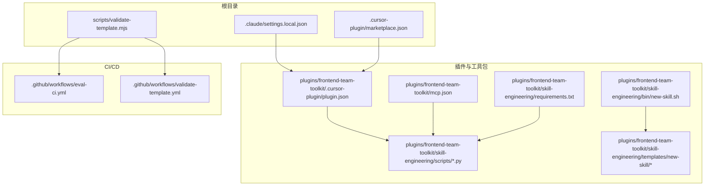
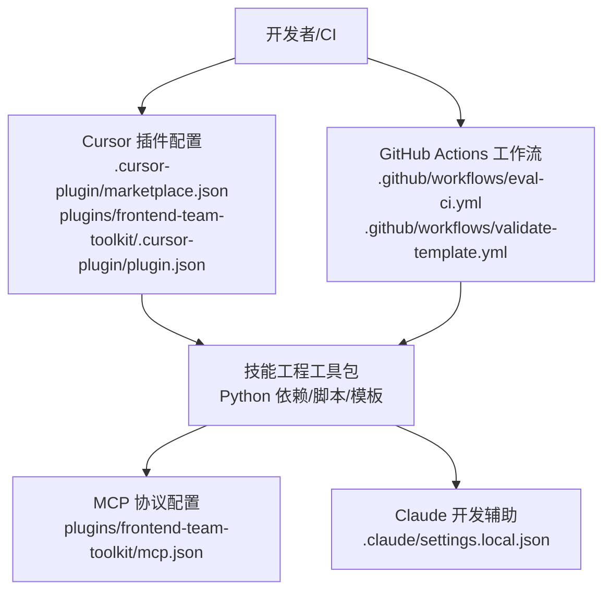
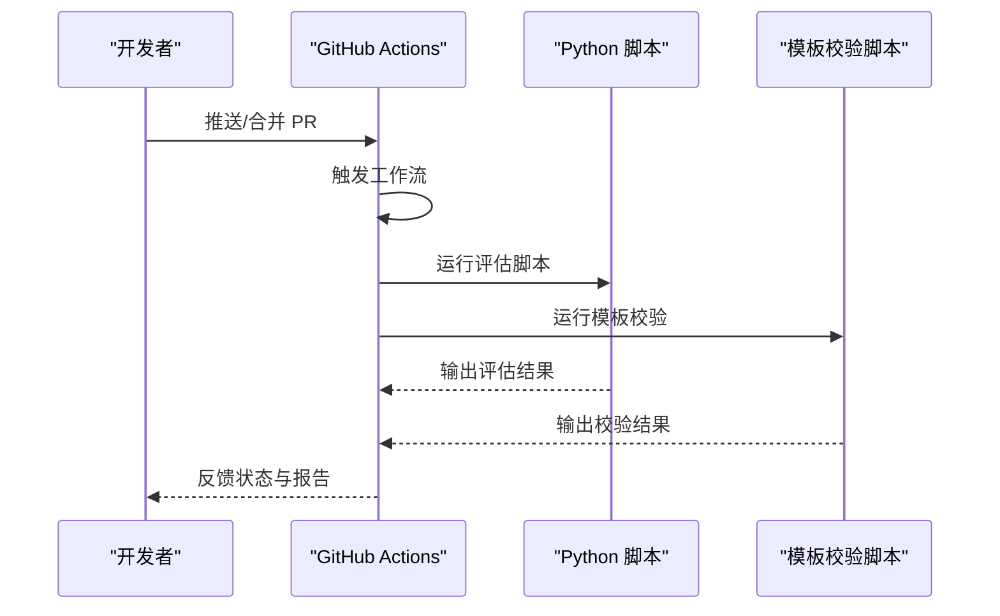
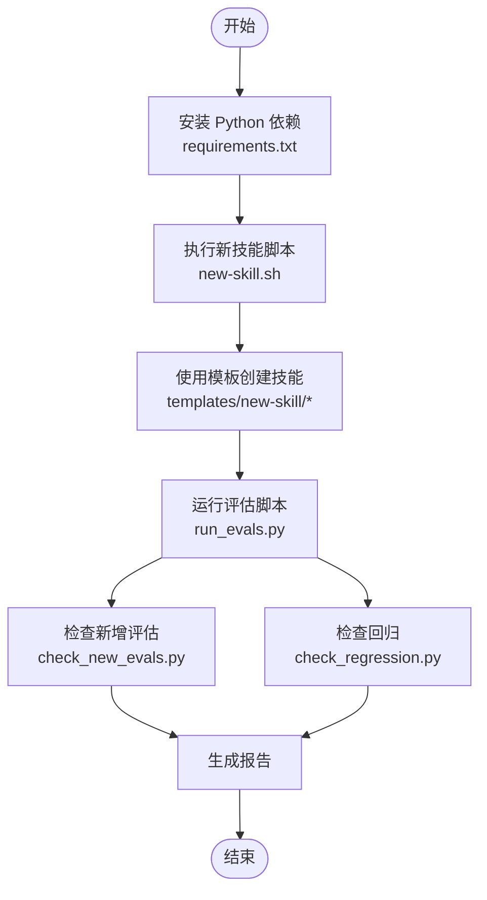
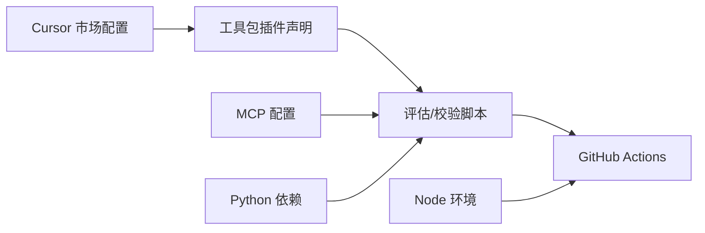

# 配置与部署

<cite>
**本文引用的文件**
- [.claude/settings.local.json](file://.claude/settings.local.json)
- [.cursor-plugin/marketplace.json](file://.cursor-plugin/marketplace.json)
- [plugins/frontend-team-toolkit/.cursor-plugin/plugin.json](file://plugins/frontend-team-toolkit/.cursor-plugin/plugin.json)
- [plugins/frontend-team-toolkit/mcp.json](file://plugins/frontend-team-toolkit/mcp.json)
- [.github/workflows/eval-ci.yml](file://.github/workflows/eval-ci.yml)
- [.github/workflows/validate-template.yml](file://.github/workflows/validate-template.yml)
- [scripts/validate-template.mjs](file://scripts/validate-template.mjs)
- [plugins/frontend-team-toolkit/skill-engineering/requirements.txt](file://plugins/frontend-team-toolkit/skill-engineering/requirements.txt)
- [plugins/frontend-team-toolkit/skill-engineering/bin/new-skill.sh](file://plugins/frontend-team-toolkit/skill-engineering/bin/new-skill.sh)
- [plugins/frontend-team-toolkit/skill-engineering/scripts/run_evals.py](file://plugins/frontend-team-toolkit/skill-engineering/scripts/run_evals.py)
- [plugins/frontend-team-toolkit/skill-engineering/scripts/check_new_evals.py](file://plugins/frontend-team-toolkit/skill-engineering/scripts/check_new_evals.py)
- [plugins/frontend-team-toolkit/skill-engineering/scripts/check_regression.py](file://plugins/frontend-team-toolkit/skill-engineering/scripts/check_regression.py)
- [plugins/frontend-team-toolkit/skill-engineering/scripts/skill_runner.py](file://plugins/frontend-team-toolkit/skill-engineering/scripts/skill_runner.py)
- [plugins/frontend-team-toolkit/skill-engineering/templates/new-skill/.skill-meta.json](file://plugins/frontend-team-toolkit/skill-engineering/templates/new-skill/.skill-meta.json)
- [plugins/frontend-team-toolkit/skill-engineering/templates/new-skill/SKILL.md](file://plugins/frontend-team-toolkit/skill-engineering/templates/new-skill/SKILL.md)
- [plugins/frontend-team-toolkit/skill-engineering/templates/new-skill/workflows/serial-workflow.js](file://plugins/frontend-team-toolkit/skill-engineering/templates/new-skill/workflows/serial-workflow.js)
- [plugins/frontend-team-toolkit/skill-engineering/templates/new-skill/workflows/parallel-workflow.js](file://plugins/frontend-team-toolkit/skill-engineering/templates/new-skill/workflows/parallel-workflow.js)
- [plugins/frontend-team-toolkit/skill-engineering/templates/new-skill/workflows/conditional-workflow.js](file://plugins/frontend-team-toolkit/skill-engineering/templates/new-skill/workflows/conditional-workflow.js)
- [plugins/frontend-team-toolkit/skill-engineering/templates/new-skill/workflows/loop-workflow.js](file://plugins/frontend-team-toolkit/skill-engineering/templates/new-skill/workflows/loop-workflow.js)
- [plugins/frontend-team-toolkit/skill-engineering/templates/new-skill/workflows/adversarial-workflow.js](file://plugins/frontend-team-toolkit/skill-engineering/templates/new-skill/workflows/adversarial-workflow.js)
- [plugins/frontend-team-toolkit/skill-engineering/templates/new-skill/workflows/weekly-regression.js](file://plugins/frontend-team-toolkit/skill-engineering/templates/new-skill/workflows/weekly-regression.js)
- [plugins/frontend-team-toolkit/skill-engineering/docs/lifecycle-quickref.md](file://plugins/frontend-team-toolkit/skill-engineering/docs/lifecycle-quickref.md)
</cite>

## 目录
1. [简介](#简介)
2. [项目结构](#项目结构)
3. [核心组件](#核心组件)
4. [架构总览](#架构总览)
5. [详细组件分析](#详细组件分析)
6. [依赖分析](#依赖分析)
7. [性能考虑](#性能考虑)
8. [故障排查指南](#故障排查指南)
9. [结论](#结论)
10. [附录](#附录)

## 简介
本指南面向前端团队市场项目（frontend-team-marketplace）的配置与部署，覆盖开发与生产环境的配置要点、依赖安装、安全配置、插件配置（含 Cursor 插件、MCP 协议）、GitHub Actions CI/CD 流水线、自动化部署流程、验证方法、性能调优与扩展性建议，以及与外部服务的集成配置。

## 项目结构
该项目围绕“技能工程工具包”构建，包含 CLI 脚本、评估脚本、工作流模板、技能元数据与文档等。关键目录与文件如下：
- 插件与市场配置：.cursor-plugin/marketplace.json、plugins/frontend-team-toolkit/.cursor-plugin/plugin.json、plugins/frontend-team-toolkit/mcp.json
- GitHub Actions 工作流：.github/workflows/eval-ci.yml、.github/workflows/validate-template.yml
- 技能工程工具链：bin、scripts、templates、schemas、docs、requirements.txt
- 校验脚本：scripts/validate-template.mjs
- Claude 开发辅助配置：.claude/settings.local.json

**图表来源**
- [.cursor-plugin/marketplace.json:1-200](file://.cursor-plugin/marketplace.json#L1-L200)
- [plugins/frontend-team-toolkit/.cursor-plugin/plugin.json:1-200](file://plugins/frontend-team-toolkit/.cursor-plugin/plugin.json#L1-L200)
- [plugins/frontend-team-toolkit/mcp.json:1-200](file://plugins/frontend-team-toolkit/mcp.json#L1-L200)
- [.github/workflows/eval-ci.yml:1-200](file://.github/workflows/eval-ci.yml#L1-L200)
- [.github/workflows/validate-template.yml:1-200](file://.github/workflows/validate-template.yml#L1-L200)
- [scripts/validate-template.mjs:1-200](file://scripts/validate-template.mjs#L1-L200)
- [plugins/frontend-team-toolkit/skill-engineering/requirements.txt:1-200](file://plugins/frontend-team-toolkit/skill-engineering/requirements.txt#L1-L200)
- [plugins/frontend-team-toolkit/skill-engineering/bin/new-skill.sh:1-200](file://plugins/frontend-team-toolkit/skill-engineering/bin/new-skill.sh#L1-L200)
- [plugins/frontend-team-toolkit/skill-engineering/scripts/run_evals.py:1-200](file://plugins/frontend-team-toolkit/skill-engineering/scripts/run_evals.py#L1-L200)
- [plugins/frontend-team-toolkit/skill-engineering/templates/new-skill/.skill-meta.json:1-200](file://plugins/frontend-team-toolkit/skill-engineering/templates/new-skill/.skill-meta.json#L1-L200)

**章节来源**
- [.cursor-plugin/marketplace.json:1-200](file://.cursor-plugin/marketplace.json#L1-L200)
- [plugins/frontend-team-toolkit/.cursor-plugin/plugin.json:1-200](file://plugins/frontend-team-toolkit/.cursor-plugin/plugin.json#L1-L200)
- [plugins/frontend-team-toolkit/mcp.json:1-200](file://plugins/frontend-team-toolkit/mcp.json#L1-L200)
- [.github/workflows/eval-ci.yml:1-200](file://.github/workflows/eval-ci.yml#L1-L200)
- [.github/workflows/validate-template.yml:1-200](file://.github/workflows/validate-template.yml#L1-L200)
- [scripts/validate-template.mjs:1-200](file://scripts/validate-template.mjs#L1-L200)
- [plugins/frontend-team-toolkit/skill-engineering/requirements.txt:1-200](file://plugins/frontend-team-toolkit/skill-engineering/requirements.txt#L1-L200)
- [plugins/frontend-team-toolkit/skill-engineering/bin/new-skill.sh:1-200](file://plugins/frontend-team-toolkit/skill-engineering/bin/new-skill.sh#L1-L200)
- [plugins/frontend-team-toolkit/skill-engineering/scripts/run_evals.py:1-200](file://plugins/frontend-team-toolkit/skill-engineering/scripts/run_evals.py#L1-L200)
- [plugins/frontend-team-toolkit/skill-engineering/templates/new-skill/.skill-meta.json:1-200](file://plugins/frontend-team-toolkit/skill-engineering/templates/new-skill/.skill-meta.json#L1-L200)

## 核心组件
- Cursor 插件市场与工具包配置：用于在 Cursor 中注册与启用技能工程工具包，定义市场入口与能力暴露。
- MCP 协议配置：定义与外部模型或服务交互的协议与端点。
- GitHub Actions 工作流：自动化评估与模板校验流水线。
- 技能工程工具链：包含 Python 依赖、Shell 脚本与评估脚本，支撑技能生命周期管理。
- 模板与元数据：新技能模板、工作流与技能元信息，确保一致性与可复用性。
- Claude 开发辅助：本地开发配置，便于调试与本地运行。

**章节来源**
- [.cursor-plugin/marketplace.json:1-200](file://.cursor-plugin/marketplace.json#L1-L200)
- [plugins/frontend-team-toolkit/.cursor-plugin/plugin.json:1-200](file://plugins/frontend-team-toolkit/.cursor-plugin/plugin.json#L1-L200)
- [plugins/frontend-team-toolkit/mcp.json:1-200](file://plugins/frontend-team-toolkit/mcp.json#L1-L200)
- [.github/workflows/eval-ci.yml:1-200](file://.github/workflows/eval-ci.yml#L1-L200)
- [.github/workflows/validate-template.yml:1-200](file://.github/workflows/validate-template.yml#L1-L200)
- [plugins/frontend-team-toolkit/skill-engineering/requirements.txt:1-200](file://plugins/frontend-team-toolkit/skill-engineering/requirements.txt#L1-L200)
- [plugins/frontend-team-toolkit/skill-engineering/bin/new-skill.sh:1-200](file://plugins/frontend-team-toolkit/skill-engineering/bin/new-skill.sh#L1-L200)
- [plugins/frontend-team-toolkit/skill-engineering/scripts/run_evals.py:1-200](file://plugins/frontend-team-toolkit/skill-engineering/scripts/run_evals.py#L1-L200)
- [plugins/frontend-team-toolkit/skill-engineering/templates/new-skill/.skill-meta.json:1-200](file://plugins/frontend-team-toolkit/skill-engineering/templates/new-skill/.skill-meta.json#L1-L200)

## 架构总览
下图展示从 Cursor 插件到 MCP 协议、再到 GitHub Actions 的整体配置与执行路径。

**图表来源**
- [.cursor-plugin/marketplace.json:1-200](file://.cursor-plugin/marketplace.json#L1-L200)
- [plugins/frontend-team-toolkit/.cursor-plugin/plugin.json:1-200](file://plugins/frontend-team-toolkit/.cursor-plugin/plugin.json#L1-L200)
- [plugins/frontend-team-toolkit/mcp.json:1-200](file://plugins/frontend-team-toolkit/mcp.json#L1-L200)
- [.github/workflows/eval-ci.yml:1-200](file://.github/workflows/eval-ci.yml#L1-L200)
- [.github/workflows/validate-template.yml:1-200](file://.github/workflows/validate-template.yml#L1-L200)
- [.claude/settings.local.json:1-200](file://.claude/settings.local.json#L1-L200)

## 详细组件分析

### Cursor 插件配置
- 市场入口与能力暴露：通过市场配置文件定义插件在 Cursor 市场中的可见性与能力边界。
- 工具包插件声明：工具包内的插件 JSON 定义具体能力、命令与交互方式。
- 集成要点：
  - 在 Cursor 中启用市场入口后，工具包插件应可被发现并加载。
  - 确保命令与参数与 MCP 协议一致，避免运行时错误。

**章节来源**
- [.cursor-plugin/marketplace.json:1-200](file://.cursor-plugin/marketplace.json#L1-L200)
- [plugins/frontend-team-toolkit/.cursor-plugin/plugin.json:1-200](file://plugins/frontend-team-toolkit/.cursor-plugin/plugin.json#L1-L200)

### MCP 协议配置
- 协议与端点：MCP 配置文件定义与外部服务通信的协议、端点与认证方式。
- 运行时行为：工具包脚本通过该配置与外部服务交互，执行评估与工作流。
- 安全建议：
  - 使用受控网络与最小权限访问。
  - 对敏感凭据进行加密存储与注入。

**章节来源**
- [plugins/frontend-team-toolkit/mcp.json:1-200](file://plugins/frontend-team-toolkit/mcp.json#L1-L200)

### GitHub Actions 配置
- 评估流水线：评估 CI 工作流负责运行技能评估与回归检查。
- 模板校验：模板校验工作流负责对新技能模板进行一致性与格式校验。
- 关键步骤：
  - 环境准备：安装 Python 依赖与 Node 工具。
  - 执行校验：调用模板校验脚本与评估脚本。
  - 结果输出：生成报告并触发后续流程。

**图表来源**
- [.github/workflows/eval-ci.yml:1-200](file://.github/workflows/eval-ci.yml#L1-L200)
- [.github/workflows/validate-template.yml:1-200](file://.github/workflows/validate-template.yml#L1-L200)
- [scripts/validate-template.mjs:1-200](file://scripts/validate-template.mjs#L1-L200)
- [plugins/frontend-team-toolkit/skill-engineering/scripts/run_evals.py:1-200](file://plugins/frontend-team-toolkit/skill-engineering/scripts/run_evals.py#L1-L200)

**章节来源**
- [.github/workflows/eval-ci.yml:1-200](file://.github/workflows/eval-ci.yml#L1-L200)
- [.github/workflows/validate-template.yml:1-200](file://.github/workflows/validate-template.yml#L1-L200)
- [scripts/validate-template.mjs:1-200](file://scripts/validate-template.mjs#L1-L200)
- [plugins/frontend-team-toolkit/skill-engineering/scripts/run_evals.py:1-200](file://plugins/frontend-team-toolkit/skill-engineering/scripts/run_evals.py#L1-L200)

### 技能工程工具链
- Python 依赖：集中管理评估与校验所需的第三方库。
- Shell 脚本：提供快速创建新技能的 CLI 入口。
- 评估脚本：支持多种评估模式与回归检测。
- 模板与元数据：标准化技能结构，确保一致性与可维护性。

**图表来源**
- [plugins/frontend-team-toolkit/skill-engineering/requirements.txt:1-200](file://plugins/frontend-team-toolkit/skill-engineering/requirements.txt#L1-L200)
- [plugins/frontend-team-toolkit/skill-engineering/bin/new-skill.sh:1-200](file://plugins/frontend-team-toolkit/skill-engineering/bin/new-skill.sh#L1-L200)
- [plugins/frontend-team-toolkit/skill-engineering/scripts/run_evals.py:1-200](file://plugins/frontend-team-toolkit/skill-engineering/scripts/run_evals.py#L1-L200)
- [plugins/frontend-team-toolkit/skill-engineering/scripts/check_new_evals.py:1-200](file://plugins/frontend-team-toolkit/skill-engineering/scripts/check_new_evals.py#L1-L200)
- [plugins/frontend-team-toolkit/skill-engineering/scripts/check_regression.py:1-200](file://plugins/frontend-team-toolkit/skill-engineering/scripts/check_regression.py#L1-L200)
- [plugins/frontend-team-toolkit/skill-engineering/templates/new-skill/.skill-meta.json:1-200](file://plugins/frontend-team-toolkit/skill-engineering/templates/new-skill/.skill-meta.json#L1-L200)

**章节来源**
- [plugins/frontend-team-toolkit/skill-engineering/requirements.txt:1-200](file://plugins/frontend-team-toolkit/skill-engineering/requirements.txt#L1-L200)
- [plugins/frontend-team-toolkit/skill-engineering/bin/new-skill.sh:1-200](file://plugins/frontend-team-toolkit/skill-engineering/bin/new-skill.sh#L1-L200)
- [plugins/frontend-team-toolkit/skill-engineering/scripts/run_evals.py:1-200](file://plugins/frontend-team-toolkit/skill-engineering/scripts/run_evals.py#L1-L200)
- [plugins/frontend-team-toolkit/skill-engineering/scripts/check_new_evals.py:1-200](file://plugins/frontend-team-toolkit/skill-engineering/scripts/check_new_evals.py#L1-L200)
- [plugins/frontend-team-toolkit/skill-engineering/scripts/check_regression.py:1-200](file://plugins/frontend-team-toolkit/skill-engineering/scripts/check_regression.py#L1-L200)
- [plugins/frontend-team-toolkit/skill-engineering/templates/new-skill/.skill-meta.json:1-200](file://plugins/frontend-team-toolkit/skill-engineering/templates/new-skill/.skill-meta.json#L1-L200)

### Claude 开发辅助配置
- 本地开发：通过本地配置文件为 Claude 提供开发与调试所需参数。
- 建议：
  - 将敏感参数放入受控环境变量中，避免硬编码。
  - 在本地与 CI 中保持配置一致性。

**章节来源**
- [.claude/settings.local.json:1-200](file://.claude/settings.local.json#L1-L200)

## 依赖分析
- 组件耦合：
  - Cursor 插件配置与工具包插件声明强关联，需保持命令与参数一致。
  - MCP 配置影响所有评估与工作流脚本的行为。
  - GitHub Actions 依赖 Python 与 Node 环境，以及模板校验脚本。
- 外部依赖：
  - Python 第三方库由 requirements.txt 管理。
  - Shell 脚本依赖系统工具链与 Node 环境。

**图表来源**
- [.cursor-plugin/marketplace.json:1-200](file://.cursor-plugin/marketplace.json#L1-L200)
- [plugins/frontend-team-toolkit/.cursor-plugin/plugin.json:1-200](file://plugins/frontend-team-toolkit/.cursor-plugin/plugin.json#L1-L200)
- [plugins/frontend-team-toolkit/mcp.json:1-200](file://plugins/frontend-team-toolkit/mcp.json#L1-L200)
- [plugins/frontend-team-toolkit/skill-engineering/requirements.txt:1-200](file://plugins/frontend-team-toolkit/skill-engineering/requirements.txt#L1-L200)
- [.github/workflows/eval-ci.yml:1-200](file://.github/workflows/eval-ci.yml#L1-L200)
- [.github/workflows/validate-template.yml:1-200](file://.github/workflows/validate-template.yml#L1-L200)

**章节来源**
- [plugins/frontend-team-toolkit/skill-engineering/requirements.txt:1-200](file://plugins/frontend-team-toolkit/skill-engineering/requirements.txt#L1-L200)
- [.github/workflows/eval-ci.yml:1-200](file://.github/workflows/eval-ci.yml#L1-L200)
- [.github/workflows/validate-template.yml:1-200](file://.github/workflows/validate-template.yml#L1-L200)

## 性能考虑
- 评估批处理：将多个评估任务合并为批处理以减少启动开销。
- 缓存策略：对重复的评估结果与中间产物进行缓存，缩短 CI 时间。
- 并行化：在不冲突的前提下并行执行独立评估任务。
- 资源限制：为评估与校验脚本设置超时与内存上限，避免资源耗尽。
- 日志与指标：记录评估耗时与成功率，持续优化性能瓶颈。

[本节为通用指导，无需列出章节来源]

## 故障排查指南
- Cursor 插件不可见：
  - 检查市场配置与工具包插件声明是否正确。
  - 确认命令与参数与 MCP 配置一致。
- MCP 连接失败：
  - 校验端点与认证参数。
  - 在本地与 CI 中分别测试连接。
- GitHub Actions 失败：
  - 查看工作流日志中的依赖安装与脚本执行阶段。
  - 确认模板校验脚本与评估脚本返回码与输出。
- 模板校验失败：
  - 对照模板规范与元数据文件，逐项核对字段。
  - 使用校验脚本在本地先行验证。

**章节来源**
- [.cursor-plugin/marketplace.json:1-200](file://.cursor-plugin/marketplace.json#L1-L200)
- [plugins/frontend-team-toolkit/.cursor-plugin/plugin.json:1-200](file://plugins/frontend-team-toolkit/.cursor-plugin/plugin.json#L1-L200)
- [plugins/frontend-team-toolkit/mcp.json:1-200](file://plugins/frontend-team-toolkit/mcp.json#L1-L200)
- [.github/workflows/eval-ci.yml:1-200](file://.github/workflows/eval-ci.yml#L1-L200)
- [.github/workflows/validate-template.yml:1-200](file://.github/workflows/validate-template.yml#L1-L200)
- [scripts/validate-template.mjs:1-200](file://scripts/validate-template.mjs#L1-L200)

## 结论
本指南提供了从 Cursor 插件、MCP 协议到 GitHub Actions 的完整配置与部署路径。通过统一的模板与元数据、严格的依赖管理与 CI 校验，可确保技能工程的可复用性与稳定性。建议在生产环境中强化安全与监控，并持续优化评估与校验流程的性能。

[本节为总结性内容，无需列出章节来源]

## 附录

### 开发环境配置清单
- 安装 Python 依赖：参考 requirements.txt。
- 准备 Node 环境：用于模板校验脚本与 CI。
- 配置 Cursor 插件：启用市场入口并加载工具包插件。
- 配置 MCP：确保端点与认证参数正确。
- 验证模板：在本地运行模板校验脚本。

**章节来源**
- [plugins/frontend-team-toolkit/skill-engineering/requirements.txt:1-200](file://plugins/frontend-team-toolkit/skill-engineering/requirements.txt#L1-L200)
- [scripts/validate-template.mjs:1-200](file://scripts/validate-template.mjs#L1-L200)
- [.cursor-plugin/marketplace.json:1-200](file://.cursor-plugin/marketplace.json#L1-L200)
- [plugins/frontend-team-toolkit/.cursor-plugin/plugin.json:1-200](file://plugins/frontend-team-toolkit/.cursor-plugin/plugin.json#L1-L200)
- [plugins/frontend-team-toolkit/mcp.json:1-200](file://plugins/frontend-team-toolkit/mcp.json#L1-L200)

### 生产环境安全配置建议
- 最小权限原则：仅授予 MCP 与外部服务所需的访问权限。
- 凭据管理：使用受控密钥管理服务注入敏感信息。
- 网络隔离：在受控网络内运行评估与校验任务。
- 审计日志：记录关键操作与异常事件，便于追踪与审计。

[本节为通用指导，无需列出章节来源]

### 自动化部署与 CI/CD 流程
- 触发条件：推送代码或合并 PR 后自动触发工作流。
- 步骤概览：安装依赖 → 运行评估 → 运行模板校验 → 生成报告。
- 结果反馈：根据脚本返回码与输出更新 PR 状态与评论。

**章节来源**
- [.github/workflows/eval-ci.yml:1-200](file://.github/workflows/eval-ci.yml#L1-L200)
- [.github/workflows/validate-template.yml:1-200](file://.github/workflows/validate-template.yml#L1-L200)
- [scripts/validate-template.mjs:1-200](file://scripts/validate-template.mjs#L1-L200)
- [plugins/frontend-team-toolkit/skill-engineering/scripts/run_evals.py:1-200](file://plugins/frontend-team-toolkit/skill-engineering/scripts/run_evals.py#L1-L200)

### 与外部服务集成配置
- MCP 协议：通过配置文件定义外部服务接口与认证方式。
- 评估脚本：按 MCP 配置调用外部服务，处理响应与错误。
- 监控与告警：对调用失败与延迟进行监控与告警。

**章节来源**
- [plugins/frontend-team-toolkit/mcp.json:1-200](file://plugins/frontend-team-toolkit/mcp.json#L1-L200)
- [plugins/frontend-team-toolkit/skill-engineering/scripts/run_evals.py:1-200](file://plugins/frontend-team-toolkit/skill-engineering/scripts/run_evals.py#L1-L200)