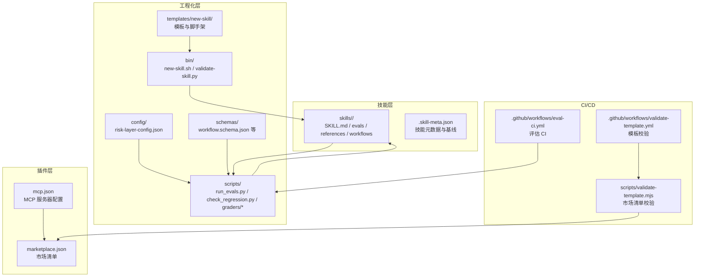
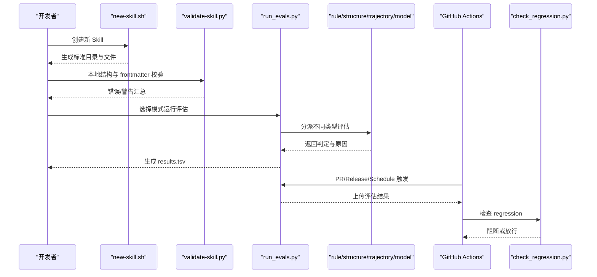
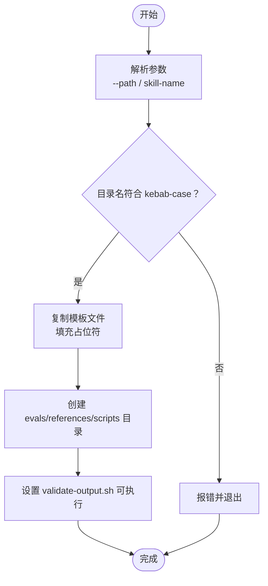
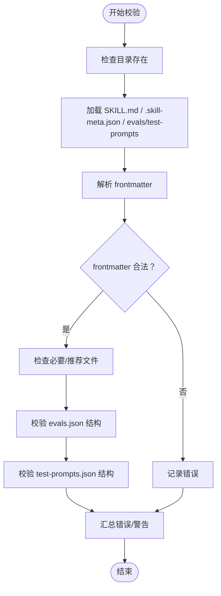
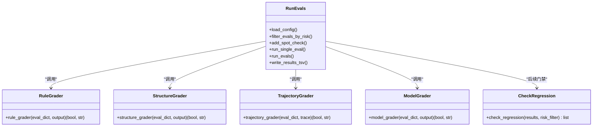
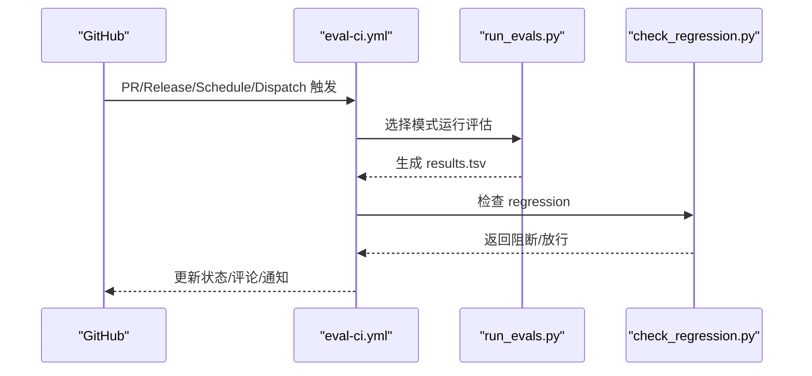
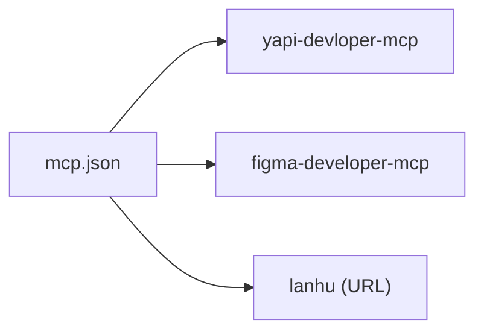
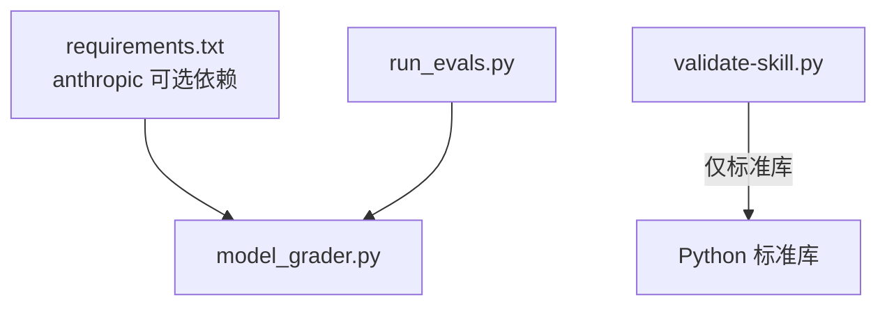

# 技术架构概览

<cite>
**本文档引用的文件**
- [README.md](file://plugins/frontend-team-toolkit/skill-engineering/README.md)
- [mcp.json](file://plugins/frontend-team-toolkit/mcp.json)
- [requirements.txt](file://plugins/frontend-team-toolkit/skill-engineering/requirements.txt)
- [eval-ci.yml](file://.github/workflows/eval-ci.yml)
- [validate-template.yml](file://.github/workflows/validate-template.yml)
- [validate-template.mjs](file://scripts/validate-template.mjs)
- [new-skill.sh](file://plugins/frontend-team-toolkit/skill-engineering/bin/new-skill.sh)
- [validate-skill.py](file://plugins/frontend-team-toolkit/skill-engineering/bin/validate-skill.py)
- [run_evals.py](file://plugins/frontend-team-toolkit/skill-engineering/scripts/run_evals.py)
- [check_regression.py](file://plugins/frontend-team-toolkit/skill-engineering/scripts/check_regression.py)
- [risk-layer-config.json](file://plugins/frontend-team-toolkit/skill-engineering/config/risk-layer-config.json)
- [workflow.schema.json](file://plugins/frontend-team-toolkit/skill-engineering/schemas/workflow.schema.json)
- [.skill-meta.json](file://plugins/frontend-team-toolkit/skills/wechat-article-review/.skill-meta.json)
- [SKILL.md](file://plugins/frontend-team-toolkit/skills/wechat-article-review/SKILL.md)
- [SKILL.md（模板）](file://plugins/frontend-team-toolkit/skill-engineering/templates/new-skill/SKILL.md)
- [rule_grader.py](file://plugins/frontend-team-toolkit/skill-engineering/scripts/graders/rule_grader.py)
- [structure_grader.py](file://plugins/frontend-team-toolkit/skill-engineering/scripts/graders/structure_grader.py)
- [trajectory_grader.py](file://plugins/frontend-team-toolkit/skill-engineering/scripts/graders/trajectory_grader.py)
</cite>

## 目录
1. [引言](#引言)
2. [项目结构](#项目结构)
3. [核心组件](#核心组件)
4. [架构总览](#架构总览)
5. [详细组件分析](#详细组件分析)
6. [依赖关系分析](#依赖关系分析)
7. [性能考虑](#性能考虑)
8. [故障排除指南](#故障排除指南)
9. [结论](#结论)

## 引言
本项目面向前端团队的 Cursor 插件市场，提供一套完整的 Agent Skill 工程化体系，涵盖脚手架、评估系统、工作流管理、CI/CD 集成与 MCP 协议对接。其目标是通过标准化的目录结构、JSON Schema、Grader 自动化与 GitHub Actions，实现 Skill 的可重复构建、可验证交付与可持续演进。

## 项目结构
项目采用“插件 + 技能 + 工程化”的三层组织方式：
- 插件层：Cursor 插件入口与市场清单，负责声明资源与 MCP 服务器。
- 工程化层：skill-engineering 提供脚手架、校验器、评估运行器、Grader 与配置。
- 技能层：skills 下的各个具体 Skill，遵循统一模板与规范。

**图表来源**
- [mcp.json:1-26](file://plugins/frontend-team-toolkit/mcp.json#L1-L26)
- [eval-ci.yml:1-208](file://.github/workflows/eval-ci.yml#L1-L208)
- [validate-template.yml:1-33](file://.github/workflows/validate-template.yml#L1-L33)
- [validate-template.mjs:1-382](file://scripts/validate-template.mjs#L1-L382)
- [new-skill.sh:1-121](file://plugins/frontend-team-toolkit/skill-engineering/bin/new-skill.sh#L1-L121)
- [validate-skill.py:1-193](file://plugins/frontend-team-toolkit/skill-engineering/bin/validate-skill.py#L1-L193)
- [run_evals.py:1-227](file://plugins/frontend-team-toolkit/skill-engineering/scripts/run_evals.py#L1-L227)
- [check_regression.py:1-100](file://plugins/frontend-team-toolkit/skill-engineering/scripts/check_regression.py#L1-L100)
- [risk-layer-config.json:1-70](file://plugins/frontend-team-toolkit/skill-engineering/config/risk-layer-config.json#L1-L70)
- [workflow.schema.json:1-101](file://plugins/frontend-team-toolkit/skill-engineering/schemas/workflow.schema.json#L1-L101)

**章节来源**
- [README.md:1-294](file://plugins/frontend-team-toolkit/skill-engineering/README.md#L1-L294)
- [mcp.json:1-26](file://plugins/frontend-team-toolkit/mcp.json#L1-L26)
- [eval-ci.yml:1-208](file://.github/workflows/eval-ci.yml#L1-L208)
- [validate-template.yml:1-33](file://.github/workflows/validate-template.yml#L1-L33)
- [validate-template.mjs:1-382](file://scripts/validate-template.mjs#L1-L382)

## 核心组件
- 脚手架与校验
  - new-skill.sh：从模板生成标准化 Skill 目录，填充占位符并赋予可执行权限。
  - validate-skill.py：校验目录结构、frontmatter、必要文件与 evals/test-prompts 格式。
- 评估系统
  - run_evals.py：按 PR/Release/Scheduled 模式筛选 Eval，调用 skill_runner 执行并分派到 rule/structure/trajectory/model Grader。
  - check_regression.py：基于 results.tsv 检查 regression 类型失败并决定是否阻断合并。
  - Grader：rule/structure/trajectory 为完全自动化；model 为半自动化（LLM Judge）。
- 配置与规范
  - risk-layer-config.json：定义 PR/Release/Scheduled 三阶段的风险过滤与阻断策略。
  - workflow.schema.json：约束动态工作流脚本元数据结构。
- CI/CD 集成
  - eval-ci.yml：PR/Release/Schedule/Dispatch 触发的评估流水线，上传结果并通知。
  - validate-template.yml + validate-template.mjs：校验市场清单与插件清单的结构与引用路径。
- MCP 协议
  - mcp.json：声明外部 MCP 服务器（如 YAPI、Figma、本地服务），支持命令行或 URL 两种接入方式。

**章节来源**
- [new-skill.sh:1-121](file://plugins/frontend-team-toolkit/skill-engineering/bin/new-skill.sh#L1-L121)
- [validate-skill.py:1-193](file://plugins/frontend-team-toolkit/skill-engineering/bin/validate-skill.py#L1-L193)
- [run_evals.py:1-227](file://plugins/frontend-team-toolkit/skill-engineering/scripts/run_evals.py#L1-L227)
- [check_regression.py:1-100](file://plugins/frontend-team-toolkit/skill-engineering/scripts/check_regression.py#L1-L100)
- [risk-layer-config.json:1-70](file://plugins/frontend-team-toolkit/skill-engineering/config/risk-layer-config.json#L1-L70)
- [workflow.schema.json:1-101](file://plugins/frontend-team-toolkit/skill-engineering/schemas/workflow.schema.json#L1-L101)
- [eval-ci.yml:1-208](file://.github/workflows/eval-ci.yml#L1-L208)
- [validate-template.mjs:1-382](file://scripts/validate-template.mjs#L1-L382)
- [mcp.json:1-26](file://plugins/frontend-team-toolkit/mcp.json#L1-L26)

## 架构总览
系统以“模板驱动 + 标准化规范 + 自动化评估 + CI/CD 阻断”为核心，形成从“创建 → 校验 → 评估 → 回归 → 发布”的闭环。

**图表来源**
- [new-skill.sh:1-121](file://plugins/frontend-team-toolkit/skill-engineering/bin/new-skill.sh#L1-L121)
- [validate-skill.py:1-193](file://plugins/frontend-team-toolkit/skill-engineering/bin/validate-skill.py#L1-L193)
- [run_evals.py:1-227](file://plugins/frontend-team-toolkit/skill-engineering/scripts/run_evals.py#L1-L227)
- [check_regression.py:1-100](file://plugins/frontend-team-toolkit/skill-engineering/scripts/check_regression.py#L1-L100)
- [eval-ci.yml:1-208](file://.github/workflows/eval-ci.yml#L1-L208)

## 详细组件分析

### 脚手架与模板系统
- new-skill.sh
  - 作用：复制模板文件，替换占位符（名称、标题、时间），创建必要目录与可执行脚本。
  - 关键点：强制 kebab-case 目录名；默认输出到 toolkit/skills；支持自定义输出路径。
- SKILL.md 模板
  - 作用：提供标准化的触发条件、契约、工作流、反模式与资源清单说明。
  - 与动态工作流协作：模板中声明可用的 workflow 类型，指导 Claude 或用户选择合适的编排。

**图表来源**
- [new-skill.sh:1-121](file://plugins/frontend-team-toolkit/skill-engineering/bin/new-skill.sh#L1-L121)
- [SKILL.md（模板）:1-97](file://plugins/frontend-team-toolkit/skill-engineering/templates/new-skill/SKILL.md#L1-L97)

**章节来源**
- [new-skill.sh:1-121](file://plugins/frontend-team-toolkit/skill-engineering/bin/new-skill.sh#L1-L121)
- [SKILL.md（模板）:1-97](file://plugins/frontend-team-toolkit/skill-engineering/templates/new-skill/SKILL.md#L1-L97)

### 结构校验与规范
- validate-skill.py
  - 作用：校验目录结构、frontmatter 键值、必要/推荐文件、evals/test-prompts 格式。
  - 约定：frontmatter 仅允许白名单键；description 必须包含触发短语；SKILL.md 建议包含若干推荐章节。
- JSON Schema
  - workflow.schema.json：约束动态工作流脚本元数据，确保输入/输出契约、触发词、Agent 列表、风险等级等字段一致。

**图表来源**
- [validate-skill.py:1-193](file://plugins/frontend-team-toolkit/skill-engineering/bin/validate-skill.py#L1-L193)
- [workflow.schema.json:1-101](file://plugins/frontend-team-toolkit/skill-engineering/schemas/workflow.schema.json#L1-L101)

**章节来源**
- [validate-skill.py:1-193](file://plugins/frontend-team-toolkit/skill-engineering/bin/validate-skill.py#L1-L193)
- [workflow.schema.json:1-101](file://plugins/frontend-toolkit/skill-engineering/schemas/workflow.schema.json#L1-L101)

### 评估系统与 Grader 自动化
- run_evals.py
  - 作用：按模式筛选 Eval，调用 skill_runner 执行，分派到 rule/structure/trajectory/model Grader，生成 TSV 结果。
  - 风险分层：PR 模式仅 high/medium；Release 全量；Scheduled 按频率与随机抽查。
- Grader 组件
  - rule_grader：关键词/路径/禁用词检查，完全自动化。
  - structure_grader：章节/步骤/元数据结构检查，完全自动化。
  - trajectory_grader：Agent 调用顺序与并行/串行约束检查，完全自动化。
  - model_grader：LLM Judge 半自动化，用于语义漂移检测。
- check_regression.py
  - 作用：从 results.tsv 中筛选 regression 类型失败用例，按风险级别决定阻断或告警。

**图表来源**
- [run_evals.py:1-227](file://plugins/frontend-team-toolkit/skill-engineering/scripts/run_evals.py#L1-L227)
- [rule_grader.py:1-110](file://plugins/frontend-team-toolkit/skill-engineering/scripts/graders/rule_grader.py#L1-L110)
- [structure_grader.py:1-155](file://plugins/frontend-team-toolkit/skill-engineering/scripts/graders/structure_grader.py#L1-L155)
- [trajectory_grader.py:1-163](file://plugins/frontend-team-toolkit/skill-engineering/scripts/graders/trajectory_grader.py#L1-L163)
- [check_regression.py:1-100](file://plugins/frontend-team-toolkit/skill-engineering/scripts/check_regression.py#L1-L100)

**章节来源**
- [run_evals.py:1-227](file://plugins/frontend-team-toolkit/skill-engineering/scripts/run_evals.py#L1-L227)
- [rule_grader.py:1-110](file://plugins/frontend-team-toolkit/skill-engineering/scripts/graders/rule_grader.py#L1-L110)
- [structure_grader.py:1-155](file://plugins/frontend-team-toolkit/skill-engineering/scripts/graders/structure_grader.py#L1-L155)
- [trajectory_grader.py:1-163](file://plugins/frontend-team-toolkit/skill-engineering/scripts/graders/trajectory_grader.py#L1-L163)
- [check_regression.py:1-100](file://plugins/frontend-team-toolkit/skill-engineering/scripts/check_regression.py#L1-L100)

### CI/CD 集成与门禁
- eval-ci.yml
  - 触发：PR/Release/Schedule/Dispatch。
  - 步骤：检测变更技能、按模式运行评估、检查 regression、上传结果、评论/通知。
  - 门禁：high 风险 regression 必阻；medium 风险可警告；新增 Eval 未 baseline 必阻；改技能未跑 baseline 必阻。
- validate-template.yml + validate-template.mjs
  - 校验市场清单与插件清单，检查 frontmatter、引用路径安全与存在性。

**图表来源**
- [eval-ci.yml:1-208](file://.github/workflows/eval-ci.yml#L1-L208)
- [run_evals.py:1-227](file://plugins/frontend-team-toolkit/skill-engineering/scripts/run_evals.py#L1-L227)
- [check_regression.py:1-100](file://plugins/frontend-team-toolkit/skill-engineering/scripts/check_regression.py#L1-L100)

**章节来源**
- [eval-ci.yml:1-208](file://.github/workflows/eval-ci.yml#L1-L208)
- [validate-template.mjs:1-382](file://scripts/validate-template.mjs#L1-L382)

### MCP 协议与外部集成
- mcp.json
  - 作用：声明外部 MCP 服务器，支持命令行（npx）或 URL 两种接入方式，便于与 YAPI、Figma、本地服务等集成。
  - 适用：当 Skill 需要访问外部系统或数据源时，通过 MCP 服务器桥接。

**图表来源**
- [mcp.json:1-26](file://plugins/frontend-team-toolkit/mcp.json#L1-L26)

**章节来源**
- [mcp.json:1-26](file://plugins/frontend-team-toolkit/mcp.json#L1-L26)

## 依赖关系分析
- 组件耦合
  - run_evals.py 依赖 graders 子模块与 skill_runner（内部导入），耦合度适中，便于扩展新的 Grader。
  - CI 通过 GitHub Actions 调用本地脚本，形成“本地可复现 + CI 自动化”的闭环。
- 外部依赖
  - anthropic：可选的 LLM Judge 依赖，用于 model_grader。
  - 标准库：validate-skill.py 仅使用 Python 标准库，降低外部依赖风险。
- 配置驱动
  - risk-layer-config.json 控制评估范围与门禁策略，避免硬编码，提升灵活性。

**图表来源**
- [requirements.txt:1-13](file://plugins/frontend-team-toolkit/skill-engineering/requirements.txt#L1-L13)
- [run_evals.py:1-227](file://plugins/frontend-team-toolkit/skill-engineering/scripts/run_evals.py#L1-L227)
- [model_grader.py:1-200](file://plugins/frontend-team-toolkit/skill-engineering/scripts/graders/model_grader.py#L1-L200)
- [validate-skill.py:1-193](file://plugins/frontend-team-toolkit/skill-engineering/bin/validate-skill.py#L1-L193)

**章节来源**
- [requirements.txt:1-13](file://plugins/frontend-team-toolkit/skill-engineering/requirements.txt#L1-L13)
- [run_evals.py:1-227](file://plugins/frontend-team-toolkit/skill-engineering/scripts/run_evals.py#L1-L227)
- [validate-skill.py:1-193](file://plugins/frontend-team-toolkit/skill-engineering/bin/validate-skill.py#L1-L193)

## 性能考虑
- 评估规模控制
  - PR 模式仅运行 high/medium 风险用例，缩短反馈周期。
  - Scheduled 模式按频率与随机抽查平衡覆盖率与成本。
- I/O 与并发
  - Grader 以纯文本处理为主，避免重型依赖；模型评分采用采样与阈值控制漂移风险。
- 结果缓存与增量
  - results.tsv 作为中间产物，便于增量对比与回归追踪。

## 故障排除指南
- 本地校验失败
  - 使用 validate-skill.py 检查目录结构与 frontmatter；根据错误/警告提示补齐缺失文件或修正格式。
- CI 评估失败
  - 查看评估结果与日志，定位 rule/structure/trajectory/model 中哪类判定失败；修复后重新提交。
  - regression 失败会阻断 PR 合并，需修复后再触发评估。
- 模板校验失败
  - validate-template.mjs 会检查 marketplce.json 与 plugin.json 的字段与引用路径，修正不合法或缺失项。

**章节来源**
- [validate-skill.py:1-193](file://plugins/frontend-team-toolkit/skill-engineering/bin/validate-skill.py#L1-L193)
- [eval-ci.yml:1-208](file://.github/workflows/eval-ci.yml#L1-L208)
- [validate-template.mjs:1-382](file://scripts/validate-template.mjs#L1-L382)

## 结论
该架构通过“模板 + 规范 + 自动化评估 + CI 门禁”的组合，实现了 Skill 的标准化工程与高质量交付。MCP 协议为外部系统接入提供了统一接口；JSON Schema 保障了工作流与元数据的一致性；多语言工具链（Shell/Python/JS）分别承担脚手架、评估与市场清单校验，满足不同场景需求。建议在团队内推广模板使用与基线维护，持续完善 Grader 与 Schema，以进一步提升评估的稳定性与可扩展性。