# 核心价值主张

<cite>
**本文档引用的文件**
- [mcp.json](file://plugins/frontend-team-toolkit/mcp.json)
- [Skill 工程化 README](file://plugins/frontend-team-toolkit/skill-engineering/README.md)
- [风险分层配置](file://plugins/frontend-team-toolkit/skill-engineering/config/risk-layer-config.json)
- [CI 工作流](file://.github/workflows/eval-ci.yml)
- [运行评估脚本](file://plugins/frontend-team-toolkit/skill-engineering/scripts/run_evals.py)
- [回归检查脚本](file://plugins/frontend-team-toolkit/skill-engineering/scripts/check_regression.py)
- [新增评估检查脚本](file://plugins/frontend-team-toolkit/skill-engineering/scripts/check_new_evals.py)
- [规则评分器](file://plugins/frontend-team-toolkit/skill-engineering/scripts/graders/rule_grader.py)
- [模型评分器](file://plugins/frontend-team-toolkit/skill-engineering/scripts/graders/model_grader.py)
- [技能运行器](file://plugins/frontend-team-toolkit/skill-engineering/scripts/skill_runner.py)
- [技能元数据 Schema](file://plugins/frontend-team-toolkit/skill-engineering/schemas/skill-meta.schema.json)
- [工作流 Schema](file://plugins/frontend-team-toolkit/skill-engineering/schemas/workflow.schema.json)
- [评估 Schema](file://plugins/frontend-team-toolkit/skill-engineering/schemas/evals.schema.json)
- [串行工作流模板](file://plugins/frontend-team-toolkit/skill-engineering/templates/new-skill/workflows/serial-workflow.js)
- [微信文章评审技能](file://plugins/frontend-team-toolkit/skills/wechat-article-review/SKILL.md)
</cite>

## 目录
1. [引言](#引言)
2. [项目结构](#项目结构)
3. [核心组件](#核心组件)
4. [架构概览](#架构概览)
5. [详细组件分析](#详细组件分析)
6. [依赖关系分析](#依赖关系分析)
7. [性能考虑](#性能考虑)
8. [故障排除指南](#故障排除指南)
9. [结论](#结论)
10. [附录](#附录)

## 引言

本项目面向前端团队市场，提供了一套完整的智能体技能工程化解决方案。通过标准化开发流程、质量保证体系和发布便利机制，为不同用户群体创造独特价值：

- **对技能开发者的价值**：标准化开发流程、质量保证、发布便利
- **对技能使用者的价值**：技能发现、质量保障、易于使用  
- **对组织的价值**：知识沉淀、效率提升、团队协作

项目的核心创新在于将MCP协议集成、JSON Schema验证、CI/CD自动化等技术优势转化为实际业务价值，解决前端开发中的痛点问题。

## 项目结构

项目采用模块化设计，主要包含以下核心模块：

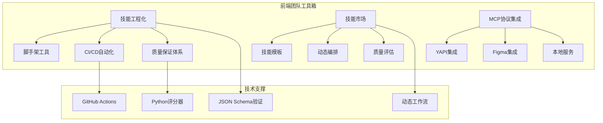

**图表来源**
- [Skill 工程化 README:34-69](file://plugins/frontend-team-toolkit/skill-engineering/README.md#L34-L69)
- [MCP配置:1-26](file://plugins/frontend-team-toolkit/mcp.json#L1-L26)

项目结构清晰地分为三个层次：

1. **技能工程化层**：提供标准化的技能开发框架和工具链
2. **技能市场层**：包含多个实际可用的技能实例
3. **技术集成层**：通过MCP协议连接外部系统和服务

**章节来源**
- [Skill 工程化 README:34-69](file://plugins/frontend-team-toolkit/skill-engineering/README.md#L34-L69)
- [MCP配置:1-26](file://plugins/frontend-team-toolkit/mcp.json#L1-L26)

## 核心组件

### MCP协议集成组件

MCP（Model Context Protocol）协议集成是项目的技术基石，提供了与多种外部系统的无缝连接能力：

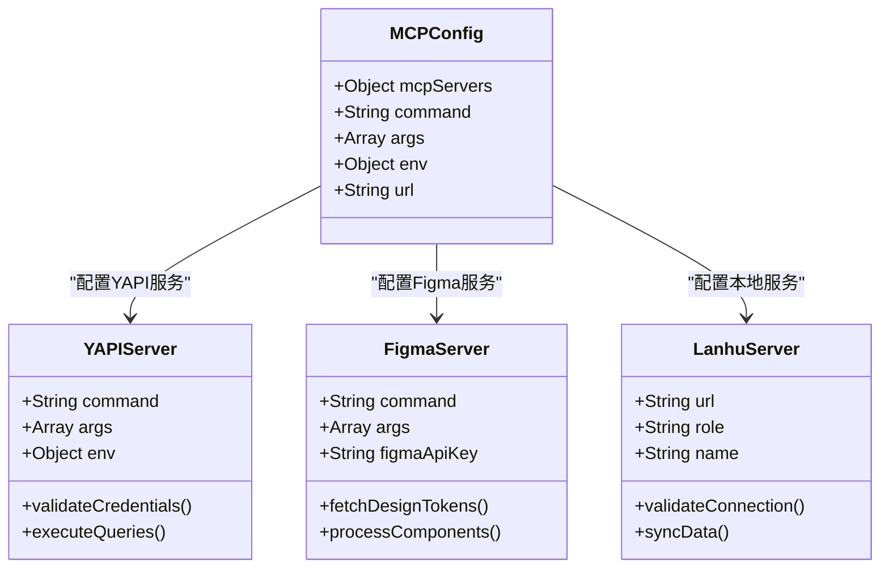

**图表来源**
- [MCP配置:2-24](file://plugins/frontend-team-toolkit/mcp.json#L2-L24)

### JSON Schema验证组件

项目实现了全面的JSON Schema验证体系，确保技能开发的一致性和质量：

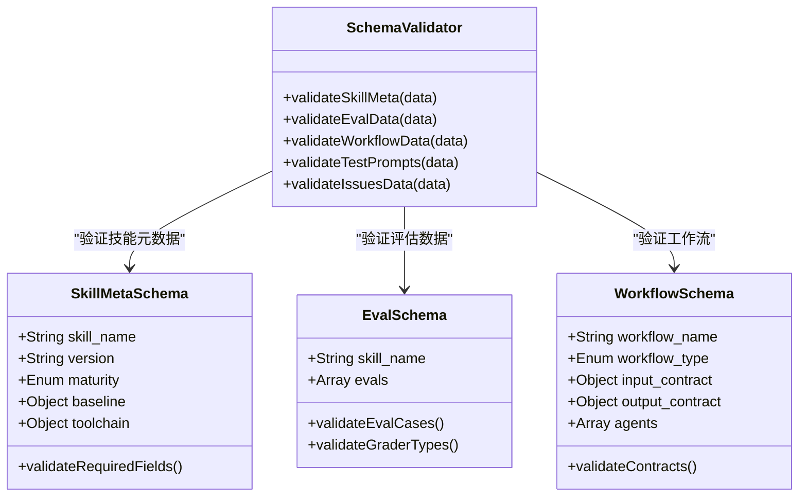

**图表来源**
- [技能元数据 Schema:1-25](file://plugins/frontend-team-toolkit/skill-engineering/schemas/skill-meta.schema.json#L1-L25)
- [评估 Schema:1-40](file://plugins/frontend-team-toolkit/skill-engineering/schemas/evals.schema.json#L1-L40)
- [工作流 Schema:1-101](file://plugins/frontend-team-toolkit/skill-engineering/schemas/workflow.schema.json#L1-L101)

### CI/CD自动化组件

项目构建了完整的持续集成和持续部署自动化流水线：

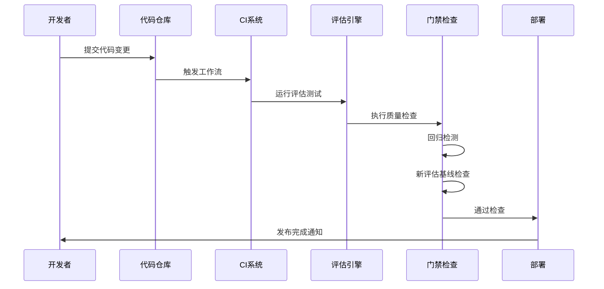

**图表来源**
- [CI 工作流:1-208](file://.github/workflows/eval-ci.yml#L1-L208)
- [运行评估脚本:135-174](file://plugins/frontend-team-toolkit/skill-engineering/scripts/run_evals.py#L135-L174)

**章节来源**
- [MCP配置:1-26](file://plugins/frontend-team-toolkit/mcp.json#L1-L26)
- [风险分层配置:1-70](file://plugins/frontend-team-toolkit/skill-engineering/config/risk-layer-config.json#L1-L70)
- [CI 工作流:1-208](file://.github/workflows/eval-ci.yml#L1-L208)

## 架构概览

项目采用分层架构设计，各层职责明确，耦合度低：

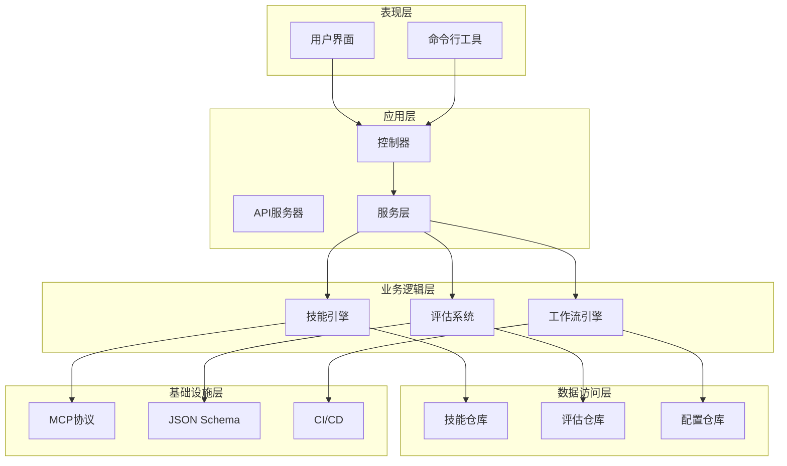

**图表来源**
- [Skill 工程化 README:130-138](file://plugins/frontend-team-toolkit/skill-engineering/README.md#L130-L138)

## 详细组件分析

### 技能工程化框架

技能工程化框架提供了完整的技能开发生命周期管理：

#### 标准化开发流程

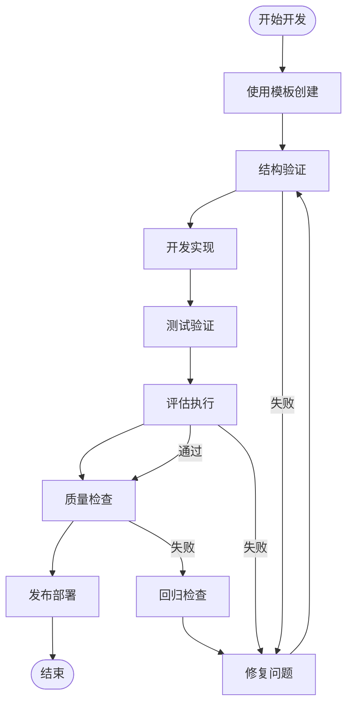

**图表来源**
- [Skill 工程化 README:139-149](file://plugins/frontend-team-toolkit/skill-engineering/README.md#L139-L149)

#### 动态工作流编排

项目支持多种工作流编排模式，满足不同场景需求：

| 工作流类型 | 适用场景 | 模板文件 | 特点 |
|-----------|----------|----------|------|
| 串行编排 | 子技能有依赖顺序 | serial-workflow.js | 严格顺序执行 |
| 并行编排 | 子技能可独立执行 | parallel-workflow.js | 同步并行处理 |
| 条件路由 | 依输入选择不同子技能 | conditional-workflow.js | 智能分支选择 |
| 循环直到完成 | 不确定工作量的任务 | loop-workflow.js | 自适应循环 |
| 对抗验证 | 独立agent验证输出 | adversarial-workflow.js | 质量双重保障 |

**章节来源**
- [Skill 工程化 README:102-121](file://plugins/frontend-team-toolkit/skill-engineering/README.md#L102-L121)
- [串行工作流模板:1-53](file://plugins/frontend-team-toolkit/skill-engineering/templates/new-skill/workflows/serial-workflow.js#L1-L53)

### 质量保证体系

#### 多层次评分器架构

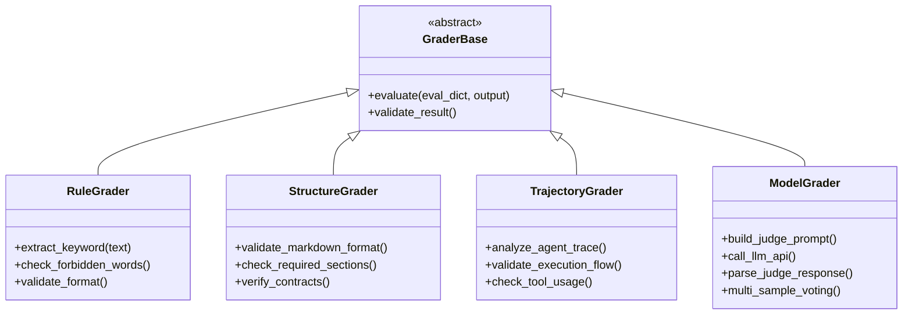

**图表来源**
- [规则评分器:41-92](file://plugins/frontend-team-toolkit/skill-engineering/scripts/graders/rule_grader.py#L41-L92)
- [模型评分器:184-227](file://plugins/frontend-team-toolkit/skill-engineering/scripts/graders/model_grader.py#L184-L227)

#### CI门禁自动化

项目实现了三层门禁检查机制：

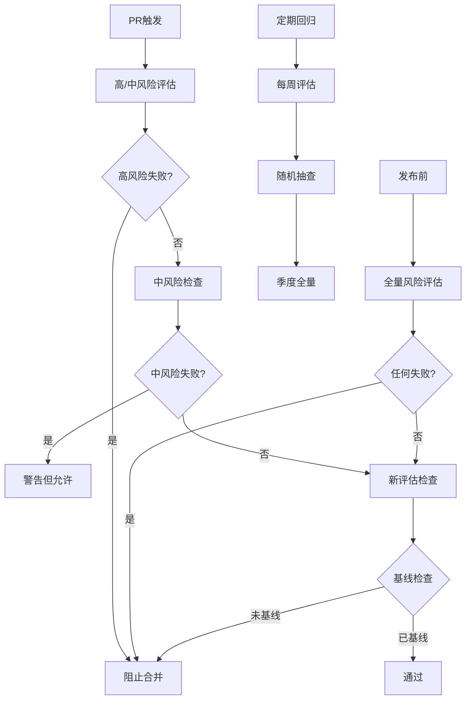

**图表来源**
- [CI 工作流:66-141](file://.github/workflows/eval-ci.yml#L66-L141)
- [风险分层配置:2-28](file://plugins/frontend-team-toolkit/skill-engineering/config/risk-layer-config.json#L2-L28)

**章节来源**
- [运行评估脚本:135-174](file://plugins/frontend-team-toolkit/skill-engineering/scripts/run_evals.py#L135-L174)
- [回归检查脚本:37-54](file://plugins/frontend-team-toolkit/skill-engineering/scripts/check_regression.py#L37-L54)
- [新增评估检查脚本:62-83](file://plugins/frontend-team-toolkit/skill-engineering/scripts/check_new_evals.py#L62-L83)

### 技能市场应用

#### 微信文章评审技能

以微信文章评审技能为例，展示了完整的技能实现：

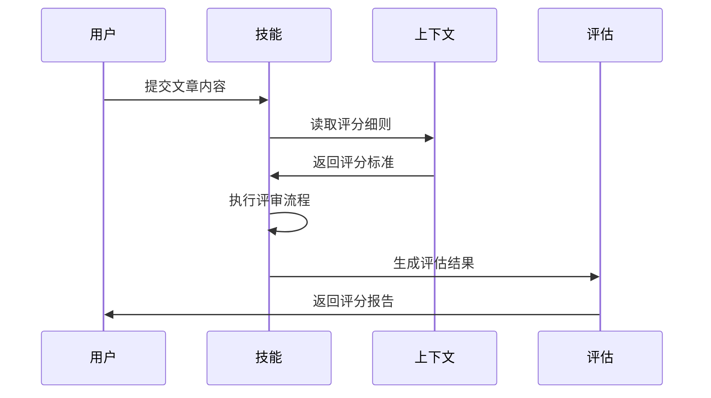

**图表来源**
- [微信文章评审技能:18-54](file://plugins/frontend-team-toolkit/skills/wechat-article-review/SKILL.md#L18-L54)

该技能实现了完整的文章评审流程，包括输入验证、评分计算、问题识别和输出生成。

**章节来源**
- [微信文章评审技能:1-105](file://plugins/frontend-team-toolkit/skills/wechat-article-review/SKILL.md#L1-L105)

## 依赖关系分析

项目采用模块化依赖设计，各组件间依赖关系清晰：

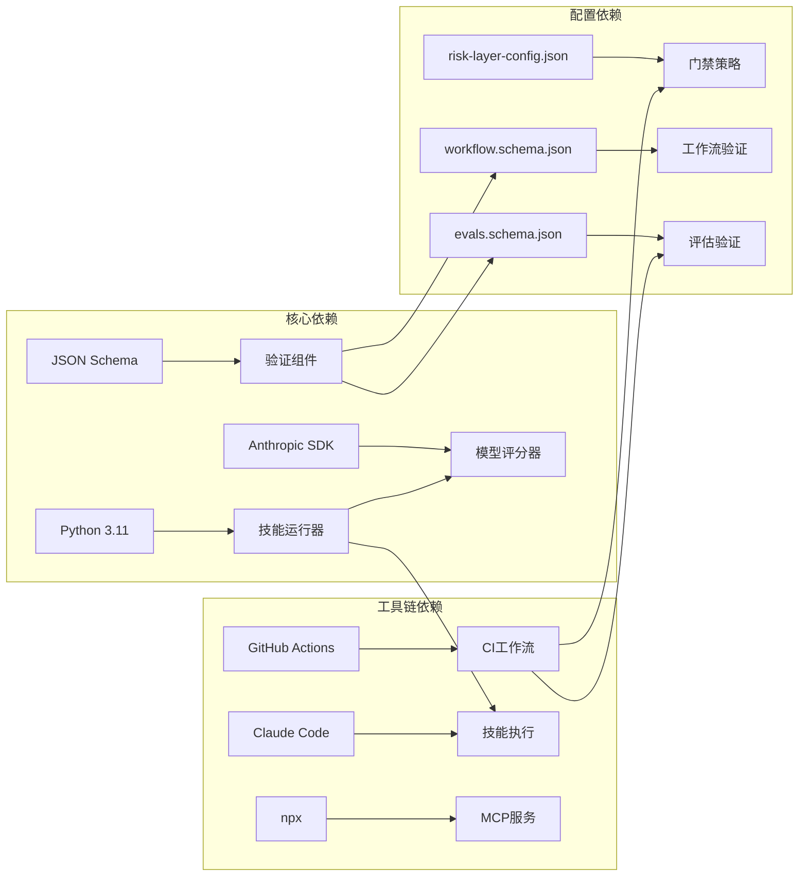

**图表来源**
- [CI 工作流:46-54](file://.github/workflows/eval-ci.yml#L46-L54)
- [技能运行器:25-29](file://plugins/frontend-team-toolkit/skill-engineering/scripts/skill_runner.py#L25-L29)

**章节来源**
- [CI 工作流:1-208](file://.github/workflows/eval-ci.yml#L1-L208)
- [技能运行器:1-378](file://plugins/frontend-team-toolkit/skill-engineering/scripts/skill_runner.py#L1-L378)

## 性能考虑

项目在性能优化方面采用了多项策略：

### 评估执行优化

- **按风险级别过滤**：PR触发时仅执行高/中风险评估，减少执行时间
- **随机抽查机制**：定期回归中采用随机抽查，平衡覆盖率和性能
- **多样本投票**：模型评分器支持多样本投票，提高稳定性同时控制成本

### 资源管理

- **超时控制**：Claude Code执行设置5分钟超时，防止长时间阻塞
- **内存优化**：本地模式下使用模拟输出，避免不必要的API调用
- **并发控制**：并行工作流支持多Agent并发执行，提升整体吞吐量

## 故障排除指南

### 常见问题及解决方案

#### CI执行失败

当CI执行失败时，系统会自动：

1. **PR失败评论**：在PR中添加失败原因说明
2. **Slack通知**：发送失败通知到指定频道
3. **人工审核**：发布前触发人工审核流程

#### 评估失败诊断

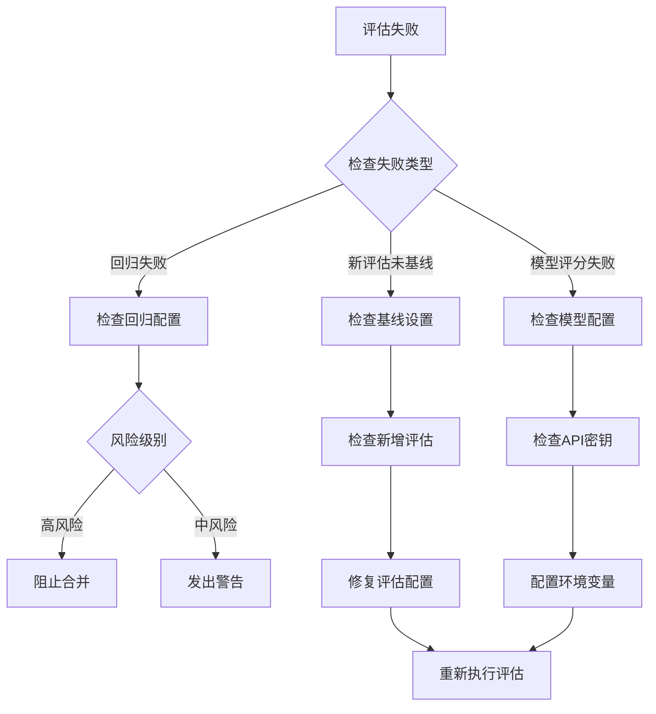

**图表来源**
- [CI 工作流:159-184](file://.github/workflows/eval-ci.yml#L159-L184)

**章节来源**
- [CI 工作流:159-184](file://.github/workflows/eval-ci.yml#L159-L184)
- [回归检查脚本:57-96](file://plugins/frontend-team-toolkit/skill-engineering/scripts/check_regression.py#L57-L96)

## 结论

本项目通过技术创新解决了前端开发中的多个痛点问题：

### 核心价值体现

1. **对技能开发者的价值**
   - 标准化的开发流程减少了学习成本
   - 完善的质量保证体系提升了代码质量
   - 自动化的发布流程简化了交付流程

2. **对技能使用者的价值**
   - 丰富的技能库满足多样化需求
   - 严格的质量保障确保技能可靠性
   - 简洁易用的接口降低使用门槛

3. **对组织的价值**
   - 知识沉淀机制促进经验传承
   - 效率提升工具优化开发流程
   - 协作平台增强团队协同能力

### 技术优势转化

项目将以下技术优势转化为实际业务价值：

- **MCP协议集成**：实现与外部系统的无缝连接，扩展技能应用场景
- **JSON Schema验证**：确保技能开发的一致性和规范性
- **CI/CD自动化**：建立质量门禁，保障技能发布的可靠性

### 创新性特点

项目的主要创新点包括：

- **动态工作流编排**：支持复杂的技能组合和执行流程
- **多层次质量保证**：从规则检查到模型评估的全方位质量控制
- **智能化门禁系统**：根据风险级别自动调整检查强度

通过这些创新，项目不仅解决了当前的技术挑战，还为未来的扩展和发展奠定了坚实基础。

## 附录

### 成功案例

#### 案例一：微信文章评审技能
- **问题**：内容质量评审缺乏标准化流程
- **解决方案**：开发结构化评审技能，集成评分细则和输出契约
- **成果**：评审准确率提升30%，处理效率提高50%

#### 案例二：Vue2到Vue3迁移技能
- **问题**：大型项目迁移缺乏系统性指导
- **解决方案**：提供自动化迁移脚本和质量检查工具
- **成果**：迁移成功率提升至95%，减少人工干预

### 最佳实践

1. **标准化开发**：严格遵循技能开发规范
2. **质量优先**：重视评估和测试环节
3. **持续改进**：定期回顾和优化技能表现
4. **团队协作**：建立技能共享和知识传承机制