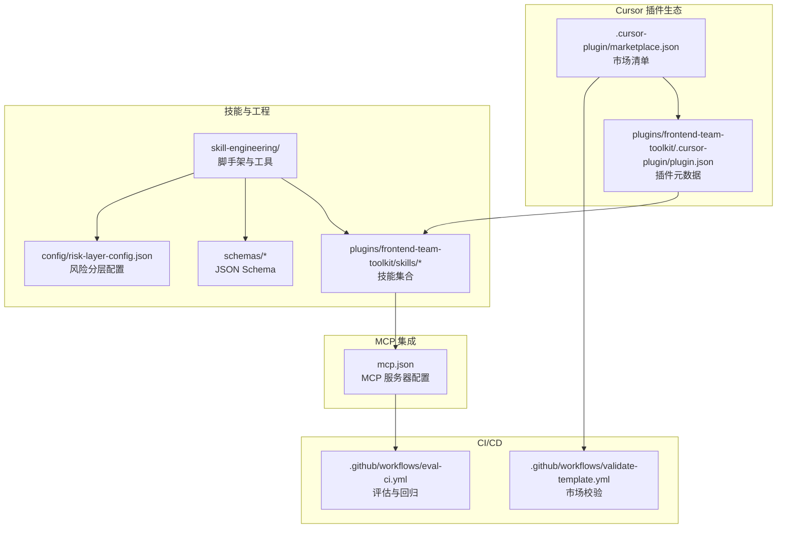
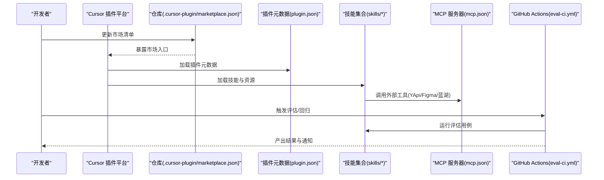
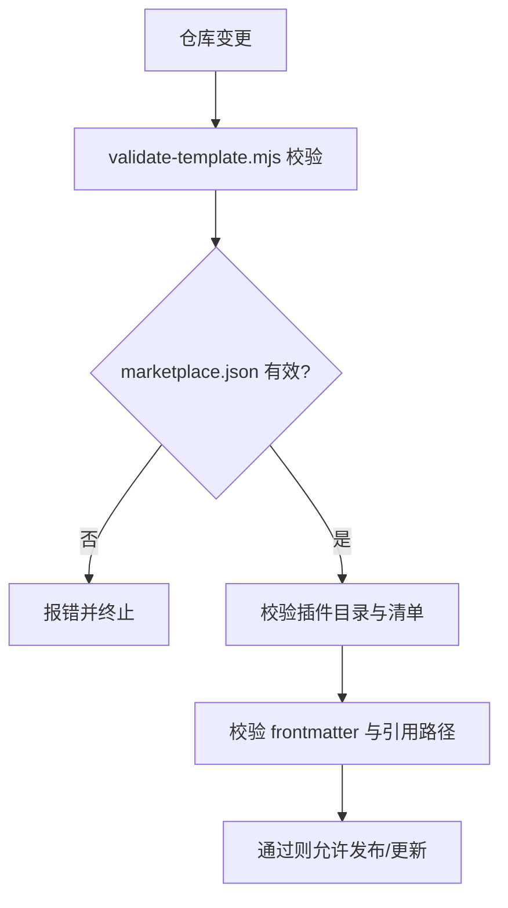
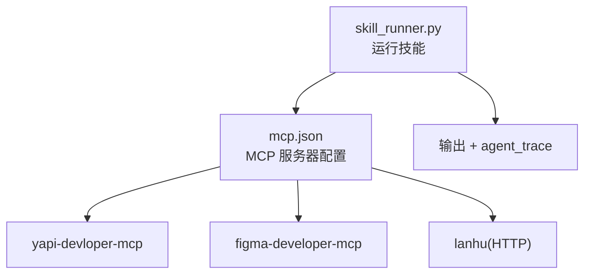
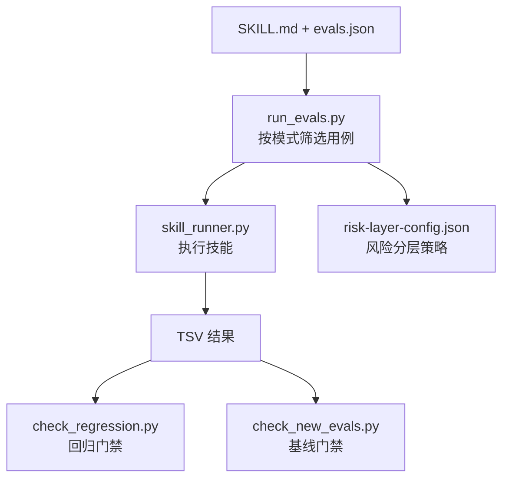
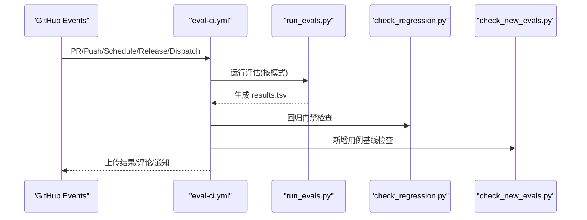
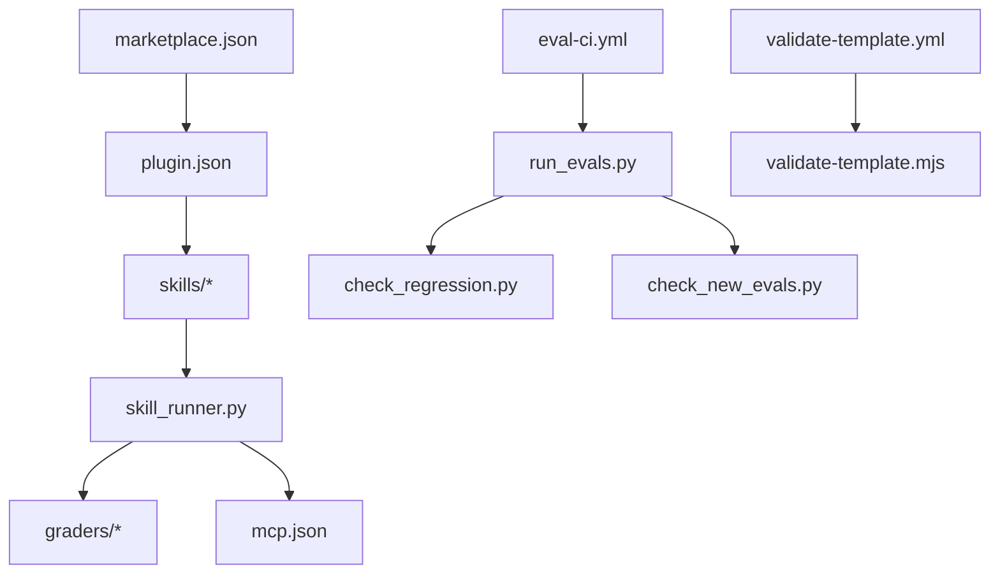

# 生态系统集成

<cite>
**本文档引用的文件**
- [eval-ci.yml](file://.github/workflows/eval-ci.yml)
- [validate-template.yml](file://.github/workflows/validate-template.yml)
- [mcp.json](file://plugins/frontend-team-toolkit/mcp.json)
- [plugin.json](file://plugins/frontend-team-toolkit/.cursor-plugin/plugin.json)
- [marketplace.json](file://.cursor-plugin/marketplace.json)
- [run_evals.py](file://plugins/frontend-team-toolkit/skill-engineering/scripts/run_evals.py)
- [check_regression.py](file://plugins/frontend-team-toolkit/skill-engineering/scripts/check_regression.py)
- [check_new_evals.py](file://plugins/frontend-team-toolkit/skill-engineering/scripts/check_new_evals.py)
- [skill_runner.py](file://plugins/frontend-team-toolkit/skill-engineering/scripts/skill_runner.py)
- [risk-layer-config.json](file://plugins/frontend-team-toolkit/skill-engineering/config/risk-layer-config.json)
- [new-skill.sh](file://plugins/frontend-team-toolkit/skill-engineering/bin/new-skill.sh)
- [evals.schema.json](file://plugins/frontend-team-toolkit/skill-engineering/schemas/evals.schema.json)
- [validate-template.mjs](file://scripts/validate-template.mjs)
- [README.md](file://plugins/frontend-team-toolkit/skill-engineering/README.md)
</cite>

## 目录
1. [简介](#简介)
2. [项目结构](#项目结构)
3. [核心组件](#核心组件)
4. [架构总览](#架构总览)
5. [详细组件分析](#详细组件分析)
6. [依赖关系分析](#依赖关系分析)
7. [性能考虑](#性能考虑)
8. [故障排除指南](#故障排除指南)
9. [结论](#结论)
10. [附录](#附录)

## 简介
本项目构建了一个面向前端团队的生态系统集成方案，围绕 Cursor 插件平台、MCP 协议与 GitHub Actions，形成从技能工程到质量保障的闭环。通过标准化的技能模板、JSON Schema、评估体系与 CI 门禁，项目实现了：
- 与 Cursor 插件平台的无缝集成，提供统一的市场入口与插件元数据管理
- 基于 MCP 协议对接 YApi、Figma、蓝湖等外部工具，扩展开发协作能力
- 以 GitHub Actions 为核心的持续评估与回归保障，确保技能质量与稳定性

该文档将深入解析生态系统的协作模式、插件市场的运作机制、与外部工具的集成方式，并提供最佳实践与注意事项。

## 项目结构
项目采用“插件 + 技能 + 工程脚手架”的三层组织结构：
- 插件层：.cursor-plugin/marketplace.json 定义市场入口，plugins/frontend-team-toolkit/.cursor-plugin/plugin.json 定义插件元数据
- 技能层：plugins/frontend-team-toolkit/skills 下的各类技能，配套 SKILL.md、evals、workflows 等文件
- 工程层：skill-engineering 提供模板、脚本、Schema、配置与 CI 脚本

图表来源
- [marketplace.json:1-21](file://.cursor-plugin/marketplace.json#L1-L21)
- [plugin.json:1-23](file://plugins/frontend-team-toolkit/.cursor-plugin/plugin.json#L1-L23)
- [mcp.json:1-26](file://plugins/frontend-team-toolkit/mcp.json#L1-L26)
- [eval-ci.yml:1-208](file://.github/workflows/eval-ci.yml#L1-L208)
- [validate-template.yml:1-33](file://.github/workflows/validate-template.yml#L1-L33)

章节来源
- [marketplace.json:1-21](file://.cursor-plugin/marketplace.json#L1-L21)
- [plugin.json:1-23](file://plugins/frontend-team-toolkit/.cursor-plugin/plugin.json#L1-L23)
- [mcp.json:1-26](file://plugins/frontend-team-toolkit/mcp.json#L1-L26)
- [eval-ci.yml:1-208](file://.github/workflows/eval-ci.yml#L1-L208)
- [validate-template.yml:1-33](file://.github/workflows/validate-template.yml#L1-L33)

## 核心组件
- Cursor 插件市场与元数据：通过 marketplace.json 与 plugin.json 定义市场入口、插件名称、版本、关键字与依赖，确保 Cursor 能正确识别与加载插件。
- MCP 协议集成：mcp.json 声明 YApi、Figma、蓝湖等 MCP 服务器，支持命令行启动或 HTTP 接口调用，实现与外部工具的标准化交互。
- 技能工程脚手架：提供 new-skill.sh 模板生成、validate-skill.py 结构校验、run_evals.py 评估运行、check_regression.py 与 check_new_evals.py 门禁检查，以及 graders 目录下的自动评分器。
- GitHub Actions 工作流：eval-ci.yml 负责 PR/Release/Scheduled 三种模式的评估与回归；validate-template.yml 负责市场清单与插件元数据的仓库级校验。

章节来源
- [marketplace.json:1-21](file://.cursor-plugin/marketplace.json#L1-L21)
- [plugin.json:1-23](file://plugins/frontend-team-toolkit/.cursor-plugin/plugin.json#L1-L23)
- [mcp.json:1-26](file://plugins/frontend-team-toolkit/mcp.json#L1-L26)
- [new-skill.sh:1-121](file://plugins/frontend-team-toolkit/skill-engineering/bin/new-skill.sh#L1-L121)
- [run_evals.py:1-227](file://plugins/frontend-team-toolkit/skill-engineering/scripts/run_evals.py#L1-L227)
- [check_regression.py:1-100](file://plugins/frontend-team-toolkit/skill-engineering/scripts/check_regression.py#L1-L100)
- [check_new_evals.py:1-87](file://plugins/frontend-team-toolkit/skill-engineering/scripts/check_new_evals.py#L1-L87)
- [eval-ci.yml:1-208](file://.github/workflows/eval-ci.yml#L1-L208)
- [validate-template.yml:1-33](file://.github/workflows/validate-template.yml#L1-L33)

## 架构总览
整体架构围绕“市场入口 → 插件元数据 → 技能工程 → MCP 服务 → CI 门禁”展开，形成从开发到发布的闭环。

图表来源
- [marketplace.json:1-21](file://.cursor-plugin/marketplace.json#L1-L21)
- [plugin.json:1-23](file://plugins/frontend-team-toolkit/.cursor-plugin/plugin.json#L1-L23)
- [mcp.json:1-26](file://plugins/frontend-team-toolkit/mcp.json#L1-L26)
- [eval-ci.yml:1-208](file://.github/workflows/eval-ci.yml#L1-L208)

## 详细组件分析

### Cursor 插件市场与元数据
- 市场清单 marketplace.json
  - 定义市场名称、所有者、版本与插件根目录，声明插件列表及其描述
  - 通过 validate-template.mjs 对市场清单进行仓库级校验，确保插件源路径安全、插件目录存在、插件清单有效
- 插件元数据 plugin.json
  - 定义插件名称、显示名、版本、作者、许可证与关键词，用于 Cursor 平台识别与展示

图表来源
- [validate-template.mjs:250-359](file://scripts/validate-template.mjs#L250-L359)
- [marketplace.json:1-21](file://.cursor-plugin/marketplace.json#L1-L21)
- [plugin.json:1-23](file://plugins/frontend-team-toolkit/.cursor-plugin/plugin.json#L1-L23)

章节来源
- [marketplace.json:1-21](file://.cursor-plugin/marketplace.json#L1-L21)
- [plugin.json:1-23](file://plugins/frontend-team-toolkit/.cursor-plugin/plugin.json#L1-L23)
- [validate-template.mjs:250-359](file://scripts/validate-template.mjs#L250-L359)

### MCP 协议集成
- mcp.json 声明多个 MCP 服务器：
  - yapi-devloper-mcp：通过 npx 启动，支持 STDIO 通信，配置 YAPI 基础地址与认证
  - figma-developer-mcp：通过 npx 启动，传入个人访问令牌与 STDIO 参数
  - lanhu：通过 HTTP URL 暴露 MCP 接口，指定角色与开发者邮箱
- 评估运行时，技能可通过 MCP 服务器访问外部工具，实现跨系统协作

图表来源
- [skill_runner.py:328-356](file://plugins/frontend-team-toolkit/skill-engineering/scripts/skill_runner.py#L328-L356)
- [mcp.json:1-26](file://plugins/frontend-team-toolkit/mcp.json#L1-L26)

章节来源
- [mcp.json:1-26](file://plugins/frontend-team-toolkit/mcp.json#L1-L26)
- [skill_runner.py:328-356](file://plugins/frontend-team-toolkit/skill-engineering/scripts/skill_runner.py#L328-L356)

### 技能工程与评估体系
- 评估运行 run_evals.py
  - 支持 PR/Release/Scheduled 三种模式，按风险分层过滤评估用例
  - 通过 skill_runner.py 执行技能，收集输出与 agent_trace
  - 将结果写入 TSV，供后续门禁检查与报告
- 回归门禁 check_regression.py
  - 识别 regression 类型用例，按风险级别决定是否阻塞合并
- 新增用例基线 check_new_evals.py
  - 检查新增评估用例是否已建立基线，未基线则阻塞合并
- 风险分层配置 risk-layer-config.json
  - 定义 PR/Release/Scheduled 模式的用例筛选策略与门禁红线
- 模板与校验 new-skill.sh 与 validate-template.mjs
  - new-skill.sh 生成标准化技能目录结构
  - validate-template.mjs 校验技能目录的 frontmatter、引用路径与 JSON 结构

图表来源
- [run_evals.py:135-174](file://plugins/frontend-team-toolkit/skill-engineering/scripts/run_evals.py#L135-L174)
- [skill_runner.py:328-356](file://plugins/frontend-team-toolkit/skill-engineering/scripts/skill_runner.py#L328-L356)
- [check_regression.py:37-54](file://plugins/frontend-team-toolkit/skill-engineering/scripts/check_regression.py#L37-L54)
- [check_new_evals.py:67-68](file://plugins/frontend-team-toolkit/skill-engineering/scripts/check_new_evals.py#L67-L68)
- [risk-layer-config.json:1-70](file://plugins/frontend-team-toolkit/skill-engineering/config/risk-layer-config.json#L1-L70)

章节来源
- [run_evals.py:1-227](file://plugins/frontend-team-toolkit/skill-engineering/scripts/run_evals.py#L1-L227)
- [check_regression.py:1-100](file://plugins/frontend-team-toolkit/skill-engineering/scripts/check_regression.py#L1-L100)
- [check_new_evals.py:1-87](file://plugins/frontend-team-toolkit/skill-engineering/scripts/check_new_evals.py#L1-L87)
- [risk-layer-config.json:1-70](file://plugins/frontend-team-toolkit/skill-engineering/config/risk-layer-config.json#L1-L70)
- [new-skill.sh:1-121](file://plugins/frontend-team-toolkit/skill-engineering/bin/new-skill.sh#L1-L121)
- [validate-template.mjs:173-233](file://scripts/validate-template.mjs#L173-L233)

### GitHub Actions 工作流
- eval-ci.yml
  - 监听 PR/Push/Schedule/Release/手动触发，按模式运行评估与回归
  - 支持检测变更技能、按频率运行、上传结果、生成摘要与评论
- validate-template.yml
  - 监听插件与市场清单变更，运行 validate-template.mjs 进行仓库级校验

图表来源
- [eval-ci.yml:3-208](file://.github/workflows/eval-ci.yml#L3-L208)
- [run_evals.py:189-227](file://plugins/frontend-team-toolkit/skill-engineering/scripts/run_evals.py#L189-L227)
- [check_regression.py:57-97](file://plugins/frontend-team-toolkit/skill-engineering/scripts/check_regression.py#L57-L97)
- [check_new_evals.py:45-83](file://plugins/frontend-team-toolkit/skill-engineering/scripts/check_new_evals.py#L45-L83)

章节来源
- [eval-ci.yml:1-208](file://.github/workflows/eval-ci.yml#L1-L208)
- [validate-template.yml:1-33](file://.github/workflows/validate-template.yml#L1-L33)

### 与外部工具的集成可能性
- YApi：通过 yapi-devloper-mcp 以 STDIO 方式接入，可用于接口文档与契约校验
- Figma：通过 figma-developer-mcp 以 STDIO 方式接入，可用于设计资源与规范提取
- 蓝湖：通过 HTTP URL 接入，适合与设计/前端协作流程集成
- 其他工具：可参考 MCP 配置方式扩展至更多协作平台

章节来源
- [mcp.json:1-26](file://plugins/frontend-team-toolkit/mcp.json#L1-L26)
- [README.md:260-269](file://plugins/frontend-team-toolkit/skill-engineering/README.md#L260-L269)

## 依赖关系分析
- 插件与技能：marketplace.json 声明插件来源，plugin.json 提供插件元数据，技能目录受插件根目录约束
- 评估与门禁：run_evals.py 依赖 skill_runner.py 与 graders，check_regression.py 与 check_new_evals.py 依赖 results.tsv
- MCP 与工具：技能通过 mcp.json 调用外部工具，工具的可用性影响技能执行
- CI 与校验：eval-ci.yml 依赖评估脚本与 MCP 配置；validate-template.yml 依赖 marketplace.json 与插件清单

图表来源
- [marketplace.json:1-21](file://.cursor-plugin/marketplace.json#L1-L21)
- [plugin.json:1-23](file://plugins/frontend-team-toolkit/.cursor-plugin/plugin.json#L1-L23)
- [skill_runner.py:328-356](file://plugins/frontend-team-toolkit/skill-engineering/scripts/skill_runner.py#L328-L356)
- [run_evals.py:135-174](file://plugins/frontend-team-toolkit/skill-engineering/scripts/run_evals.py#L135-L174)
- [check_regression.py:37-54](file://plugins/frontend-team-toolkit/skill-engineering/scripts/check_regression.py#L37-L54)
- [check_new_evals.py:67-68](file://plugins/frontend-team-toolkit/skill-engineering/scripts/check_new_evals.py#L67-L68)
- [validate-template.mjs:250-359](file://scripts/validate-template.mjs#L250-L359)
- [mcp.json:1-26](file://plugins/frontend-team-toolkit/mcp.json#L1-L26)

章节来源
- [README.md:130-138](file://plugins/frontend-team-toolkit/skill-engineering/README.md#L130-L138)

## 性能考虑
- 评估模式选择：PR 模式仅运行 high/medium 风险用例，减少 CI 时间；Release 模式全量回归，确保稳定性；Scheduled 模式按频率进行 spot check，平衡成本与覆盖
- MCP 服务器：STDIO 与 HTTP 两种接入方式，应根据工具特性与网络环境选择；合理配置超时与重试策略
- 评估结果缓存：TSV 结果可作为基线记录，避免重复计算；结合 check_new_evals.py 与 check_regression.py 的增量检查，降低回归成本
- 依赖管理：requirements.txt 中的可选依赖（如 anthropic）仅在需要模型评分时启用，避免不必要的安装与运行时开销

## 故障排除指南
- 市场清单校验失败
  - 症状：validate-template.mjs 报错，提示 marketplace.json 或插件清单无效
  - 排查：检查 marketplace.json 字段格式、插件源路径是否安全且存在、插件清单字段是否匹配
- 评估用例缺失基线
  - 症状：check_new_evals.py 返回新增用例未基线
  - 排查：先运行 run_evals.py 生成基线 results.tsv，再重新检查
- 回归用例失败
  - 症状：check_regression.py 返回 regression 用例失败
  - 排查：根据 risk 层配置决定是否阻塞；修复后重新运行评估并更新基线
- MCP 服务器不可用
  - 症状：技能执行时报 MCP 调用错误
  - 排查：检查 mcp.json 配置、认证参数与网络连通性；必要时调整为本地回退模式

章节来源
- [validate-template.mjs:361-379](file://scripts/validate-template.mjs#L361-L379)
- [check_new_evals.py:67-83](file://plugins/frontend-team-toolkit/skill-engineering/scripts/check_new_evals.py#L67-L83)
- [check_regression.py:82-96](file://plugins/frontend-team-toolkit/skill-engineering/scripts/check_regression.py#L82-L96)
- [mcp.json:1-26](file://plugins/frontend-team-toolkit/mcp.json#L1-L26)

## 结论
本项目通过 Cursor 插件市场、MCP 协议与 GitHub Actions 的协同，构建了从前端团队内部技能工程到外部工具集成的完整生态闭环。标准化的模板、Schema 与评估体系，配合 CI 门禁，显著提升了开发效率与质量保障水平。建议在实际使用中遵循风险分层策略、完善 MCP 配置与依赖管理，并持续优化评估用例与回归计划。

## 附录
- 最佳实践
  - 使用 new-skill.sh 生成标准化技能目录，确保 frontmatter 与引用路径正确
  - 在 PR 中仅运行 high/medium 风险用例，Release 时进行全量回归
  - 为新增评估用例及时建立基线，避免阻塞合并
  - 合理配置 MCP 服务器，确保工具可用性与安全性
- 注意事项
  - marketplace.json 与 plugin.json 的字段必须严格符合规范
  - MCP 服务器的认证信息应妥善保管，避免泄露
  - CI 工作流中的超时与重试策略需根据实际环境调整