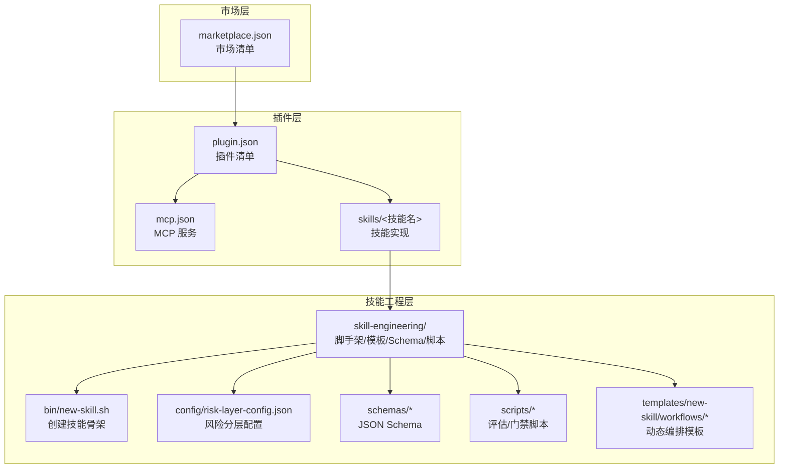
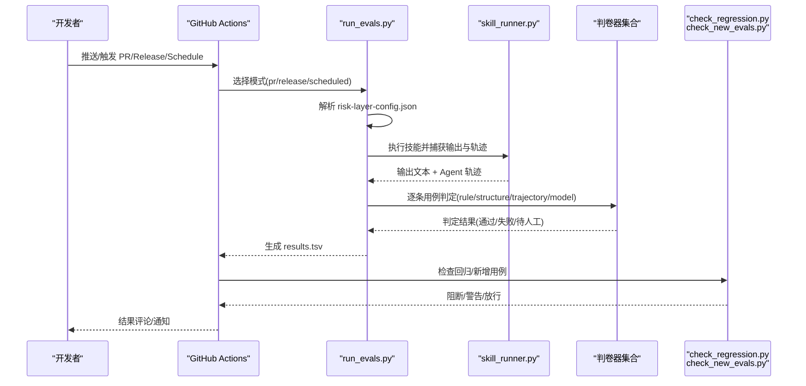
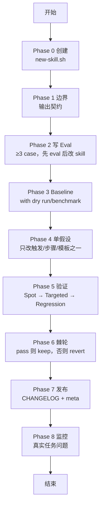
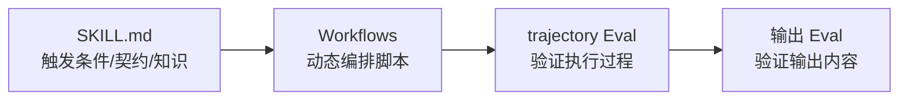
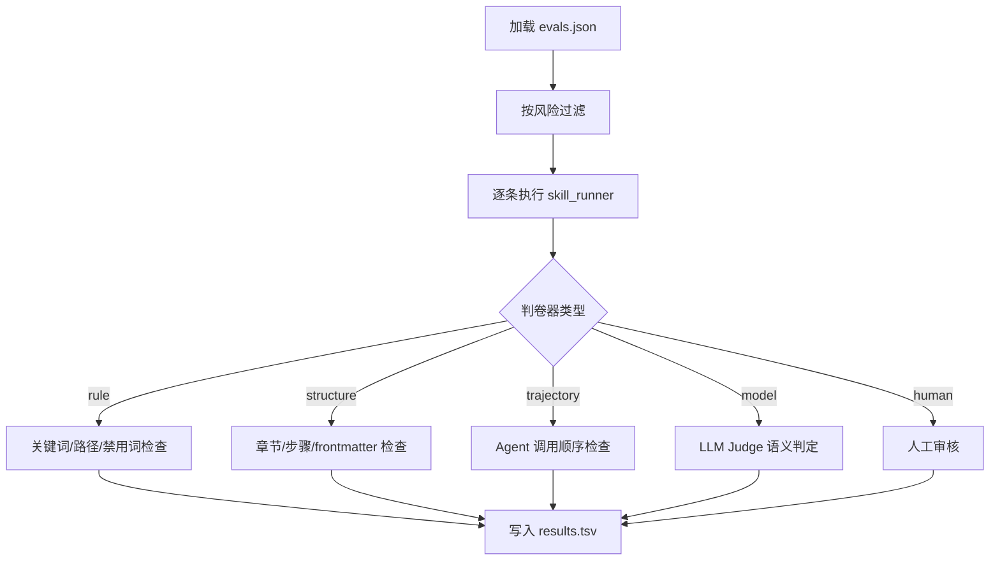
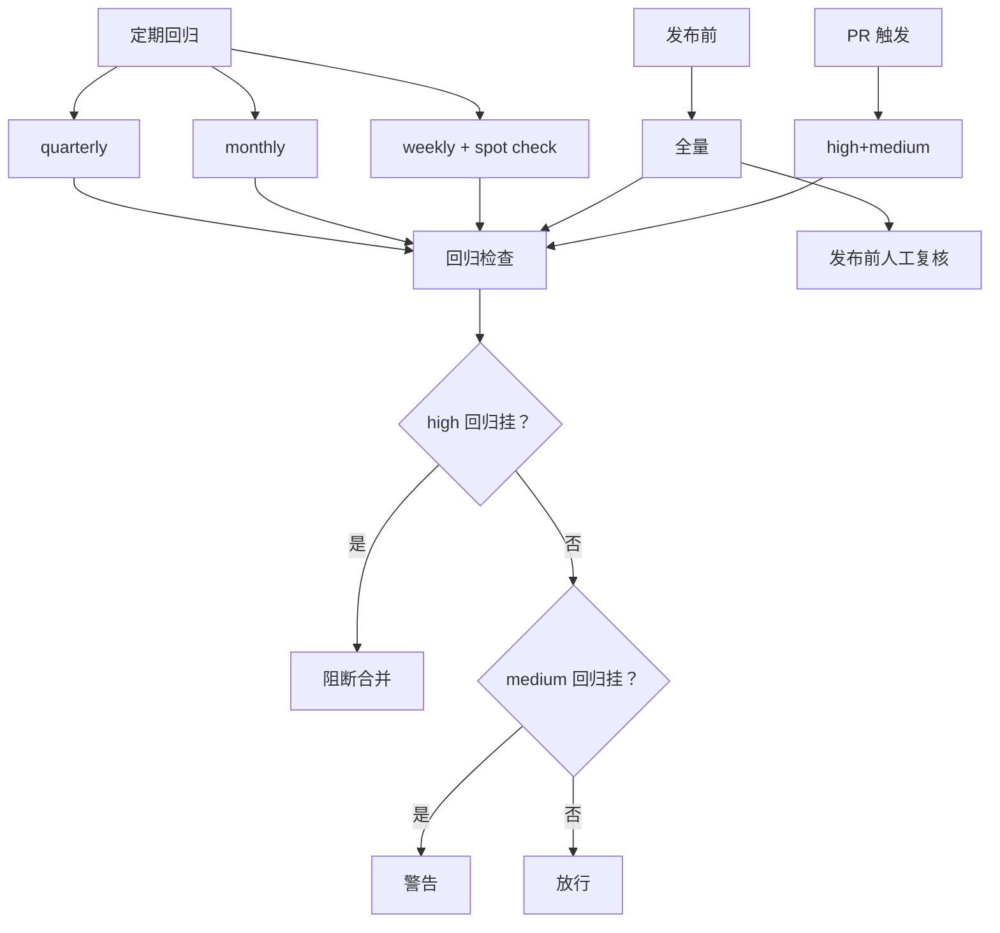
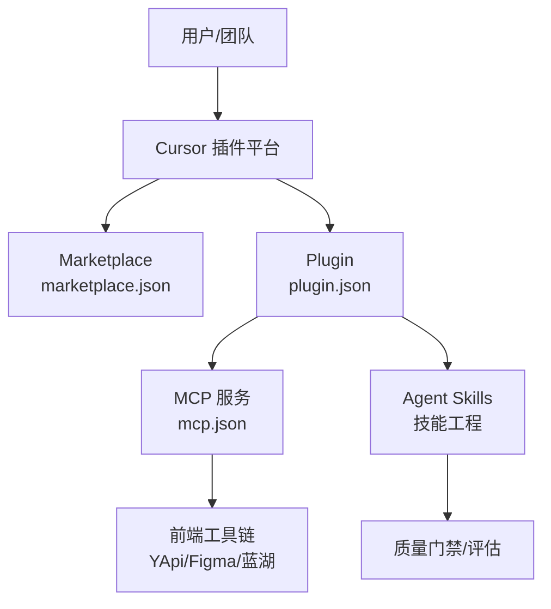
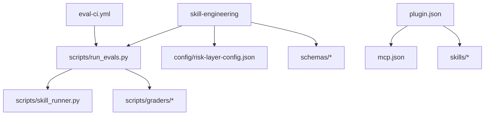

# 项目介绍

<cite>
**本文引用的文件**   
- [README.md](file://plugins/frontend-team-toolkit/skill-engineering/README.md)
- [lifecycle-quickref.md](file://plugins/frontend-team-toolkit/skill-engineering/docs/lifecycle-quickref.md)
- [new-skill.sh](file://plugins/frontend-team-toolkit/skill-engineering/bin/new-skill.sh)
- [run_evals.py](file://plugins/frontend-team-toolkit/skill-engineering/scripts/run_evals.py)
- [skill_runner.py](file://plugins/frontend-team-toolkit/skill-engineering/scripts/skill_runner.py)
- [model_grader.py](file://plugins/frontend-team-toolkit/skill-engineering/scripts/graders/model_grader.py)
- [eval-ci.yml](file://.github/workflows/eval-ci.yml)
- [risk-layer-config.json](file://plugins/frontend-team-toolkit/skill-engineering/config/risk-layer-config.json)
- [plugin.json](file://plugins/frontend-team-toolkit/.cursor-plugin/plugin.json)
- [marketplace.json](file://.cursor-plugin/marketplace.json)
- [mcp.json](file://plugins/frontend-team-toolkit/mcp.json)
- [SKILL.md（ai-coding-tri-kit）](file://plugins/frontend-team-toolkit/skills/ai-coding-tri-kit/SKILL.md)
- [SKILL.md（wechat-article-review）](file://plugins/frontend-team-toolkit/skills/wechat-article-review/SKILL.md)
- [SKILL.md（code-verify）](file://plugins/frontend-team-toolkit/skills/code-verify/SKILL.md)
- [serial-workflow.js](file://plugins/frontend-team-toolkit/skill-engineering/templates/new-skill/workflows/serial-workflow.js)
- [skill-meta.schema.json](file://plugins/frontend-team-toolkit/skill-engineering/schemas/skill-meta.schema.json)
</cite>

## 目录
1. [引言](#引言)
2. [项目结构](#项目结构)
3. [核心组件](#核心组件)
4. [架构总览](#架构总览)
5. [详细组件分析](#详细组件分析)
6. [依赖分析](#依赖分析)
7. [性能考虑](#性能考虑)
8. [故障排查指南](#故障排查指南)
9. [结论](#结论)
10. [附录](#附录)

## 引言
本项目面向前端团队市场，旨在通过“技能工程”（Skill Engineering）框架，为前端开发者社区提供一套标准化、可评估、可复用的智能体技能开发与治理方法论。我们希望帮助团队：
- 构建标准化的前端技能开发流程，降低心智负担，提升交付质量与稳定性；
- 建立可量化的技能评估体系，用数据驱动持续改进；
- 促进技能共享与复用，形成“可复制”的工程化流水线。

项目与前端开发生态的定位关系体现在：以 Cursor 插件平台为载体，将 MCP（Model Context Protocol）生态中的 YApi、Figma、蓝湖等工具能力与前端工程实践深度融合，同时通过统一的技能模板、评估规范与 CI 门禁，将“Agent Skills”从“可玩”变为“可靠”。

## 项目结构
项目采用“插件 + 市场 + 技能工程”的三层组织方式：
- 市场层（.cursor-plugin）：声明市场与插件清单，便于在 Cursor 生态中发现与安装；
- 插件层（plugins/frontend-team-toolkit）：封装前端团队工具与技能集合，提供 MCP 服务与技能模板；
- 技能工程层（skill-engineering）：提供脚手架、模板、Schema、评估脚本与 CI 门禁，支撑技能全生命周期治理。

图表来源
- [marketplace.json:1-21](file://.cursor-plugin/marketplace.json#L1-L21)
- [plugin.json:1-23](file://plugins/frontend-team-toolkit/.cursor-plugin/plugin.json#L1-L23)
- [mcp.json:1-26](file://plugins/frontend-team-toolkit/mcp.json#L1-L26)
- [new-skill.sh:1-121](file://plugins/frontend-team-toolkit/skill-engineering/bin/new-skill.sh#L1-L121)
- [risk-layer-config.json:1-70](file://plugins/frontend-team-toolkit/skill-engineering/config/risk-layer-config.json#L1-L70)
- [skill-meta.schema.json:1-25](file://plugins/frontend-team-toolkit/skill-engineering/schemas/skill-meta.schema.json#L1-L25)

章节来源
- [README.md:1-294](file://plugins/frontend-team-toolkit/skill-engineering/README.md#L1-L294)
- [.cursor-plugin/marketplace.json:1-21](file://.cursor-plugin/marketplace.json#L1-L21)
- [plugins/frontend-team-toolkit/.cursor-plugin/plugin.json:1-23](file://plugins/frontend-team-toolkit/.cursor-plugin/plugin.json#L1-L23)

## 核心组件
- 技能脚手架与模板：通过 new-skill.sh 一键生成标准化技能目录，内置 SKILL.md、evals、references、scripts 等必需文件，确保“结构即规范”。
- 评估与门禁：run_evals.py 负责按 CI 模式（PR/Release/Scheduled）筛选并执行评估用例；check_regression.py 与 check_new_evals.py 作为门禁，阻断回归与缺失 baseline。
- 动态编排：workflows 模板（串行/并行/条件/循环/对抗）将“触发条件与契约”（SKILL.md）与“具体执行逻辑”解耦，提升可维护性与可测试性。
- 评估判卷器：rule/structure/trajectory/model 等判卷器覆盖关键词/结构/轨迹/语义等维度，形成“自动 + 半自动 + 人工”的多层质量防线。
- CI 门禁：GitHub Actions eval-ci.yml 自动检测变更、运行评估、检查回归与新增用例、上传结果、通知告警，并在发布前触发人工复核。
- JSON Schema 与元数据：通过 skill-meta.schema.json 等 Schema 约束技能元信息与数据结构，保障跨团队一致性与可审计性。

章节来源
- [README.md:1-294](file://plugins/frontend-team-toolkit/skill-engineering/README.md#L1-L294)
- [run_evals.py:1-227](file://plugins/frontend-team-toolkit/skill-engineering/scripts/run_evals.py#L1-L227)
- [eval-ci.yml:1-208](file://.github/workflows/eval-ci.yml#L1-L208)
- [risk-layer-config.json:1-70](file://plugins/frontend-team-toolkit/skill-engineering/config/risk-layer-config.json#L1-L70)
- [skill-meta.schema.json:1-25](file://plugins/frontend-team-toolkit/skill-engineering/schemas/skill-meta.schema.json#L1-L25)

## 架构总览
下面的序列图展示了“从变更到门禁”的关键流程：开发者在本地或 CI 中触发评估，系统根据风险分层筛选用例，执行技能并生成 Agent 调用轨迹，随后由判卷器进行自动/半自动判定，最后由门禁脚本决定是否阻断合并或进入人工复核。

图表来源
- [eval-ci.yml:1-208](file://.github/workflows/eval-ci.yml#L1-L208)
- [run_evals.py:1-227](file://plugins/frontend-team-toolkit/skill-engineering/scripts/run_evals.py#L1-L227)
- [skill_runner.py:1-378](file://plugins/frontend-team-toolkit/skill-engineering/scripts/skill_runner.py#L1-L378)
- [model_grader.py:1-273](file://plugins/frontend-team-toolkit/skill-engineering/scripts/graders/model_grader.py#L1-L273)
- [risk-layer-config.json:1-70](file://plugins/frontend-team-toolkit/skill-engineering/config/risk-layer-config.json#L1-L70)

## 详细组件分析

### 技能工程脚手架与生命周期
- 脚手架职责：提供标准化目录结构、模板文件与校验脚本，确保每个技能都具备 SKILL.md、evals、references、scripts 等关键要素。
- 生命周期（8 Phase）：从“创建骨架”到“监控真实问题”，形成闭环的质量治理路径；发布门禁包含结构校验、回归无退步、变更说明与元数据更新等最小项。

图表来源
- [lifecycle-quickref.md:1-32](file://plugins/frontend-team-toolkit/skill-engineering/docs/lifecycle-quickref.md#L1-L32)
- [README.md:1-294](file://plugins/frontend-team-toolkit/skill-engineering/README.md#L1-L294)

章节来源
- [README.md:1-294](file://plugins/frontend-team-toolkit/skill-engineering/README.md#L1-L294)
- [lifecycle-quickref.md:1-32](file://plugins/frontend-team-toolkit/skill-engineering/docs/lifecycle-quietref.md#L1-L32)

### 动态编排与 Workflows
- 分工清晰：SKILL.md 负责触发条件、契约与知识；Workflows 负责具体执行逻辑与编排实现；trajectory Eval 负责验证执行过程。
- 模板丰富：串行、并行、条件、循环、对抗等模板覆盖常见工程场景，支持“确定性执行”与“可测试性”。

图表来源
- [README.md:102-121](file://plugins/frontend-team-toolkit/skill-engineering/README.md#L102-L121)
- [serial-workflow.js:1-53](file://plugins/frontend-team-toolkit/skill-engineering/templates/new-skill/workflows/serial-workflow.js#L1-L53)

章节来源
- [README.md:102-121](file://plugins/frontend-team-toolkit/skill-engineering/README.md#L102-L121)
- [serial-workflow.js:1-53](file://plugins/frontend-team-toolkit/skill-engineering/templates/new-skill/workflows/serial-workflow.js#L1-L53)

### 评估与判卷器
- 评估执行：run_evals.py 根据模式（PR/Release/Scheduled）加载 risk-layer-config.json，过滤用例并执行；支持随机 spot check。
- 判卷器组合：rule/structure/trajectory 完全自动；model（LLM Judge）半自动，支持多采样防漂移；human 人工复核。
- 输出格式：TSV 记录评估 ID、通过状态、时间、版本、严重级别、评审人与备注，便于追踪与统计。

图表来源
- [run_evals.py:1-227](file://plugins/frontend-team-toolkit/skill-engineering/scripts/run_evals.py#L1-L227)
- [model_grader.py:1-273](file://plugins/frontend-team-toolkit/skill-engineering/scripts/graders/model_grader.py#L1-L273)

章节来源
- [run_evals.py:1-227](file://plugins/frontend-team-toolkit/skill-engineering/scripts/run_evals.py#L1-L227)
- [model_grader.py:1-273](file://plugins/frontend-team-toolkit/skill-engineering/scripts/graders/model_grader.py#L1-L273)

### CI 门禁与风险分层
- 门禁三阶段：PR 触发（high+medium，high 回归必阻）、发布前（全量回归）、定期回归（weekly/monthly/quarterly，含 spot check）。
- 红线规则：回归挂（high/medium）、新增 Eval 未 baseline、改技能未跑 baseline 等必阻；medium 回归挂警告但不阻断。
- 通知与评论：失败时在 PR 下方评论并通知 Slack，发布前触发人工复核 Issue。

图表来源
- [eval-ci.yml:1-208](file://.github/workflows/eval-ci.yml#L1-L208)
- [risk-layer-config.json:1-70](file://plugins/frontend-team-toolkit/skill-engineering/config/risk-layer-config.json#L1-L70)

章节来源
- [eval-ci.yml:1-208](file://.github/workflows/eval-ci.yml#L1-L208)
- [risk-layer-config.json:1-70](file://plugins/frontend-team-toolkit/skill-engineering/config/risk-layer-config.json#L1-L70)

### Cursor 插件平台与 MCP 集成
- 市场与插件清单：marketplace.json 声明市场元数据与插件来源；plugin.json 声明插件能力与关键字。
- MCP 服务：mcp.json 配置 YApi/Figma/蓝湖等 MCP 服务，使前端工具能力可被 Cursor/Agent 调用。
- 集成价值：将“前端工具链 + Agent 技能”整合到 Cursor 工作流中，实现“从设计到代码再到质量”的一体化协作。

图表来源
- [marketplace.json:1-21](file://.cursor-plugin/marketplace.json#L1-L21)
- [plugin.json:1-23](file://plugins/frontend-team-toolkit/.cursor-plugin/plugin.json#L1-L23)
- [mcp.json:1-26](file://plugins/frontend-team-toolkit/mcp.json#L1-L26)

章节来源
- [marketplace.json:1-21](file://.cursor-plugin/marketplace.json#L1-L21)
- [plugin.json:1-23](file://plugins/frontend-team-toolkit/.cursor-plugin/plugin.json#L1-L23)
- [mcp.json:1-26](file://plugins/frontend-team-toolkit/mcp.json#L1-L26)

### 技能示例与工程化实践
- AI 编程三件套（OpenSpec + Superpowers + Agent Skills）：强调“先对齐、再开发、守质量”的工程化工作流，覆盖从需求对齐到归档的完整生命周期。
- 微信文章评审：结构化评分与修改清单，严格输出契约与阈值控制，体现“可验证交付”的工程思维。
- Code Verify：先锚定再迭代的全链路闸门，通过“文档锚 + 实现锚 + 七维验证 + 小步验证 + 止损换策 + 经验沉淀”闭环，降低“迭代幻觉”。

章节来源
- [SKILL.md（ai-coding-tri-kit）:1-301](file://plugins/frontend-team-toolkit/skills/ai-coding-tri-kit/SKILL.md#L1-L301)
- [SKILL.md（wechat-article-review）:1-105](file://plugins/frontend-team-toolkit/skills/wechat-article-review/SKILL.md#L1-L105)
- [SKILL.md（code-verify）:1-369](file://plugins/frontend-team-toolkit/skills/code-verify/SKILL.md#L1-L369)

## 依赖分析
- 组件内聚与耦合：技能工程层通过脚本与模板将“创建—评估—门禁—发布—监控”串联；与 Cursor 插件平台通过清单与 MCP 服务解耦集成。
- 外部依赖：Anthropic API（可选，用于 LLM Judge）；Claude Code CLI（可选，用于本地/远程执行）；GitHub Actions（CI 门禁）。
- 潜在循环依赖：脚手架与技能实现通过“模板/Schema/脚本”约定解耦，未见直接循环依赖迹象。

图表来源
- [run_evals.py:1-227](file://plugins/frontend-team-toolkit/skill-engineering/scripts/run_evals.py#L1-L227)
- [skill_runner.py:1-378](file://plugins/frontend-team-toolkit/skill-engineering/scripts/skill_runner.py#L1-L378)
- [risk-layer-config.json:1-70](file://plugins/frontend-team-toolkit/skill-engineering/config/risk-layer-config.json#L1-L70)
- [plugin.json:1-23](file://plugins/frontend-team-toolkit/.cursor-plugin/plugin.json#L1-L23)
- [mcp.json:1-26](file://plugins/frontend-team-toolkit/mcp.json#L1-L26)
- [eval-ci.yml:1-208](file://.github/workflows/eval-ci.yml#L1-L208)

章节来源
- [run_evals.py:1-227](file://plugins/frontend-team-toolkit/skill-engineering/scripts/run_evals.py#L1-L227)
- [skill_runner.py:1-378](file://plugins/frontend-team-toolkit/skill-engineering/scripts/skill_runner.py#L1-L378)
- [eval-ci.yml:1-208](file://.github/workflows/eval-ci.yml#L1-L208)

## 性能考虑
- 评估成本控制：通过 risk 分层与 spot check 降低全量评估频率；模型判卷器支持多采样投票，兼顾稳定性与成本。
- 执行模式选择：本地模拟适合快速验证；API/Claude Code 适合真实场景；按环境变量切换，避免不必要的网络调用。
- CI 并行与缓存：建议在 CI 中对不同技能并行评估，并缓存依赖以缩短构建时间。

## 故障排查指南
- 评估失败
  - 检查 results.tsv 中失败用例与原因，定位 rule/structure/trajectory/model 失败的具体条目。
  - 使用 check_regression.py 与 check_new_evals.py 确认是否存在回归或新增用例未 baseline。
- 门禁阻断
  - PR 阶段 high 回归必阻；发布前全量回归必阻；确认 risk 分层与门禁配置。
  - 如为新增用例或改技能未跑 baseline，先补齐 baseline 再重试。
- 执行模式问题
  - API 模式需配置 ANTHROPIC_API_KEY；Claude Code 模式需安装 CLI 并配置路径；本地模式用于测试与无网络场景。
- MCP 服务异常
  - 检查 mcp.json 中服务地址与鉴权配置，确认网络可达与凭据有效。

章节来源
- [eval-ci.yml:1-208](file://.github/workflows/eval-ci.yml#L1-L208)
- [risk-layer-config.json:1-70](file://plugins/frontend-team-toolkit/skill-engineering/config/risk-layer-config.json#L1-L70)
- [skill_runner.py:1-378](file://plugins/frontend-team-toolkit/skill-engineering/scripts/skill_runner.py#L1-L378)
- [mcp.json:1-26](file://plugins/frontend-team-toolkit/mcp.json#L1-L26)

## 结论
本项目通过“技能工程”框架，将前端技能从“可玩”变为“可复制、可评估、可治理”。借助 Cursor 插件平台与 MCP 生态，我们将工具链、Agent 技能与工程化质量门禁有机融合，帮助前端团队建立标准化的技能开发流程、完善的评估体系与可持续的共享机制。对于初学者而言，建议从“生命周期速查”与“脚手架创建”入手，逐步掌握“评估—门禁—发布—监控”的闭环方法论。

## 附录

### 术语与概念
- 技能工程：将“触发条件/契约/执行逻辑/评估/门禁/发布/监控”等环节标准化、可复用的工程化方法论。
- 动态编排：通过 workflows 将多个子技能按串行/并行/条件/循环/对抗等方式组合，实现复杂任务的确定性执行。
- 评估与门禁：通过规则、结构、轨迹、语义等多维度判卷器与 CI 门禁，确保技能质量稳定与回归可控。
- Cursor 插件平台与 MCP：在 Cursor 中发现与安装插件，通过 MCP 将 YApi/Figma/蓝湖等工具能力接入 Agent 工作流。

章节来源
- [README.md:1-294](file://plugins/frontend-team-toolkit/skill-engineering/README.md#L1-L294)
- [lifecycle-quickref.md:1-32](file://plugins/frontend-team-toolkit/skill-engineering/docs/lifecycle-quickref.md#L1-L32)
- [marketplace.json:1-21](file://.cursor-plugin/marketplace.json#L1-L21)
- [plugin.json:1-23](file://plugins/frontend-team-toolkit/.cursor-plugin/plugin.json#L1-L23)
- [mcp.json:1-26](file://plugins/frontend-team-toolkit/mcp.json#L1-L26)