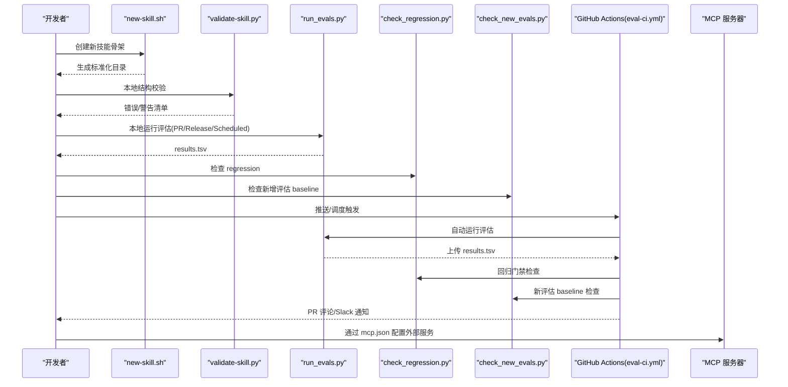
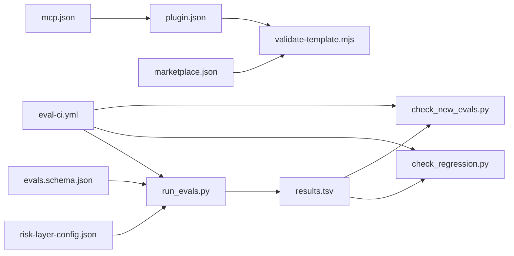

# 项目概述

<cite>
**本文档引用的文件**
- [README.md](file://plugins/frontend-team-toolkit/skill-engineering/README.md)
- [new-skill.sh](file://plugins/frontend-team-toolkit/skill-engineering/bin/new-skill.sh)
- [validate-skill.py](file://plugins/frontend-team-toolkit/skill-engineering/bin/validate-skill.py)
- [run_evals.py](file://plugins/frontend-team-toolkit/skill-engineering/scripts/run_evals.py)
- [check_regression.py](file://plugins/frontend-team-toolkit/skill-engineering/scripts/check_regression.py)
- [check_new_evals.py](file://plugins/frontend-team-toolkit/skill-engineering/scripts/check_new_evals.py)
- [risk-layer-config.json](file://plugins/frontend-team-toolkit/skill-engineering/config/risk-layer-config.json)
- [evals.schema.json](file://plugins/frontend-team-toolkit/skill-engineering/schemas/evals.schema.json)
- [lifecycle-quickref.md](file://plugins/frontend-team-toolkit/skill-engineering/docs/lifecycle-quickref.md)
- [SKILL.md（示例）](file://plugins/frontend-team-toolkit/skills/wechat-article-review/SKILL.md)
- [.skill-meta.json（示例）](file://plugins/frontend-team-toolkit/skills/wechat-article-review/.skill-meta.json)
- [mcp.json](file://plugins/frontend-team-toolkit/mcp.json)
- [eval-ci.yml](file://.github/workflows/eval-ci.yml)
- [validate-template.mjs](file://scripts/validate-template.mjs)
</cite>

## 目录
1. [引言](#引言)
2. [项目结构](#项目结构)
3. [核心组件](#核心组件)
4. [架构总览](#架构总览)
5. [详细组件分析](#详细组件分析)
6. [依赖分析](#依赖分析)
7. [性能考虑](#性能考虑)
8. [故障排查指南](#故障排查指南)
9. [结论](#结论)
10. [附录](#附录)

## 引言
本项目面向前端团队市场（Cursor 插件生态），提供一套标准化的“技能工程”框架，用于规范 Agent Skill 的开发、评估、回归与发布流程。其核心目标是：
- 统一技能开发与交付标准，降低跨团队协作成本
- 以可重复的评估体系保障质量与稳定性
- 通过 GitHub Actions 实现 CI 门禁，确保变更不退化
- 与 Cursor 插件平台、MCP 协议协同，扩展前端开发工具链

价值主张：
- 为初学者提供“脚手架 + 模板 + 规范”的入门路径
- 为资深工程师提供“可配置的风险分层 + 自动化评估 + 回归门禁”的工程化手段
- 通过 JSON Schema 与结构化产物，提升可审计性与可维护性

## 项目结构
项目采用“插件 + 技能 + 工程化工具”的三层组织方式：
- 插件层：.cursor-plugin/marketplace.json 与各插件的 plugin.json，声明市场入口与资源索引
- 技能层：plugins/frontend-team-toolkit/skills 下的每个 Skill 目录，包含 SKILL.md、评估用例、参考文档等
- 工程化层：skill-engineering 提供脚手架、校验器、评估运行器、门禁脚本与 JSON Schema

```mermaid
graph TB
subgraph "插件层"
MP[".cursor-plugin/marketplace.json"]
PLG[".cursor-plugin/plugin.json"]
end
subgraph "工程化层 skill-engineering"
BIN["bin/new-skill.sh<br/>bin/validate-skill.py"]
SCRP["scripts/run_evals.py<br/>scripts/check_regression.py<br/>scripts/check_new_evals.py"]
CFG["config/risk-layer-config.json"]
SCH["schemas/*.json"]
DOC["docs/lifecycle-quickref.md"]
end
subgraph "技能层 skills"
SK1["skills/wechat-article-review/"]
SK2["skills/ai-coding-tri-kit/"]
SK3["skills/change-spec-workflow/"]
end
subgraph "CI"
WF[".github/workflows/eval-ci.yml"]
end
subgraph "MCP"
MCP["mcp.json"]
end
MP --> PLG
BIN --> SK1
BIN --> SK2
BIN --> SK3
SCRP --> SK1
SCRP --> SK2
SCRP --> SK3
WF --> SCRP
WF --> SK1
WF --> SK2
WF --> SK3
SCH --> SCRP
CFG --> SCRP
MCP --> PLG
```

图表来源
- [eval-ci.yml:1-208](file://.github/workflows/eval-ci.yml#L1-L208)
- [new-skill.sh:1-121](file://plugins/frontend-team-toolkit/skill-engineering/bin/new-skill.sh#L1-L121)
- [run_evals.py:1-227](file://plugins/frontend-team-toolkit/skill-engineering/scripts/run_evals.py#L1-L227)
- [risk-layer-config.json:1-70](file://plugins/frontend-team-toolkit/skill-engineering/config/risk-layer-config.json#L1-L70)
- [evals.schema.json:1-40](file://plugins/frontend-team-toolkit/skill-engineering/schemas/evals.schema.json#L1-L40)
- [lifecycle-quickref.md:1-32](file://plugins/frontend-team-toolkit/skill-engineering/docs/lifecycle-quickref.md#L1-L32)
- [mcp.json:1-26](file://plugins/frontend-team-toolkit/mcp.json#L1-L26)

章节来源
- [README.md:1-294](file://plugins/frontend-team-toolkit/skill-engineering/README.md#L1-L294)
- [validate-template.mjs:1-382](file://scripts/validate-template.mjs#L1-L382)

## 核心组件
- 脚手架与模板
  - new-skill.sh：从模板生成标准化 Skill 目录，填充基础文件与占位信息
  - templates/new-skill：包含 SKILL.md、evals、workflows、references 等模板骨架
- 结构校验器
  - validate-skill.py：校验目录结构、frontmatter、必要文件与 JSON 结构
- 评估与回归
  - run_evals.py：按 PR/Release/Scheduled 三种模式筛选并运行评估用例，产出 results.tsv
  - check_regression.py：检测 regression 用例失败，支持按风险级别阻断或告警
  - check_new_evals.py：检测新增评估用例是否已建立 baseline
- 风险分层与门禁
  - risk-layer-config.json：定义 PR/Release/Scheduled 三阶段的风险过滤、阻断策略与通知
- JSON Schema
  - evals.schema.json 等：约束 evals、test-prompts、skill-meta、skill-issue、workflow 等结构
- 生命周期速查
  - lifecycle-quickref.md：8 Phase 质量流程与发布门禁清单
- 示例技能
  - wechat-article-review：展示 SKILL.md、.skill-meta.json、references、evals 等完整结构
- CI 与市场校验
  - eval-ci.yml：PR/Release/Schedule 触发的评估门禁流水线
  - validate-template.mjs：校验 marketplace.json 与插件 manifest 的一致性与安全路径

章节来源
- [README.md:1-294](file://plugins/frontend-team-toolkit/skill-engineering/README.md#L1-L294)
- [new-skill.sh:1-121](file://plugins/frontend-team-toolkit/skill-engineering/bin/new-skill.sh#L1-L121)
- [validate-skill.py:1-193](file://plugins/frontend-team-toolkit/skill-engineering/bin/validate-skill.py#L1-L193)
- [run_evals.py:1-227](file://plugins/frontend-team-toolkit/skill-engineering/scripts/run_evals.py#L1-L227)
- [check_regression.py:1-100](file://plugins/frontend-team-toolkit/skill-engineering/scripts/check_regression.py#L1-L100)
- [check_new_evals.py:1-87](file://plugins/frontend-team-toolkit/skill-engineering/scripts/check_new_evals.py#L1-L87)
- [risk-layer-config.json:1-70](file://plugins/frontend-team-toolkit/skill-engineering/config/risk-layer-config.json#L1-L70)
- [evals.schema.json:1-40](file://plugins/frontend-team-toolkit/skill-engineering/schemas/evals.schema.json#L1-L40)
- [lifecycle-quickref.md:1-32](file://plugins/frontend-team-toolkit/skill-engineering/docs/lifecycle-quickref.md#L1-L32)
- [SKILL.md（示例）:1-105](file://plugins/frontend-team-toolkit/skills/wechat-article-review/SKILL.md#L1-L105)
- [.skill-meta.json（示例）:1-40](file://plugins/frontend-team-toolkit/skills/wechat-article-review/.skill-meta.json#L1-L40)
- [eval-ci.yml:1-208](file://.github/workflows/eval-ci.yml#L1-L208)
- [validate-template.mjs:1-382](file://scripts/validate-template.mjs#L1-L382)

## 架构总览
该框架围绕“标准化技能 + 结构化评估 + CI 门禁”构建，形成从创建、校验、评估、回归到发布的闭环。



图表来源
- [new-skill.sh:1-121](file://plugins/frontend-team-toolkit/skill-engineering/bin/new-skill.sh#L1-L121)
- [validate-skill.py:1-193](file://plugins/frontend-team-toolkit/skill-engineering/bin/validate-skill.py#L1-L193)
- [run_evals.py:1-227](file://plugins/frontend-team-toolkit/skill-engineering/scripts/run_evals.py#L1-L227)
- [check_regression.py:1-100](file://plugins/frontend-team-toolkit/skill-engineering/scripts/check_regression.py#L1-L100)
- [check_new_evals.py:1-87](file://plugins/frontend-team-toolkit/skill-engineering/scripts/check_new_evals.py#L1-L87)
- [eval-ci.yml:1-208](file://.github/workflows/eval-ci.yml#L1-L208)
- [mcp.json:1-26](file://plugins/frontend-team-toolkit/mcp.json#L1-L26)

## 详细组件分析

### 脚手架与模板（new-skill.sh）
- 功能要点
  - 解析参数：技能名称（kebab-case）、输出目录（默认 plugins/frontend-team-toolkit/skills）
  - 从 templates/new-skill 复制并替换模板变量（名称、标题、日期）
  - 生成标准目录结构与初始文件（SKILL.md、.skill-meta.json、evals、references、scripts）
- 使用场景
  - 新建技能：一键生成符合规范的目录与文件
  - 适配个人 Cursor 技能：通过 --path 指向 ~/.cursor/skills
- 与生命周期的关系
  - Phase 0：创建骨架，后续进入 Phase 1 边界与 Phase 2 写 Eval

章节来源
- [new-skill.sh:1-121](file://plugins/frontend-team-toolkit/skill-engineering/bin/new-skill.sh#L1-L121)
- [README.md:13-31](file://plugins/frontend-team-toolkit/skill-engineering/README.md#L13-L31)

### 结构校验器（validate-skill.py）
- 校验范围
  - 目录命名（kebab-case）、必要文件存在性、frontmatter 键值与长度限制
  - SKILL.md：name 与目录一致、description 触发词建议、body 推荐章节
  - .skill-meta.json：字段一致性
  - evals/evals.json、test-prompts.json：基本结构与内容提示
- 输出
  - 错误（阻断）与警告（提醒补齐）
- 与生命周期的关系
  - Phase 0/1/2：前置校验，保证后续评估与发布顺利进行

章节来源
- [validate-skill.py:1-193](file://plugins/frontend-team-toolkit/skill-engineering/bin/validate-skill.py#L1-L193)
- [README.md:282-294](file://plugins/frontend-team-toolkit/skill-engineering/README.md#L282-L294)

### 评估运行器（run_evals.py）
- 模式与筛选
  - pr：按 risk-layer-config.json 的 risk_filter 过滤（默认 high+medium），支持按风险阻断
  - release：全量评估，阻断任何 regression
  - scheduled：按频率（weekly/monthly/quarterly）筛选，支持随机 spot check
- 执行流程
  - 读取 evals.json，按 grader 类型（rule/structure/trajectory/model/human 或组合）调用对应评分器
  - 通过 skill_runner（内部模块）执行具体技能并采集输出与 agent_trace
  - 生成 results.tsv，打印汇总统计
- 与 Schema 的关系
  - 依赖 evals.schema.json 约束用例结构，确保评估输入合法

章节来源
- [run_evals.py:1-227](file://plugins/frontend-team-toolkit/skill-engineering/scripts/run_evals.py#L1-L227)
- [evals.schema.json:1-40](file://plugins/frontend-team-toolkit/skill-engineering/schemas/evals.schema.json#L1-L40)
- [risk-layer-config.json:1-70](file://plugins/frontend-team-toolkit/skill-engineering/config/risk-layer-config.json#L1-L70)

### 回归与新增评估门禁
- check_regression.py
  - 从 results.tsv 中筛选 type=regression 的用例，按 risk 过滤，支持 block=true 阻断合并
- check_new_evals.py
  - 对比 evals.json 与 results.tsv，发现新增用例未建立 baseline 时阻断合并
- 与 CI 的关系
  - eval-ci.yml 在 PR/Release/Schedule 场景分别调用上述脚本，实现门禁自动化

章节来源
- [check_regression.py:1-100](file://plugins/frontend-team-toolkit/skill-engineering/scripts/check_regression.py#L1-L100)
- [check_new_evals.py:1-87](file://plugins/frontend-team-toolkit/skill-engineering/scripts/check_new_evals.py#L1-L87)
- [eval-ci.yml:1-208](file://.github/workflows/eval-ci.yml#L1-L208)

### 风险分层与门禁配置（risk-layer-config.json）
- PR 触发：仅运行 high+medium，high regression 挂必阻
- 发布前：全量评估，regression 挂必阻
- 定期回归：按周/月/季调整 risk 过滤与 spot check 数量
- 评分器风险等级与自动程度
  - rule/structure/trajectory：完全自动，漂移风险低
  - model：半自动，多次采样降低漂移
  - human：人工审核（可配置触发时机）

章节来源
- [risk-layer-config.json:1-70](file://plugins/frontend-team-toolkit/skill-engineering/config/risk-layer-config.json#L1-L70)
- [README.md:168-247](file://plugins/frontend-team-toolkit/skill-engineering/README.md#L168-L247)

### JSON Schema 与结构约束
- evals.schema.json：约束评估用例数组结构、字段类型与枚举值
- 其他 schema：test-prompts、skill-meta、skill-issue、workflow 等
- 作用
  - 在 CI 或本地脚本中统一校验，减少歧义与错误传播
  - 与 run_evals.py 配合，确保评估输入与输出结构一致

章节来源
- [evals.schema.json:1-40](file://plugins/frontend-team-toolkit/skill-engineering/schemas/evals.schema.json#L1-L40)
- [README.md:153-164](file://plugins/frontend-team-toolkit/skill-engineering/README.md#L153-L164)

### 生命周期速查与发布门禁
- 8 Phase 流程：创建 → 边界 → 写 Eval → Baseline → 单假设 → 验证 → 棘轮 → 发布 → 监控
- 发布门禁（最小）：结构校验通过、无 regression 退化、CHANGELOG 完备、.skill-meta.json baseline 更新
- 与现有技能的关系：逐步补齐工业级文件，新技能统一从 new-skill.sh 创建

章节来源
- [lifecycle-quickref.md:1-32](file://plugins/frontend-team-toolkit/skill-engineering/docs/lifecycle-quickref.md#L1-L32)
- [README.md:139-149](file://plugins/frontend-team-toolkit/skill-engineering/README.md#L139-L149)

### 示例技能：微信公众号文章评分（wechat-article-review）
- SKILL.md：定义触发条件、输入契约、工作流、检查点、反模式与下游协作
- .skill-meta.json：记录版本、成熟度、baseline 指标、评估统计与工具链信息
- 与工程化层的映射：遵循模板结构，使用 references/output-contract.md 与 evals/trajectory-evals.json

章节来源
- [SKILL.md（示例）:1-105](file://plugins/frontend-team-toolkit/skills/wechat-article-review/SKILL.md#L1-L105)
- [.skill-meta.json（示例）:1-40](file://plugins/frontend-team-toolkit/skills/wechat-article-review/.skill-meta.json#L1-L40)

### 与 Cursor 插件平台、MCP 协议与 GitHub Actions 的集成
- Cursor 插件平台
  - marketplace.json：声明市场入口与插件列表
  - plugin.json：声明 logo、rules、skills、agents、commands、hooks、mcpServers 等资源路径
  - validate-template.mjs：校验 marketplace 与插件 manifest 的一致性与安全路径
- MCP 协议
  - mcp.json：声明外部 MCP 服务器（如 YAPI、Figma、本地服务），供 Cursor/Agent 调用
- GitHub Actions
  - eval-ci.yml：监听 PR/Release/Schedule，自动运行评估、回归门禁与通知

章节来源
- [validate-template.mjs:1-382](file://scripts/validate-template.mjs#L1-L382)
- [mcp.json:1-26](file://plugins/frontend-team-toolkit/mcp.json#L1-L26)
- [eval-ci.yml:1-208](file://.github/workflows/eval-ci.yml#L1-L208)

## 依赖分析
- 组件耦合
  - run_evals.py 依赖 risk-layer-config.json 与各类 grader（rule/structure/trajectory/model）
  - CI 依赖 run_evals.py、check_regression.py、check_new_evals.py 与 GitHub Actions 环境
  - market 校验依赖 validate-template.mjs 与 .cursor-plugin/marketplace.json
- 外部依赖
  - Python 依赖（requirements.txt）与 anthropic SDK（CI 中安装）
  - Node 生态（validate-template.mjs 与 GitHub Actions 环境）



图表来源
- [run_evals.py:1-227](file://plugins/frontend-team-toolkit/skill-engineering/scripts/run_evals.py#L1-L227)
- [risk-layer-config.json:1-70](file://plugins/frontend-team-toolkit/skill-engineering/config/risk-layer-config.json#L1-L70)
- [evals.schema.json:1-40](file://plugins/frontend-team-toolkit/skill-engineering/schemas/evals.schema.json#L1-L40)
- [check_regression.py:1-100](file://plugins/frontend-team-toolkit/skill-engineering/scripts/check_regression.py#L1-L100)
- [check_new_evals.py:1-87](file://plugins/frontend-team-toolkit/skill-engineering/scripts/check_new_evals.py#L1-L87)
- [validate-template.mjs:1-382](file://scripts/validate-template.mjs#L1-L382)
- [eval-ci.yml:1-208](file://.github/workflows/eval-ci.yml#L1-L208)
- [mcp.json:1-26](file://plugins/frontend-team-toolkit/mcp.json#L1-L26)

章节来源
- [README.md:130-138](file://plugins/frontend-team-toolkit/skill-engineering/README.md#L130-L138)
- [eval-ci.yml:1-208](file://.github/workflows/eval-ci.yml#L1-L208)

## 性能考虑
- 评估筛选与随机 spot check
  - scheduled 模式按频率调整 risk 过滤与 spot check 数量，平衡覆盖率与成本
- 评分器自动程度
  - rule/structure/trajectory 完全自动，避免 LLM 评分的不确定性与漂移
- CI 并行化
  - GitHub Actions 可针对不同技能并行运行评估（当前脚本示例为逐个运行，可根据需要扩展）
- 输出缓存与增量
  - results.tsv 作为基准记录，便于快速对比与增量回归

## 故障排查指南
- 本地校验失败
  - 使用 validate-skill.py 检查目录结构与 frontmatter，按错误/警告逐项修复
- 评估运行异常
  - 检查 evals.json 是否满足 evals.schema.json 约束；确认 grader 类型与 risk 字段正确
  - 使用 run_evals.py 的 --mode 与 --skill 参数定位问题技能
- 回归门禁阻断
  - 使用 check_regression.py 指定 --risk 与 --block 参数，查看失败用例并修复
- 新增评估未 baseline
  - 使用 check_new_evals.py 检查 results.tsv 是否包含对应 eval_id，补齐 baseline
- CI 通知与 PR 评论
  - eval-ci.yml 在失败时会评论 PR 并可选通知 Slack；关注日志中的失败用例与修复建议

章节来源
- [validate-skill.py:170-193](file://plugins/frontend-team-toolkit/skill-engineering/bin/validate-skill.py#L170-L193)
- [run_evals.py:189-227](file://plugins/frontend-team-toolkit/skill-engineering/scripts/run_evals.py#L189-L227)
- [check_regression.py:57-100](file://plugins/frontend-team-toolkit/skill-engineering/scripts/check_regression.py#L57-L100)
- [check_new_evals.py:45-87](file://plugins/frontend-team-toolkit/skill-engineering/scripts/check_new_evals.py#L45-L87)
- [eval-ci.yml:159-185](file://.github/workflows/eval-ci.yml#L159-L185)

## 结论
本项目通过“脚手架 + 校验 + 评估 + 门禁 + CI”的工程化闭环，为前端团队在 Cursor 插件生态中提供了可复用、可审计、可演进的技能开发与交付范式。对于初学者，从 new-skill.sh 与模板入手即可快速上手；对于资深工程师，可通过 risk-layer-config.json 与各类 grader 实现精细化的质量控制与自动化回归。

## 附录
- 实际使用场景示例
  - 新建技能：执行 new-skill.sh 生成骨架 → validate-skill.py 本地校验 → 填写 SKILL.md 与 evals → 本地运行 run_evals.py → 提交 PR 触发 eval-ci.yml
  - 发布前回归：在 main 分支推送或发布事件触发 release 模式评估，确保全量回归通过
  - 定期回归：按周/月/季运行 scheduled 模式，结合 spot check 与全量回归发现长期退化
- 术语对照
  - Skill：在 Cursor 插件生态中可被 Agent 调用的功能单元
  - Eval：用于评估 Skill 行为的测试用例集合
  - Trajectory Eval：验证执行过程（Agent 调用顺序）的评估
  - MCP：Model Context Protocol，用于与外部服务交互的协议